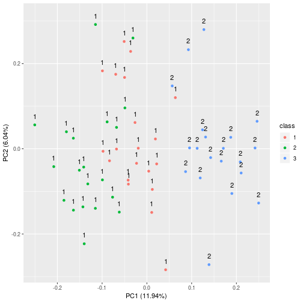

# Chapter 5 - Applied


```r
library(ISLR)
library(MASS)
library(broom)
library(modelr)
library(tidyverse)
library(ggdendro)
library(ggfortify)
```

## 7)

*In the chapter, we mentioned the use of correlation-based distance and Euclidean distance as dissimilarity measures for hierarchical clustering. It turns out that these two measures are almost equivalent: if each observation has been centered to have mean zero and standard deviation one, and if we let $r_{ij} denote the correlation between the $i$th and $j$th observations, then the quantity $1 - r_{ij}$ is proportional to the squared Euclidean distance between the ith and jth observations.*

*On the `USArrests` data, show that this proportionality holds.*

Scaling the USArrests data is easy, however the correlation requires some thought. The `cor()` function returns a correlation matrix between the columns of the matrix. In its original format this is between the features, however we want it between the observations. To do this we transpose the matrix so that each colunm is an observation.


```r
arrests_scaled <- scale(USArrests)

# Calculate the sqaured distance
arrests_dist <- dist(arrests_scaled)^2

# Transpose the matrix and take the correlation 
arrests_cor <- as.dist(1 -cor(t(arrests_scaled)))

# A summary of the proportional matrix
summary(arrests_cor / arrests_dist)
```

```
##     Min.  1st Qu.   Median     Mean  3rd Qu.     Max. 
## 0.000086 0.069135 0.133943 0.234193 0.262589 4.887686
```

## 8)

*In Section 10.2.3, a formula for calculating PVE was given in Equation 10.8. We also saw that the PVE can be obtained using the `sdev` output of the `prcomp()` function. On the `USArrests` data, calculate PVE in two ways:*

### a) 

*Using the `sdev` output of the `prcomp()` function.*


```r
arrests_pca <- USArrests %>%
    prcomp(scale = T)

arrests_pca$sdev^2 / sum(arrests_pca$sdev^2)
```

```
## [1] 0.62006039 0.24744129 0.08914080 0.04335752
```

### b)

*By applying Equation 10.8 directly.*

The equation 10.8, which gives the *proportion of variance explained* of the $m$th principal component, is:

$$ \frac{ \sum_{i=1}^n ( \sum_{j=1}^p \phi_{jm} x_{ij})^2 }{ \sum_{j=1}^p\sum_{i=1}^n x_{ij}^2 } $$


```r
# We create a function to scale the matrix
standardise <- function(x) {
    feature_means <- colMeans(x)
    feature_sd <- sqrt( apply(x, 2, var) )

    scaled <- x %>%
        sweep(., 2, feature_means, '-') %>%
        sweep(., 2, feature_sd, '/')

    return( scaled )
}

# We take the matrix and multiply each column by each
# element of the lading vector (the number of columns
# and the number of elements will be the same.
# We then sum the rows, square and sum. This is
# The denomitator.
# We then divide the element by the sum of the squares
# of the original matrix
pve <- function(x, pca, m) {
    num <- x %>%
        sweep(MARGIN = 2, pca$rotation[,m], '*') %>%
        rowSums() %>%
        .^2 %>%
        sum()

    pve <- num / sum(x^2)

    return(pve)
}

map_dbl(1:4, ~pve(standardise(USArrests), arrests_pca, .x))
```

```
## [1] 0.62006039 0.24744129 0.08914080 0.04335752
```

## 9)

*Consider the USArrests data. We will now perform hierarchical clustering on the states.*

### a)

*Using hierarchical clustering with complete linkage and Euclidean distance, cluster the states.*


```r
arrests_hclust <- USArrests %>%
    dist() %>%
    hclust() 

ggdendrogram(arrests_hclust)
```


### b)

*Cut the dendrogram at a height that results in three distinct clusters. Which states belong to which clusters?*


```r
arrests_hclust %>% cutree(k = 3)
```

```
##        Alabama         Alaska        Arizona       Arkansas     California 
##              1              1              1              2              1 
##       Colorado    Connecticut       Delaware        Florida        Georgia 
##              2              3              1              1              2 
##         Hawaii          Idaho       Illinois        Indiana           Iowa 
##              3              3              1              3              3 
##         Kansas       Kentucky      Louisiana          Maine       Maryland 
##              3              3              1              3              1 
##  Massachusetts       Michigan      Minnesota    Mississippi       Missouri 
##              2              1              3              1              2 
##        Montana       Nebraska         Nevada  New Hampshire     New Jersey 
##              3              3              1              3              2 
##     New Mexico       New York North Carolina   North Dakota           Ohio 
##              1              1              1              3              3 
##       Oklahoma         Oregon   Pennsylvania   Rhode Island South Carolina 
##              2              2              3              2              1 
##   South Dakota      Tennessee          Texas           Utah        Vermont 
##              3              2              2              3              3 
##       Virginia     Washington  West Virginia      Wisconsin        Wyoming 
##              2              2              3              3              2
```

```r
arrests_hclust %>% cutree(k = 3) -> cluster_a

table(cluster_a)
```

```
## cluster_a
##  1  2  3 
## 16 14 20
```

### c)


```r
arrests_scale_hclust <- USArrests %>%
    scale() %>%
    dist() %>%
    hclust()

ggdendrogram(arrests_scale_hclust)
```


```r
arrests_scale_hclust %>% cutree(k = 3) -> cluster_b

table(cluster_b)
```

```
## cluster_b
##  1  2  3 
##  8 11 31
```

```r
table(cluster_a, cluster_b)
```

```
##          cluster_b
## cluster_a  1  2  3
##         1  6  9  1
##         2  2  2 10
##         3  0  0 20
```

### d)

*What effect does scaling the variables have on the hierarchical clustering obtained? In your opinion, should the variables be scaled before the inter-observation dissimilarities are computed? Provide a justification for your answer.*

The scaling appears to increase the dissimilarity (in a relative sense) of the observations, as the linkages are higher up in the dendrogram. The variables should be scaled as the `UrbanPop` variable is in different units to the other variables.

## 10)

*In this problem, you will generate simulated data, and then perform PCA and K-means clustering on the data.*

### a)

*Generate a simulated data set with 20 observations in each of three classes (i.e. 60 observations total), and 50 variables.*


```r
set.seed(1)
q10data <- matrix(rnorm(60 * 50), ncol = 50)
q10data[21:40,] <- q10data[21:40,] + 60 * mean(q10data[21:40,])
q10data[41:60,] <- q10data[41:60,] - 50 * mean(q10data[41:60,])
q10data <- q10data %>%
    as_tibble(.name_repair = ~make.names(1:50)) %>%
    mutate(class = as.factor( flatten_int( map(1:3, ~rep(.x, 20) )) ))
```

### b)

*Perform PCA on the 60 observations and plot the first two principal component score vectors. Use a different color to indicate the observations in each of the three classes.*


```r
q10pca <- q10data %>%
    select(-class) %>%
    prcomp() 

q10pca %>% autoplot(data = q10data, colour = 'class')
```


### c)

*Perform K-means clustering of the observations with K = 3. How well do the clusters that you obtained in K-means clustering compare to the true class labels?*


```r
set.seed(1)
q10_kmeans <- q10data %>% kmeans(3, nstart = 20)

q10data %>%
    mutate(k_cluster = q10_kmeans$cluster) %>%
    autoplot(q10pca, data = ., colour = 'class') +
    geom_text(aes(label = k_cluster), nudge_y = .02)
```


### d)

*Now perform K-means clustering with K = 2, and describe your results.*


```r
set.seed(1)
q10_kmeans <- q10data %>% kmeans(2, nstart = 20)

q10data %>%
    mutate(k_cluster = q10_kmeans$cluster) %>%
    autoplot(q10pca, data = ., colour = 'class') +
    geom_text(aes(label = k_cluster), nudge_y = .02)
```



We see that groups 1 and 2 have been merged together into a single group, leaving the other group. The clustering has been accurate.

### e)

*Now perform K-means clustering with K = 4, and describe your results.*


```r
set.seed(1)
q10_kmeans <- q10data %>% kmeans(4, nstart = 20)

q10data %>%
    mutate(k_cluster = q10_kmeans$cluster) %>%
    autoplot(q10pca, data = ., colour = 'class') +
    geom_text(aes(label = k_cluster), nudge_y = .02)
```


We now see groups 1 and 2 split into three, with the other group on the right still relatively stable.

### f) 

*Now perform K-means clustering with K = 3 on the first two principal component score vectors, rather than on the raw data.*

*That is, perform K-means clustering on the 60 × 2 matrix of which the first column is the first principal component score vector, and the second column is the second principal component score vector. Comment on the results.*


```r
set.seed(1)
q10f_kmeans <- kmeans(q10pca$x, 3)

q10data %>%
    mutate(k_cluster = q10f_kmeans$cluster) %>%
    autoplot(q10pca, data = ., colour = 'class') +
    geom_text(aes(label = k_cluster), nudge_y = .02)
```


We can see that the K-means on the PCA has switched some of the group 1 and 2 observations and the group 2 and 3 observations.

### g)

*Using the `scale()` function, perform K-means clustering with K = 3 on the data after scaling each variable to have standard deviation one. How do these results compare to those obtained in (b)? Explain.*


```r
set.seed(1)
q10f_kmeans <- q10data %>%
    scale() %>%
    kmeans(3, nstart = 20)
```

```
## Error in colMeans(x, na.rm = TRUE): 'x' must be numeric
```

```r
q10data %>%
    mutate(k_cluster = q10f_kmeans$cluster) %>%
    autoplot(q10pca, data = ., colour = 'class') +
    geom_text(aes(label = k_cluster), nudge_y = .02)
```


The scaling appears to have negatively affected the clustering. This would be because it has changed the distance between the observations.

