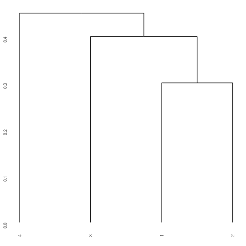
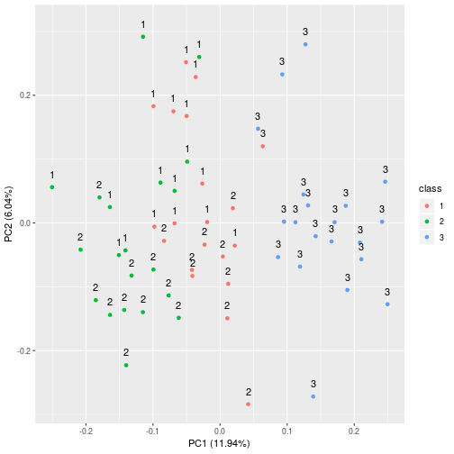

# Conceptual


```r
library(tidyverse)
library(ISLR)
library(ggdendro)
```

## 1) K-Means

*This problem involves the K-means clustering algorithm.*

### a) 

*Prove:*

$$ \frac{1}{\vert C_k \vert} \sum_{i, i' \in C_l} \sum_{j=1}^p ( x_{ij} - x_{i'j} )^2 = 2 \sum_{i \in C_k} \sum_{j=1}^p ( x_{ij} - \bar{x}_{kj} )^2 $$

where

$$ \bar{x}_{kj} = \frac{1}{\vert C_k \vert} \sum_{i \in C_k} x_{ij} $$

### b) 

*On the basis of this identity, argue that the K-means clustering algorithm (Algorithm 10.1) decreases the objective (10.11) at each iteration.*

## 2)

*Suppose that we have four observations, for which we compute a dissimilarity matrix, given by:*

$$ \begin{bmatrix}
 & 0.3 & 0.4 & 0.7 \\\
 0.3 & & 0.5 & 0.8 \\\
 0.4 & 0.5 & & 0.45 \\\
 0.7 & 0.8 & 0.45 & \\\
\end{bmatrix}
$$

To make viewing of the matrix simpler, we remove the top-right corner which is identical to the bottom left.

$$ \begin{bmatrix}
 & & & \\\
 0.3 & & & \\\
 0.4 & 0.5 & & \\\
 0.7 & 0.8 & 0.45 & \\\
\end{bmatrix}
$$

### a) 

*On the basis of this dissimilarity matrix, sketch the dendrogram that results from hierarchically clustering these four observations using complete linkage. Be sure to indicate on the plot the height at which each fusion occurs, as well as the observations corresponding to each leaf in the dendrogram.*

The dissimilarity matrix shows the dissimilarity between to observations - generally done via Euclidean distance. For example:


```r
matrix(1:9, ncol = 3) %>%
    dist() %>%
    as.matrix()
```

```
##          1        2        3
## 1 0.000000 1.732051 3.464102
## 2 1.732051 0.000000 1.732051
## 3 3.464102 1.732051 0.000000
```

With complete linkage we're using maximal intercluster similarity.

* We start with $\{1\}, \{2\}, \{3\}, \{4\}$
* The most similar observations are $1$ and $2$, so we fuse $\{1,2\}$ at 0.3.
* On the next iteration:
    * $\{1,2\}$ to $\{3\}$ is 0.5 (the largest pairwise similarity)
    * $\{1,2\}$ to $\{4\}$ is 0.8 (the largest pairwise similarity)
    * $\{3\}$ $\{4\}$ is 0.45, so we fuse $\{3,4\}$ at 0.45
* We fuse $\{1,2\}$ to $\{3,4\}$ at 0.8


```r
q2_dist_vec <- c(
0,      0.3,    0.4,    0.7,
0.3,    0,      0.5,    0.8,
0.4,    0.5,    0,      0.45,
0.7,    0.8,    0.45,   0
)

matrix(q2_dist_vec, ncol = 4) %>%
    as.dist() %>%
    hclust(method='complete') %>%
    ggdendrogram()
```


### b)

*Repeat a) with single linkage*

With single linkage we use minimal intercluster similarity

* We start with $\{1\}, \{2\}, \{3\}, \{4\}$
* The most similar observations are $1$ and $2$, so we fuse $\{1,2\}$ at 0.3.
* Iteration 2:
    * $\{1,2\}$ to $\{3\}$ is 0.4 
    * $\{1,2\}$ to $\{4\}$ is 0.7 
    * $\{3\}$ $\{4\}$ is 0.45
* We fuse $\{1,2\}$ to $\{3\}$
* We fuse $\{1,2,3\}$ to $\{4\}$ at 0.45


```r
matrix(q2_dist_vec, ncol = 4) %>%
    as.dist() %>%
    hclust(method='single') %>%
    ggdendrogram()
```



### c)

*Suppose that we cut the dendogram obtained in a) such tha two clusters result. Which observations are in each cluster?*

$\{1,2\}$ and $\{3,4\}$

### d)

*Suppose that we cut the dendogram obtained in b) such tha two clusters result. Which observations are in each cluster?*

$\{1,2,3\}$ and $\{4\}$

### e)

*The position of the two clusters being fused can be swapped without changing the meaning of the dendrogram. Draw a dendrogram that is equivalent to the dendrogram in (a), for which two or more of the leaves are repositioned, but for which the meaning of the dendrogram is the same.*

Let's swap the labels around to observe that the denrogram isn't changed in any material way.


```r
matrix(q2_dist_vec, ncol = 4) %>%
    as.dist() %>%
    hclust() %>%
    plot(labels = c(2,1,4,3))
```


## 3)

*In this problem, you will perform K-means clustering manually, with $K = 2$, on a small example with $n = 6$ observations and $p = 2$ features. The observations are as follows:*


```r
(q3_data <- tribble(
    ~obs, ~x1, ~x2,
    1,    1,   4,
    2,    1,   3,
    3,    0,   4,
    4,    5,   1,
    5,    6,   2,
    4,    4,   0
))
```

```
## # A tibble: 6 x 3
##     obs    x1    x2
##   <dbl> <dbl> <dbl>
## 1     1     1     4
## 2     2     1     3
## 3     3     0     4
## 4     4     5     1
## 5     5     6     2
## 6     4     4     0
```

### a)

*Plot the observations.*

The observations are in a 2D plane - I will use ggplot() rather than doing this by hand as it is reasonably trivial.


```r
q3_data %>%
    ggplot(aes(x1, x2)) +
    geom_point()
```


### b)

*Randomly assign a cluster label to each observation.*


```r
set.seed(1)
q3_data %>%
    mutate(cat = base::sample(1:2, 6, replace = T)) -> q3_data

q3_data %>%
    ggplot(aes(x1, x2)) +
    geom_point() +
    geom_text(aes(label = cat), vjust = 1.5)
```


### c)

*Compute the centroid for each cluster.*

The centroid is the mean of each component.


```r
q3_data %>%
    group_by(cat) %>%
    summarise(
        x1_c = mean(x1),
        x2_c = mean(x2)
    ) -> q3_centroids

q3_centroids
```

```
## # A tibble: 2 x 3
##     cat  x1_c  x2_c
##   <int> <dbl> <dbl>
## 1     1  2.67  3   
## 2     2  3     1.67
```

### d)

*Assign each observation to the centroid to which it is closest, in terms of Euclidean distance. Report the cluster labels for each observation.*


```r
q3_data %>%
    mutate(
        c1_dist = sqrt((x1 - q3_centroids[1,]$x1_c)^2 + (x2 - q3_centroids[1,]$x2_c)^2),
        c2_dist = sqrt((x1 - q3_centroids[2,]$x1_c)^2 + (x2 - q3_centroids[2,]$x2_c)^2),
        cat = ifelse(c1_dist <= c2_dist, 1, 2)
    ) -> q3_data

q3_data %>%
    ggplot(aes(x1, x2)) +
    geom_point() +
    geom_text(aes(label = cat), vjust = 1.5)
```



### e)

*Repeat c) and d) until the groups stop changing*

The groups stop chaning after the first iteration.

### f)

*In your plot from (a), color the observations according to the cluster labels obtained.*


```r
set.seed(1)
q3_data %>%
    mutate(orig_cat = base::sample(1:2, 6, replace = T)) %>%
    ggplot(aes(x1, x2)) +
    geom_point(aes(colour = as.factor(orig_cat))) +
    geom_text(aes(label = cat), vjust = 1.5)
```


## 4)

*Suppose that for a particular data set, we perform hierarchical clustering using single linkage and using complete linkage. We obtain two dendrograms.*

### a) 

*At a certain point on the single linkage dendrogram, the clusters $\{1,2,3\}$ and \{4,5\} fuse. On the complete linkage dendrogram, the clusters $\{1, 2, 3\}$ and $\{4, 5\}$ also fuse at a certain point. Which fusion will occur higher on the tree, or will they fuse at the same height, or is there not enough information to tell?*

Complete linkage will use the largest inter-observation distance, and single linkage will use the smallest. If all of the distances are the same then the fusion may be at the same point. Otherwise the complete linkage will always be above the single linkage.

### b)

*At a certain point on the single linkage dendrogram, the clusters $\{5\}$ and $\{6\}$ fuse. On the complete linkage dendrogram, the clusters $\{5\}$ and $\{6\}$ also fuse at a certain point. Which fusion will occur higher on the tree, or will they fuse at the same height, or is there not enough information to tell?*

With single elements, the linkage is irrelevant, so the fusion will occur at the same height.

## 5)

*In words, describe the results that you would expect if you performed K-means clustering of the eight shoppers in Figure 10.14, on the basis of their sock and computer purchases, with K = 2. Give three answers, one for each of the variable scalings displayed. Explain.*


Figure 10.14 shows data from a matrix where the rows are the shoppers and the columns are the items available for purchase. The first shows items purchased, the second scales the items to a SD of 1 and mean of 0, the third uses cost.

If K-means with $K = 2$ was used on these data sets:

* The first data set would cluster on least socks and computers vs most socks and computers.
* The second would cluster on computer purchased vs no computer purchase.
* The third would cluster on those who purchased computers vs those who didn't.

## 6)

*A researcher collects expression measurements for 1,000 genes in 100 tissue samples. The data can be written as a 1,000 × 100 matrix, which we call $\boldsymbol{X}$, in which each row represents a gene and each column a tissue sample. Each tissue sample was processed on a different day, and the columns of $\boldsymbol{X}$ are ordered so that the samples that were processed earliest are on the left, and the samples that were processed later are on the right.*

*The tissue samples belong to two groups: control (C) and treatment (T). The C and T samples were processed in a random order across the days. The researcher wishes to determine whether each gene’s expression measurements differ between the treatment and control groups. As a pre-analysis (before comparing T versus C), the researcher performs a principal component analysis of the data, and finds that the first principal component (a vector of length 100) has a strong linear trend from left to right, and explains 10 % of the variation.*

*The researcher now remembers that each patient sample was run on one of two machines, A and B, and machine A was used more often in the earlier times while B was used more often later. The researcher has a record of which sample was run on which machine.*

### a)

*Explain what it means that the first principal component “explains 10 % of the variation”.*

The matrix $n \times p$ is $1000 \times 100$, this there are are most 100 principal components. The first principal component loading vector is a vector in the feature space along which the data varies the most. In this instance, it contains 10% of the variance, and **doesn't** contain the other 90%.

### b) 
*The researcher decides to replace the $(i, j)$th element of $\boldsymbol{X}$ with:*

$$ x_{ij} - z_{i1}\phi_{j1} $$

*where $z_{i1}$ is the $i$th score, and $\phi_{j1}$ is the $j$th loading, for the first principal component. He will then perform a two-sample t-test on each gene in this new data set in order to determine whether its expression differs between the two conditions. Critique this idea, and suggest a better approach.*

We can consider the the vector as the $p$ dimensional hyperplane that is closest to the observations in terms of average squared Euclidean distance. The first $M$ principal component score vectors and $M$ principal component loading vectors can give a good representation of the data when $M$ is large. When $M = min(n-1, p)$ then the representation is exact, for example:

$$ $x_{1,2} = \sum_{m=1}^M z_{1m} \phi_{2m} $$

The researcher's first formula is therefore determining how far away each of the observations is away from it's first principal component.

The t-test will then determine if there's a significant difference between the means of the two groups.

**At this point I am unsure on how to critique, or a better approach. Looking to answers:**

### c)

*Design and run a small simulation experiment to demonstrate the superiority of your idea.*


```r
gene_expression <- rnorm(1000 * 100) %>%
    matrix(ncol = 100) %>%
    as_tibble(.name_repair = ~map_chr(1:100, ~paste("gene_", .x, sep='')))

set.seed(1)
gene_expression <- gene_expression %>%
    mutate(group = sample(c('C', 'T'), nrow(gene_expression), replace = T))
```

**Unfinished**
