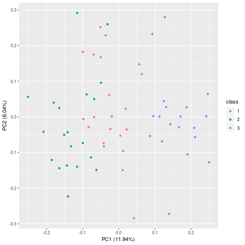
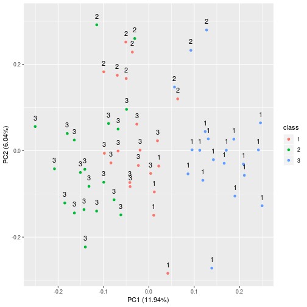
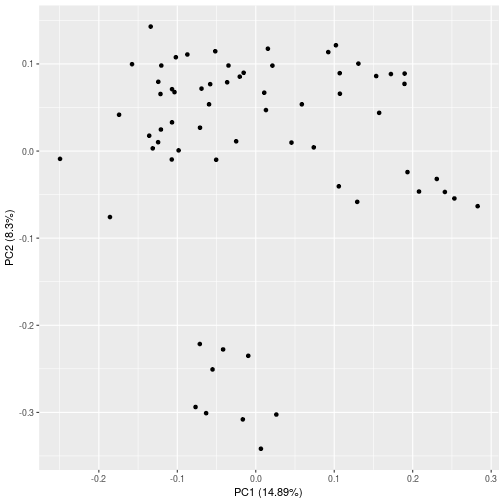
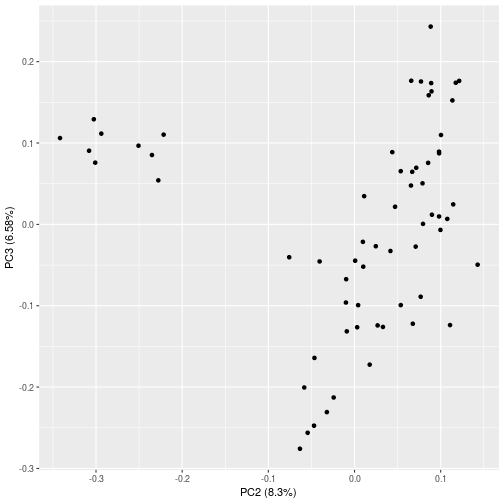
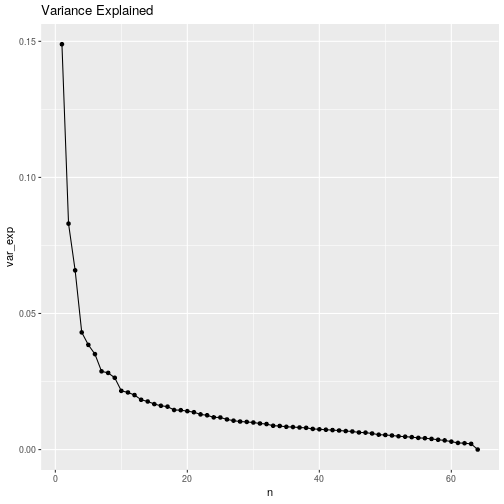
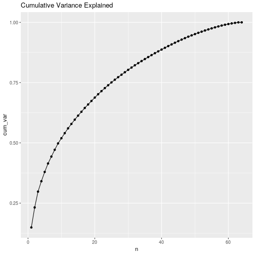
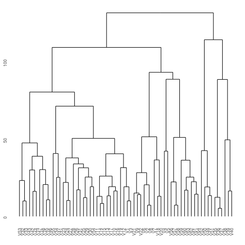

# Chapter 5 - Lab - Cross-validation and the Bootstrap


```r
library(broom)
library(modelr)
library(tidyverse)
library(modelr)
library(ISLR)
library(ggdendro)
library(ggfortify)
```

## 10.4 - Principal Component Analysis

We will perform PCA on the `USArrests` data set. It contains the 50 states in alphabetical order, with the urban population, and the number of assaults, rapes and murders.


```r
(us_arrests <- as_tibble(USArrests, rownames = 'State'))
```

```
## # A tibble: 50 x 5
##    State       Murder Assault UrbanPop  Rape
##    <chr>        <dbl>   <int>    <int> <dbl>
##  1 Alabama       13.2     236       58  21.2
##  2 Alaska        10       263       48  44.5
##  3 Arizona        8.1     294       80  31  
##  4 Arkansas       8.8     190       50  19.5
##  5 California     9       276       91  40.6
##  6 Colorado       7.9     204       78  38.7
##  7 Connecticut    3.3     110       77  11.1
##  8 Delaware       5.9     238       72  15.8
##  9 Florida       15.4     335       80  31.9
## 10 Georgia       17.4     211       60  25.8
## # … with 40 more rows
```

We take a look at the data, specifically the means and the variance for each variable:


```r
us_arrests %>%
    gather(key = 'Key', value = 'Value', c(Murder, Assault, Rape, UrbanPop)) %>%
    group_by(Key) %>%
    summarise(average = mean(Value), variance = var(Value))
```

```
## # A tibble: 4 x 3
##   Key      average variance
##   <chr>      <dbl>    <dbl>
## 1 Assault   171.     6945. 
## 2 Murder      7.79     19.0
## 3 Rape       21.2      87.7
## 4 UrbanPop   65.5     210.
```

The variables have vastly different means and variances, meaning we will need to scale before PCA is performed. If we didn't, most of the principal components would be driver by the `Assault` variable since it has the largest mean and variance.

By default `prcomp()` centers the variables with mean zero. The `scale` argument scales the standard deviations to one.


```r
arrests_pca <- us_arrests %>%
    select(-State) %>%
    prcomp(scale = T)

arrests_pca
```

```
## Standard deviations (1, .., p=4):
## [1] 1.5748783 0.9948694 0.5971291 0.4164494
## 
## Rotation (n x k) = (4 x 4):
##                 PC1        PC2        PC3         PC4
## Murder   -0.5358995  0.4181809 -0.3412327  0.64922780
## Assault  -0.5831836  0.1879856 -0.2681484 -0.74340748
## UrbanPop -0.2781909 -0.8728062 -0.3780158  0.13387773
## Rape     -0.5434321 -0.1673186  0.8177779  0.08902432
```

The rotation matrix provides the principal component loadings - each column is the loading vector for each principal component. It's called the rotation matrix because when we multiply it with $X$ we get the coordinates of the data in the rotated coordinate system.


```r
arrests_pca$rotation
```

```
##                 PC1        PC2        PC3         PC4
## Murder   -0.5358995  0.4181809 -0.3412327  0.64922780
## Assault  -0.5831836  0.1879856 -0.2681484 -0.74340748
## UrbanPop -0.2781909 -0.8728062 -0.3780158  0.13387773
## Rape     -0.5434321 -0.1673186  0.8177779  0.08902432
```

We don't need to multiply these matrices ourselves - the rotated matrix is in `x`:


```r
arrests_pca$x[1:4,]
```

```
##             PC1        PC2         PC3        PC4
## [1,] -0.9756604  1.1220012 -0.43980366  0.1546966
## [2,] -1.9305379  1.0624269  2.01950027 -0.4341755
## [3,] -1.7454429 -0.7384595  0.05423025 -0.8262642
## [4,]  0.1399989  1.1085423  0.11342217 -0.1809736
```

We plot the first two principal components:

```r
arrests_pca %>% biplot(scale = 0)
```


The `prcomp()` function also outputs the standard deviation. From this we can calculate the proportion of variance explained by each principal component.


```r
arrests_pca$sdev^2 / sum(arrests_pca$sdev^2)
```

```
## [1] 0.62006039 0.24744129 0.08914080 0.04335752
```

```r
tibble(
    pc = c('PC1', 'PC2', 'PC3', 'PC4'),
    pve = arrests_pca$sdev^2 / sum(arrests_pca$sdev^2)
) %>%
    ggplot(aes(pc, pve, group = 1)) +
    geom_line() +
    geom_point()
```



## 10.5 - Clustering

### 10.5.1 - K-means clustering

The `kmeans()` function is used to perform K-means clustering. Let's create a random data set where 25 observations have a mean shift.


```r
set.seed(1)
random_data <- tibble(x = rnorm(50), y = rnorm(50))

random_data <- random_data %>%
    mutate(x = x-3, y = y+6) %>%
    sample_n(25) %>%
    full_join(random_data, copy = T)
```

```
## Joining, by = c("x", "y")
```

```r
data_kmeans <- kmeans(random_data, 2, nstart = 20)

random_data %>%
    mutate(group = as.factor(data_kmeans$cluster)) %>%
    ggplot(aes(x,y)) +
    geom_point(aes(colour = group))
```


The cluster assignments are in the `$cluster` variable. We can see that they have been perfectly separated into their groups.

In real life we don't know how many clusters there are - let's try it with 3 groups.


```r
data_kmeans <- kmeans(random_data, 3, nstart = 20)

random_data %>%
    mutate(group = as.factor(data_kmeans$cluster)) %>%
    ggplot(aes(x,y)) +
    geom_point(aes(colour = group))
```


The `nstart` argument to `kmeans()` causes it to run with multiple random group assignments, and the function only reports the best results.

The `$tot.withinss` variable is the total within cluster sum of squares which we're seeking to minimise: 

$$ \text{minimise}_{C_1, \ldots, C_K} \bigg\{ \sum_{k=1}^K W(C_k) \bigg\} $$

### 10.5.2 - Hierarchical Clustering

The `hclust()` function implements hierarchical clustering. We begin by clustering our previous random data observations using complete linkage, and use the `dist()` function to compute the 50x50 inter-observation Euclidean distance matrix.


```r
h_clust_comp <- random_data %>%
    dist() %>%
    hclust(method = 'complete')

h_clust_av <- random_data %>%
    dist() %>%
    hclust(method = 'average')

h_clust_sngle <- random_data %>%
    dist() %>%
    hclust(method = 'single')
```

We use the `ggdendrogram()` function from the `ggdendro` library to render the dendrogram:


```r
ggdendrogram(h_clust_comp) + labs(title = "Complete Linkage")
```


```r
ggdendrogram(h_clust_av) + labs(title = "Average Linkage")
```


```r
ggdendrogram(h_clust_sngle) + labs(title = "Single Linkage")
```


To determine the the cluster labels you can use the `cutree()` function, which determines where on the dendrogam the cut should be made. The `k = ` argument determines the number of groups (like the K in k-means) or the `h = ` argument determines the heigh on the dendrogram. The first argument is `k`.


```r
h_clust_comp %>% cutree(2)
```

```
##  [1] 1 1 1 1 1 1 1 1 1 1 1 1 1 1 1 1 1 1 1 1 1 1 1 1 1 2 2 2 2 2 2 2 2 2 2
## [36] 2 2 2 2 2 2 2 2 2 2 2 2 2 2 2 2 2 2 2 2 2 2 2 2 2 2 2 2 2 2 2 2 2 2 2
## [71] 2 2 2 2 2
```

```r
h_clust_comp %>% cutree(3)
```

```
##  [1] 1 2 2 1 2 1 2 1 2 2 2 2 2 1 2 2 2 2 2 1 2 2 2 2 2 3 3 3 3 3 3 3 3 3 3
## [36] 3 3 3 3 3 3 3 3 3 3 3 3 3 3 3 3 3 3 3 3 3 3 3 3 3 3 3 3 3 3 3 3 3 3 3
## [71] 3 3 3 3 3
```

We should scale the variables before performing the clustering:


```r
random_data %>%
    scale() %>%
    dist() %>%
    hclust() %>%
    ggdendrogram() +
    labs(title = 'Dendrogram with Scaling')
```




### 10.6 - NCI60 Data Example

Unsupervised techniques are often used in the analysis of genomic data. We take a look at the NCI60 cancer cell microarray data. It consists of gene expression measurements on cancer cells.

We perform PCA on the data after scaling the variables, then visualise the first couple of principal components.


```r
nci_data <- NCI60$data
nci_pca <- prcomp(nci_data)
autoplot(nci_pca)
```



```r
autoplot(nci_pca, x = 2, y = 3)
```



We take a look at the proportion of variance explained and the cumulative variance explained via the summary and graph it:


```r
summary(nci_pca)$importance[2,] %>%
    as.tibble() %>%
    mutate(n = row_number()) %>%
    ggplot(aes(n,value)) +
    geom_point() +
    geom_line() +
    labs(title = "Variance Explained")
```

```
## Warning: `as.tibble()` is deprecated, use `as_tibble()` (but mind the new semantics).
## This warning is displayed once per session.
```



```r
summary(nci_pca)$importance[3,] %>%
    as.tibble() %>%
    mutate(n = row_number()) %>%
    ggplot(aes(n,value)) +
    geom_point() +
    geom_line() +
    labs(title = 'Cumulative Variance Explained')
```




### 10.6.2 - Clustering the NCI60 Data

We now look at using hierarchical clustering on the NCI60 data. We first scale the observations to have a mean of 0 and a standard deviation of one.

We then perform clustering with complete linkage, using Euclidian distance as the similarity measure.


```r
nci_scaled <- scale(NCI60$data)
nci_hc <- nci_scaled %>% 
    dist() %>% 
    hclust()

nci_hc %>% ggdendrogram()
```


We then cut the dendrogram at a height that will yield four clusters.


```r
nci_hc %>% 
    cutree(4) -> nci_four_cluster

table( nci_four_cluster, NCI60$labs )
```

```
##                 
## nci_four_cluster BREAST CNS COLON K562A-repro K562B-repro LEUKEMIA
##                1      2   3     2           0           0        0
##                2      3   2     0           0           0        0
##                3      0   0     0           1           1        6
##                4      2   0     5           0           0        0
##                 
## nci_four_cluster MCF7A-repro MCF7D-repro MELANOMA NSCLC OVARIAN PROSTATE
##                1           0           0        8     8       6        2
##                2           0           0        0     1       0        0
##                3           0           0        0     0       0        0
##                4           1           1        0     0       0        0
##                 
## nci_four_cluster RENAL UNKNOWN
##                1     8       1
##                2     1       0
##                3     0       0
##                4     0       0
```

We can see some clear patterns, with `OVARIAN` and `LEUKEMIA` falling in the same category.

Lets compare the K-means clustering against the hierarchical clustering:


```r
nci_kmeans <- NCI60$data %>% kmeans(4, nstart = 20)
nci_kmeans_four_cluster <- nci_kmeans$cluster
table( nci_kmeans_four_cluster, nci_four_cluster )
```

```
##                        nci_four_cluster
## nci_kmeans_four_cluster  1  2  3  4
##                       1 23  7  0  0
##                       2  0  0  8  0
##                       3  8  0  0  9
##                       4  9  0  0  0
```

We see diferences in the clustering allocations.

Rather than perform hierarchical clustering on the entire matrix, we can perform it on the first few principal component scores.


```r
NCI60$data %>%
    prcomp(scale = T) %>%
    .$x %>% .[,1:5] %>%
    dist() %>%
    hclust() -> nci_hc_pca

ggdendrogram(nci_hc_pca)
```



Not surprisingly the results are different. Sometimes performing clustering on the first few principal components can give better results. We might view the PCA step as 'de-noising' the data.


