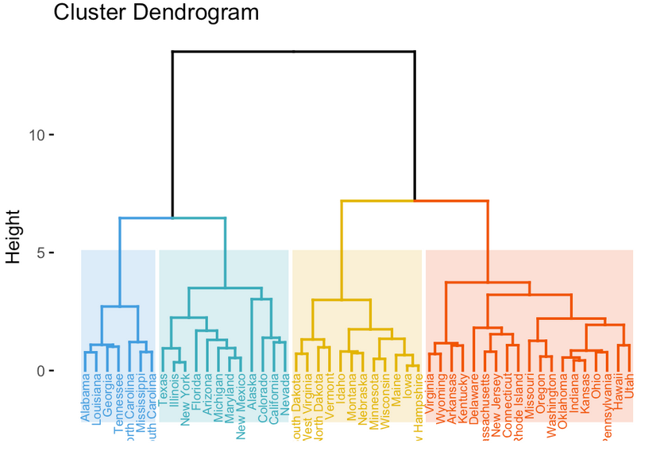

# 10 - Unsupervised Learning

Previous chapters have discussed *supervised learning* such as regression and classification. In this setting we have access to $p$ features measured on $n$ observations, and a response $Y$. The goal is to predict $Y$ based on the observations.

With *unsupervised learning* we only have the observations and features. We're not interested in prediction, rather the goals is to discover interesting things about the measurements.

This chapter focuses on *principal components analysis* and *clustering*.

## 10.1 - The Challenge

Unsupervised learning tends to be challenging as the exercise tends to be more subjective; there are no simple goal for the analysis. 

It can be hard to assess the results as there is no universally accepted mechanism for for performing cross-validation or validating against an independent data set.

Some example use cases:

* Cancer researcher assaying gene expression levels in patients with cancer then look for sub-groups in order to gain a better understanding.
* Online shopping site identifying groups of shoppers with similar browsing and purchase history..
* Search engine choosing what results to display based on click histories.

## 10.2 - Principal Components Analysis

As discussed in chapter 6, PCA allows us to summarise a large set of correlated variables with a small number of small variables that collectively explain most of the variability in the set.

The PCA directions are directions in the feature space along which the data is *highly variable*. These directions also define lines and subspaces that are *as close as possible* to the data cloud.

In supervised learning, the PCA are then used as predictors in the regression model. PCA itself is an unsupervised approach, since it only involves the features and not the response.

### 10.2.1 - What are Principal Components?

Suppose we wish to view $n$ observations of $p$ features $X_1, \ldots, X_p$ as two dimensional scatterplots. However there are ${p}\choose{2}$ scatterplots to look at, and with a large $p$ that is infeasible, and most of them will only contain a small amount of the information.

We would like to find a low-dimension representation of the data that captures as much of the information as possible. PCA provides a tool to do this: it provides a low-dimension representation of the data that contains as much as possible of the variation.

Each of the dimensions found by PCA is a linear combination of the $p$ features.

The **first principal component** of a set of features $X_1, \ldots, X_p$ is the normalised linear combination of the features.

$$ Z = \phi_{11} X_1 + \phi_{21} X_2 + \ldots + \phi_{p1} X_p $$

that has the largents **variance**. Normalisation means $\sum_{j=1}^p \phi^2_{j1} = 1$.

The $\phi$ values are the *loadings* of the first principal component. These loadings make up the first principal component loading vector:

$$ \phi_1 = (\phi_{11} \phi_{21} \ldots \phi_{p1})^T $$

With an $n \times p$ data set $X$, the variables must be centered so that they have a mean of zero. We then look for the linear combination of the sample features of the form:

$$ z_{i1} = \phi_{11} x_{i1} + \phi_{21} x_{i2} + \ldots + \phi_{p1} x_{ip} $$

that has the largest variance. The $z$ are the *scores* of the first principal component.

In terms of a geometric representation, the $\phi$ loading vector defines a direction in feature space along which the data vary the most. If we project the $n$ data points $x_1, \ldots, x_n$ onto this direction, the projected values are the principal component scores $z_{11}, \ldots, z_{n1}$.

After the first principal component has been found, we can find the second principal component $Z_2$. This is the linear combination of $X_1, \ldots, X_p$ that has maximal variance that are *uncorrelated* with $Z_1$.

Constraining $Z_2$ to be uncorrelated with $Z_1$ constrains the direction of $\phi_2$ to be orthogonal to the direction of $\phi_1$.

Once the components have been found ($min(n-1, p)$), they can be plotted against each other to produce low dimensional views of the data. Geometrically this is projecting the original data down onto the subspace spanned by the $\phi$ vectors and plotting the projected points.

### 10.2.2 - Another Interpretation

An alternative interpretation of PCA can be useful: they provide low-domensional surfaces that are *clostest* to the observations.

The first principal component loading vector has a very special property: it is the line in $p$-dimensional space that is closest to the $n$ observations (using average sqaured Euclidean distance as a measure of closeness).

The first two principal components define the plane that is closest to the $n$ observations.

Using this interpretation, the first $M$ principal component score vectors and the first $M$ principal component loading vectors provide the best $M$-dimensional approximation to the $i$th observation $x_{ij}$.

$$ x_{ij} \approx \sum_{m=1}^M z_{im} \phi_{jm} $$

### 10.2.3 - More on PCA

#### Scaling

Before PCA is performed, the variables should be centered to mean zero. The results also depend on wherether the variables have been scaled. This differs to other supervised and unsupervised learning methods. Because it is undesirable to scale arbitrarily, we typically scale to a standard deviation of one.

In certain settings, where the variables may be in the same units, scaling might not be appropriate.

#### Uniqueness of the Principal Components

Each principal component loading vector is unique, up to a sign flip. This means two different software packages will produce the same components, but the sign may be flipped. The same is true for the score vectors.

#### Proportion of Variance Explained

We can project a three-dimensional data set onto a plane defined by the first two principal components to get a two dimensional view of the data. This begs the question: how much information is lost by projecting onto the first few principal components? How much of the variance in the data is not contained in the first few principal components?

We are interested in knowing the *proportion of variance explained* by each principal component. The total variance is:

$$ \sum_{j=1}^p Var(X_j) = \sum_{j=1}^p \frac{1}{n} \sum_{i=1}^n x^2_{ij} $$

and the variance explained by the $m$th principal component is:

$$ \frac{1}{n} \sum_{i=1}^n z^2_{im} = \frac{1}{n} \sum_{i=1}^n \bigg( \sum_{j=1}^p \phi_{jm} x_{ij} \bigg ) $$

The PVE is the variance explained divided by the total variance of the data set - i.e. dividing the second formula above by the first one.

The PVE is a positive quantity, so to compute the cumlulative variance explained we can sum over the first $M$ PVEs. In total there are $min(n-1,p)$ principal components, their PVEs sum to one.

#### Deciding How Many Principal Components to Use

There is no single or simple answer. A scree plot (x = principal components, y = proportion of variance explained) can be used, a you can look for the 'elbow'. This is inherently ad-hoc and subjective.

### 10.2.4 - Other Uses

Many statistical techniques, including regression, clustering, and classification can use the $n \times M$ matrix whose columns are the first $M \ll p$ principal component score vectors.

This can lead to less *noisy* results since it is often the case that the signal in a data set is concentrated in the first few principal components.

## 10.3 - Clustering Methods

*Clustering* refers to a broad set of techniques for finding *subgroups* or *clusters* within data. To do this we must define what makes two different observations different. This is a domain specific consideration.

### 10.3.1 - K-Means Clustering

K-means is a simple and elegant approach for partitioning a data set into $K$ distinct, non-overlapping clusters.

We let $C_1, \ldots, C_K$ denote sets containing the indicies of the observations in each cluster. These sets satisfy two properties:

$$ C_1 \cup C_2 \cup \ldots \cup C_K = \{1, \ldots, n\} \text{ - each observation belongs to at least one of the $K$ clusters} $$

$$ C_k \cap C_{k'} = \emptyset \text{ for all } k \ne k' \text{ - the clusters are non-overlapping} $$

Good clustering is when the in-cluster variation is as small as possible. The within cluster variation for cluster $C_k$ is a measure $W(C_k)$. The problem to solve is therefore:

$$ \text{minimise}_{C_1, \ldots, C_K} \bigg\{ \sum_{k=1}^K W(C_k) \bigg\} $$

The most common choice of $W()$ is squared Euclidean distance. The within cluster variation for the $k$th cluster is the sum of all the pairwise distances between the observations in the $k$th cluster, divided by the total number of observations.

The issue is that the number of ways to partition $n$ observations into $K$ clusters is $K^n$, which is generally going to be large.

K-means uses a *local optimum* to provide a reasmonable and tractable solution.

1. Randomly assign a number from 1 to $K$ to each of the observations.
2. Iterate undtil the cluster assignments stop changing:
    * For each of the $K$ clusters, compute the cluster *centroid*. This is the vector of the $p$ feature means for the observations in the $k$th cluster.
    * Assign each observation to the cluster whose centroid is closest.

The algorithm depends on the initial, random cluster assignments. Thus it is important to run the algorithm multiple times.

To perform K-means, we must select $K$, which can be a difficult task.

### 10.3.2 - Hierarchical Clustering

Hierarchical clustering is an alternative approach which does not require us to specify $K$. This section looks at *bottom-up* or *agglomerative* clustering.

#### Interpreting a Dendrogram

Each leaf of the dendrogram represents one observation. As we move up the tree, these observations begin to fuse, which correspond to observations that are similar to each other. For any two observations, we can look for the point in the tree where their branches first fused. The height of this fusion indicates how different the observations are.

An important point is that you can only draw conclusions about similarity based on the *fusion* point on the vertical axis. The horizontal axis is irrelevant.

To identify clusters, horizontal cuts are made across the dendrogram. The distinct sets below the line are the clusters. Further cuts can be made to obtain any number of clusters. The height of the cuts servers the same role as the $K$ in K-means clustering.

The term *hierarchical* refers to the fact that the clusters obtained by cutting the dendrogram are nested within the clusters obtained by cutting at any greater height. However on an arbitrary data set, the assumptions of a hierarchy may be unrealistic - i.e. consider people in two clusters split by gender, but split into three by nationality. Nationality is not a subset of gender. Due to situations like this. hierarchical clustering can lead to *worse* results than K-means.

#### The Hierarchical Clustering Algorithm

* We define a *dissimilarity measure* between each pair of observations (i.e. Euclidean distance). 
* Each of the $n$ observations is treated as its own cluster. 
* The two observations that are most similar are fused.
    * The dissimilarity between the clusters indicates the heigh on the dendrogram where the fusion occurs.
    * There are now $n-1$ clusters.
* The process repeats until all of the observations belong to a single cluster.

How is cluster $\{5, 7\}$ compared to $\{8\}$? The concept of dissimilarity needs to be extended to groups of observations.

This is achieved with the concept of *linkage*. There are four common types of linkage:

* **Complete** - Maximial intercluster dissimilarity. Compute all pairwise dissimilarities and record the *largest*.
* **Single** - Minimal intercluster dissimilarity. Compute all pairwise dissimilarities and record the *smallest*.
* **Average** - Mean intercluster dissimilarity.
* **Centroid** - Dissimilarity between the *centroids* of the two clusters.
    * Recall centroid is a mean vector of length $p$.
    * Can lead to undesirable inversions - two clusters fused at a heigh *below* either of the individual clusters.

#### Choice of Dissimilarity Measure

We have discussed Euclidean distance, but other measures may be preferred, for example correlation between the features. Careful consideration should be taken with regard to the data and the scientific question at hand.

One should also consider whether the variables should be scaled to have a standard deviation of one. This could be because of their frequency (e.g. how often something is purchased skewing the dissimilarity) or because their are measured in different scales.

#### Practical Considerations

##### Small Decisions / Big Consequences

* Should the observations be standardised in some way?
* With hierarchical clustering:
    * What dissimilarity measure should be used?
    * What type of linkage should be used?
    * Where should we cut the dendrogram in order to obtain clusters?
* In the case of K-means, how many clusters should we look for in the data?

##### Validating Clusters Obtained

We will always find clusters, but are they true sub-groups, or are we clustering the noise? There is no consensus on a single best approach.

##### Other Considerations

Both K-means and hierarchical clustering will assign observations into a cluster. Sometimes this is not appropriate. Consider some observations that are quite different from each other and from all other observations. Since the methods will assign every observation to a cluster, the clusters may be heavily distorted.

Mixture models are an attractive approach - they amount to a *soft* version of K-means.

Clustering methods are also not very robust to perterbations in the data. Consider clustering on $n$ observations, then removing 10% randomly. You would hope that the clusters are similar, but often they are not.

#### A Tempered Approach to Interpretation

Small changes (as described in 'Small Decisions / Big Consequences')can have big effects, so the key is to try different values and looking and the full set of results.
