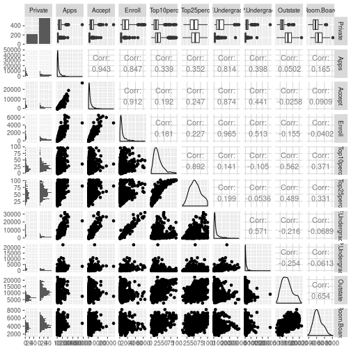
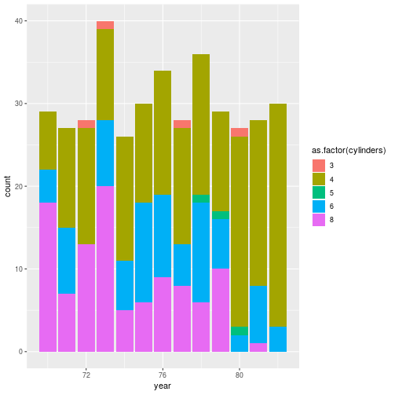

# Chapter 2 - Applied

# 9

## a)

Load in the college data frame - we convert it to a tibble.
    

```r
library(ISLR)
library(tidyverse)

college <- as_tibble(College)
```

## c) - College Data

### i)


```r
summary(college)
```

```
##  Private        Apps           Accept          Enroll       Top10perc    
##  No :212   Min.   :   81   Min.   :   72   Min.   :  35   Min.   : 1.00  
##  Yes:565   1st Qu.:  776   1st Qu.:  604   1st Qu.: 242   1st Qu.:15.00  
##            Median : 1558   Median : 1110   Median : 434   Median :23.00  
##            Mean   : 3002   Mean   : 2019   Mean   : 780   Mean   :27.56  
##            3rd Qu.: 3624   3rd Qu.: 2424   3rd Qu.: 902   3rd Qu.:35.00  
##            Max.   :48094   Max.   :26330   Max.   :6392   Max.   :96.00  
##    Top25perc      F.Undergrad     P.Undergrad         Outstate    
##  Min.   :  9.0   Min.   :  139   Min.   :    1.0   Min.   : 2340  
##  1st Qu.: 41.0   1st Qu.:  992   1st Qu.:   95.0   1st Qu.: 7320  
##  Median : 54.0   Median : 1707   Median :  353.0   Median : 9990  
##  Mean   : 55.8   Mean   : 3700   Mean   :  855.3   Mean   :10441  
##  3rd Qu.: 69.0   3rd Qu.: 4005   3rd Qu.:  967.0   3rd Qu.:12925  
##  Max.   :100.0   Max.   :31643   Max.   :21836.0   Max.   :21700  
##    Room.Board       Books           Personal         PhD        
##  Min.   :1780   Min.   :  96.0   Min.   : 250   Min.   :  8.00  
##  1st Qu.:3597   1st Qu.: 470.0   1st Qu.: 850   1st Qu.: 62.00  
##  Median :4200   Median : 500.0   Median :1200   Median : 75.00  
##  Mean   :4358   Mean   : 549.4   Mean   :1341   Mean   : 72.66  
##  3rd Qu.:5050   3rd Qu.: 600.0   3rd Qu.:1700   3rd Qu.: 85.00  
##  Max.   :8124   Max.   :2340.0   Max.   :6800   Max.   :103.00  
##     Terminal       S.F.Ratio      perc.alumni        Expend     
##  Min.   : 24.0   Min.   : 2.50   Min.   : 0.00   Min.   : 3186  
##  1st Qu.: 71.0   1st Qu.:11.50   1st Qu.:13.00   1st Qu.: 6751  
##  Median : 82.0   Median :13.60   Median :21.00   Median : 8377  
##  Mean   : 79.7   Mean   :14.09   Mean   :22.74   Mean   : 9660  
##  3rd Qu.: 92.0   3rd Qu.:16.50   3rd Qu.:31.00   3rd Qu.:10830  
##  Max.   :100.0   Max.   :39.80   Max.   :64.00   Max.   :56233  
##    Grad.Rate     
##  Min.   : 10.00  
##  1st Qu.: 53.00  
##  Median : 65.00  
##  Mean   : 65.46  
##  3rd Qu.: 78.00  
##  Max.   :118.00
```

### ii)

Create a scatterplot matrix of the first ten variables.	


```r
	library(GGally)
	college %>% ggpairs(columns = 1:10)
```

```
## 
 plot: [1,1] [---------------------------------------------]  1% est: 0s 
 plot: [1,2] [>--------------------------------------------]  2% est:20s 
 plot: [1,3] [>--------------------------------------------]  3% est:22s 
 plot: [1,4] [=>-------------------------------------------]  4% est:19s 
 plot: [1,5] [=>-------------------------------------------]  5% est:18s 
 plot: [1,6] [==>------------------------------------------]  6% est:16s 
 plot: [1,7] [==>------------------------------------------]  7% est:14s 
 plot: [1,8] [===>-----------------------------------------]  8% est:13s 
 plot: [1,9] [===>-----------------------------------------]  9% est:12s 
 plot: [1,10] [===>----------------------------------------] 10% est:11s 
 plot: [2,1] [====>----------------------------------------] 11% est:11s `stat_bin()` using `bins = 30`. Pick better value with `binwidth`.
## 
 plot: [2,2] [====>----------------------------------------] 12% est:12s 
 plot: [2,3] [=====>---------------------------------------] 13% est:11s 
 plot: [2,4] [=====>---------------------------------------] 14% est:10s 
 plot: [2,5] [======>--------------------------------------] 15% est:10s 
 plot: [2,6] [======>--------------------------------------] 16% est:10s 
 plot: [2,7] [=======>-------------------------------------] 17% est: 9s 
 plot: [2,8] [=======>-------------------------------------] 18% est: 9s 
 plot: [2,9] [========>------------------------------------] 19% est: 9s 
 plot: [2,10] [========>-----------------------------------] 20% est: 8s 
 plot: [3,1] [========>------------------------------------] 21% est: 8s `stat_bin()` using `bins = 30`. Pick better value with `binwidth`.
## 
 plot: [3,2] [=========>-----------------------------------] 22% est: 8s 
 plot: [3,3] [=========>-----------------------------------] 23% est: 8s 
 plot: [3,4] [==========>----------------------------------] 24% est: 8s 
 plot: [3,5] [==========>----------------------------------] 25% est: 7s 
 plot: [3,6] [===========>---------------------------------] 26% est: 7s 
 plot: [3,7] [===========>---------------------------------] 27% est: 7s 
 plot: [3,8] [============>--------------------------------] 28% est: 7s 
 plot: [3,9] [============>--------------------------------] 29% est: 7s 
 plot: [3,10] [============>-------------------------------] 30% est: 6s 
 plot: [4,1] [=============>-------------------------------] 31% est: 6s `stat_bin()` using `bins = 30`. Pick better value with `binwidth`.
## 
 plot: [4,2] [=============>-------------------------------] 32% est: 6s 
 plot: [4,3] [==============>------------------------------] 33% est: 6s 
 plot: [4,4] [==============>------------------------------] 34% est: 6s 
 plot: [4,5] [===============>-----------------------------] 35% est: 6s 
 plot: [4,6] [===============>-----------------------------] 36% est: 5s 
 plot: [4,7] [================>----------------------------] 37% est: 5s 
 plot: [4,8] [================>----------------------------] 38% est: 5s 
 plot: [4,9] [=================>---------------------------] 39% est: 5s 
 plot: [4,10] [=================>--------------------------] 40% est: 5s 
 plot: [5,1] [=================>---------------------------] 41% est: 5s `stat_bin()` using `bins = 30`. Pick better value with `binwidth`.
## 
 plot: [5,2] [==================>--------------------------] 42% est: 5s 
 plot: [5,3] [==================>--------------------------] 43% est: 5s 
 plot: [5,4] [===================>-------------------------] 44% est: 5s 
 plot: [5,5] [===================>-------------------------] 45% est: 4s 
 plot: [5,6] [====================>------------------------] 46% est: 4s 
 plot: [5,7] [====================>------------------------] 47% est: 4s 
 plot: [5,8] [=====================>-----------------------] 48% est: 4s 
 plot: [5,9] [=====================>-----------------------] 49% est: 4s 
 plot: [5,10] [=====================>----------------------] 50% est: 4s 
 plot: [6,1] [======================>----------------------] 51% est: 4s `stat_bin()` using `bins = 30`. Pick better value with `binwidth`.
## 
 plot: [6,2] [======================>----------------------] 52% est: 4s 
 plot: [6,3] [=======================>---------------------] 53% est: 4s 
 plot: [6,4] [=======================>---------------------] 54% est: 4s 
 plot: [6,5] [========================>--------------------] 55% est: 3s 
 plot: [6,6] [========================>--------------------] 56% est: 3s 
 plot: [6,7] [=========================>-------------------] 57% est: 3s 
 plot: [6,8] [=========================>-------------------] 58% est: 3s 
 plot: [6,9] [==========================>------------------] 59% est: 3s 
 plot: [6,10] [=========================>------------------] 60% est: 3s 
 plot: [7,1] [==========================>------------------] 61% est: 3s `stat_bin()` using `bins = 30`. Pick better value with `binwidth`.
## 
 plot: [7,2] [===========================>-----------------] 62% est: 3s 
 plot: [7,3] [===========================>-----------------] 63% est: 3s 
 plot: [7,4] [============================>----------------] 64% est: 3s 
 plot: [7,5] [============================>----------------] 65% est: 3s 
 plot: [7,6] [=============================>---------------] 66% est: 3s 
 plot: [7,7] [=============================>---------------] 67% est: 2s 
 plot: [7,8] [==============================>--------------] 68% est: 2s 
 plot: [7,9] [==============================>--------------] 69% est: 2s 
 plot: [7,10] [==============================>-------------] 70% est: 2s 
 plot: [8,1] [===============================>-------------] 71% est: 2s `stat_bin()` using `bins = 30`. Pick better value with `binwidth`.
## 
 plot: [8,2] [===============================>-------------] 72% est: 2s 
 plot: [8,3] [================================>------------] 73% est: 2s 
 plot: [8,4] [================================>------------] 74% est: 2s 
 plot: [8,5] [=================================>-----------] 75% est: 2s 
 plot: [8,6] [=================================>-----------] 76% est: 2s 
 plot: [8,7] [==================================>----------] 77% est: 2s 
 plot: [8,8] [==================================>----------] 78% est: 2s 
 plot: [8,9] [===================================>---------] 79% est: 2s 
 plot: [8,10] [==================================>---------] 80% est: 1s 
 plot: [9,1] [===================================>---------] 81% est: 1s `stat_bin()` using `bins = 30`. Pick better value with `binwidth`.
## 
 plot: [9,2] [====================================>--------] 82% est: 1s 
 plot: [9,3] [====================================>--------] 83% est: 1s 
 plot: [9,4] [=====================================>-------] 84% est: 1s 
 plot: [9,5] [=====================================>-------] 85% est: 1s 
 plot: [9,6] [======================================>------] 86% est: 1s 
 plot: [9,7] [======================================>------] 87% est: 1s 
 plot: [9,8] [=======================================>-----] 88% est: 1s 
 plot: [9,9] [=======================================>-----] 89% est: 1s 
 plot: [9,10] [=======================================>----] 90% est: 1s 
 plot: [10,1] [=======================================>----] 91% est: 1s `stat_bin()` using `bins = 30`. Pick better value with `binwidth`.
## 
 plot: [10,2] [=======================================>----] 92% est: 1s 
 plot: [10,3] [========================================>---] 93% est: 1s 
 plot: [10,4] [========================================>---] 94% est: 0s 
 plot: [10,5] [=========================================>--] 95% est: 0s 
 plot: [10,6] [=========================================>--] 96% est: 0s 
 plot: [10,7] [==========================================>-] 97% est: 0s 
 plot: [10,8] [==========================================>-] 98% est: 0s 
 plot: [10,9] [===========================================>] 99% est: 0s 
 plot: [10,10] [===========================================]100% est: 0s 
                                                                         
```



### iii)

Create a boxplot of *Outstate* versus *Private*


```r
    college %>% ggplot + geom_boxplot(aes(Private, Outstate))
```


### iv)
Create a new variable *Elite* by binning the *Top10perc* variable. We divide universities into two groups depending on whether or not the proportion of students coming from the top 10% of their high schools exceeds 10%.


```r
	college %>% mutate(Elite = factor(ifelse(Top10perc > 50, "Yes", "No)))
```

```
## Error: <text>:1:73: unexpected INCOMPLETE_STRING
## 1:         college %>% mutate(Elite = factor(ifelse(Top10perc > 50, "Yes", "No)))
##                                                                             ^
```
We now get a summary of the *Elite* 	

	summary(college['Elite'])
	Elite    
 	No :699  
 	Yes: 78

### v)

Create some histograms with differing bins for the quantitative variables:

* The amount of enrollments in bin widths of 100

	college %>% ggplot + geom_histogram(aes(Enroll), binwidth = 100)


* The number of PhD students in bin widths of 1

	college %>% ggplot + geom_histogram(aes(PhD), binwidth = 1)


# 9 - Auto data

###	a) Which predictors are quantative and which are qualitative?

 **Quantitative** - mpg, displacement, horsepower, weight, acceleration.
 **Qualitative** - cylinders, year, origin, name.

### b) What is the range of each quantitative predictor?

	> range(auto['mpg'])
	[1]  9.0 46.6
	> range(auto['displacement'])
	[1]  68 455
	> range(auto['horsepower'])
	[1]  46 230
	> range(auto['weight'])
	[1] 1613 5140
	> range(auto['acceleration'])
	[1]  8.0 24.8

### c) What is the mean and standard deviation for each quantitative predictor?

	> auto %>% select(-cylinders, -year, -origin, -name) %>% summarise_all(mean)
	# A tibble: 1 x 5
	    mpg displacement horsepower weight acceleration
	  <dbl>        <dbl>      <dbl>  <dbl>        <dbl>
	1  23.4         194.       104.  2978.         15.5

	> auto %>% select(-cylinders, -year, -origin, -name) %>% summarise_all(sd)
	# A tibble: 1 x 5
	    mpg displacement horsepower weight acceleration
	  <dbl>        <dbl>      <dbl>  <dbl>        <dbl>
	1  7.81         105.       38.5   849.         2.76

### d) Remove the 10th to 85th observations. What is the range, mean and standard deviation of each predictor?

	> auto[-c(10:85),] %>% select(-cylinders, -year, -origin, -name) %>% summarise_all(mean)
	# A tibble: 1 x 5
	    mpg displacement horsepower weight acceleration
	  <dbl>        <dbl>      <dbl>  <dbl>        <dbl>
	1  24.4         187.       101.  2936.         15.7

	> auto[-c(10:85),] %>% select(-cylinders, -year, -origin, -name) %>% summarise_all(sd)
	# A tibble: 1 x 5
	    mpg displacement horsepower weight acceleration
	  <dbl>        <dbl>      <dbl>  <dbl>        <dbl>
	1  7.87         99.7       35.7   811.         2.69


### e) Some graphical representations

Relationship between the miles per gallon and the horsepower, with the colour of the points representing the number of cylinders.

	auto %>% ggplot + geom_point(aes(horsepower, mpg, colour = as.factor(cylinders)))


How many cars were produced per year, with colours representing the proportion of cylinders.

	auto %>% ggplot + geom_bar(aes(year, fill = as.factor(cylinders)))



### f) What variables appear to be useful in predicting mpg?

Using `ggpairs` we can see a relationship between *mpg* and *displacement*, *horsepower* and *weight*.
	

# 10 - Boston Data Set


