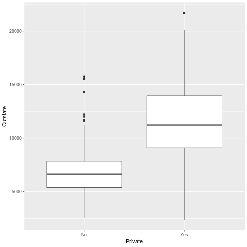
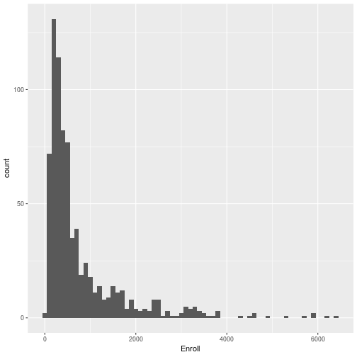
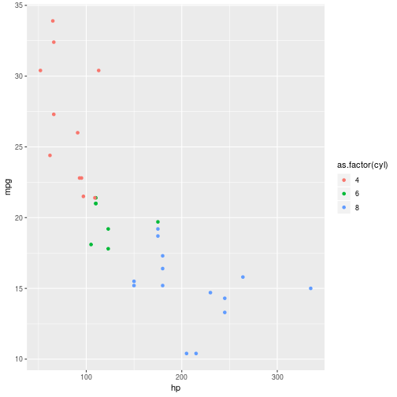

# Chapter 2 - Applied

# 9

## a)

Load in the college data frame - we convert it to a tibble.
    

```r
library(ISLR)
library(tidyverse)

college <- as_tibble(College)
```

## c) - College Data

### i)


```r
summary(college)
```

```
##  Private        Apps           Accept          Enroll       Top10perc    
##  No :212   Min.   :   81   Min.   :   72   Min.   :  35   Min.   : 1.00  
##  Yes:565   1st Qu.:  776   1st Qu.:  604   1st Qu.: 242   1st Qu.:15.00  
##            Median : 1558   Median : 1110   Median : 434   Median :23.00  
##            Mean   : 3002   Mean   : 2019   Mean   : 780   Mean   :27.56  
##            3rd Qu.: 3624   3rd Qu.: 2424   3rd Qu.: 902   3rd Qu.:35.00  
##            Max.   :48094   Max.   :26330   Max.   :6392   Max.   :96.00  
##    Top25perc      F.Undergrad     P.Undergrad         Outstate    
##  Min.   :  9.0   Min.   :  139   Min.   :    1.0   Min.   : 2340  
##  1st Qu.: 41.0   1st Qu.:  992   1st Qu.:   95.0   1st Qu.: 7320  
##  Median : 54.0   Median : 1707   Median :  353.0   Median : 9990  
##  Mean   : 55.8   Mean   : 3700   Mean   :  855.3   Mean   :10441  
##  3rd Qu.: 69.0   3rd Qu.: 4005   3rd Qu.:  967.0   3rd Qu.:12925  
##  Max.   :100.0   Max.   :31643   Max.   :21836.0   Max.   :21700  
##    Room.Board       Books           Personal         PhD        
##  Min.   :1780   Min.   :  96.0   Min.   : 250   Min.   :  8.00  
##  1st Qu.:3597   1st Qu.: 470.0   1st Qu.: 850   1st Qu.: 62.00  
##  Median :4200   Median : 500.0   Median :1200   Median : 75.00  
##  Mean   :4358   Mean   : 549.4   Mean   :1341   Mean   : 72.66  
##  3rd Qu.:5050   3rd Qu.: 600.0   3rd Qu.:1700   3rd Qu.: 85.00  
##  Max.   :8124   Max.   :2340.0   Max.   :6800   Max.   :103.00  
##     Terminal       S.F.Ratio      perc.alumni        Expend     
##  Min.   : 24.0   Min.   : 2.50   Min.   : 0.00   Min.   : 3186  
##  1st Qu.: 71.0   1st Qu.:11.50   1st Qu.:13.00   1st Qu.: 6751  
##  Median : 82.0   Median :13.60   Median :21.00   Median : 8377  
##  Mean   : 79.7   Mean   :14.09   Mean   :22.74   Mean   : 9660  
##  3rd Qu.: 92.0   3rd Qu.:16.50   3rd Qu.:31.00   3rd Qu.:10830  
##  Max.   :100.0   Max.   :39.80   Max.   :64.00   Max.   :56233  
##    Grad.Rate     
##  Min.   : 10.00  
##  1st Qu.: 53.00  
##  Median : 65.00  
##  Mean   : 65.46  
##  3rd Qu.: 78.00  
##  Max.   :118.00
```

### ii)

Create a scatterplot matrix of the first ten variables.	


```r
	library(GGally)
```

```
## Error in library(GGally): there is no package called 'GGally'
```

```r
	college %>% ggpairs(columns = 1:10)
```

```
## Error in ggpairs(., columns = 1:10): could not find function "ggpairs"
```

### iii)

Create a boxplot of *Outstate* versus *Private*


```r
opts_knit$set(base.uri='/')
college %>% ggplot + geom_boxplot(aes(Private, Outstate))
```



### iv)
Create a new variable *Elite* by binning the *Top10perc* variable. We divide universities into two groups depending on whether or not the proportion of students coming from the top 10% of their high schools exceeds 10%.


```r
college %>% mutate(Elite = factor(ifelse(Top10perc > 50, "Yes", "No")))
```

```
## # A tibble: 777 x 19
##    Private  Apps Accept Enroll Top10perc Top25perc F.Undergrad P.Undergrad
##    <fct>   <dbl>  <dbl>  <dbl>     <dbl>     <dbl>       <dbl>       <dbl>
##  1 Yes      1660   1232    721        23        52        2885         537
##  2 Yes      2186   1924    512        16        29        2683        1227
##  3 Yes      1428   1097    336        22        50        1036          99
##  4 Yes       417    349    137        60        89         510          63
##  5 Yes       193    146     55        16        44         249         869
##  6 Yes       587    479    158        38        62         678          41
##  7 Yes       353    340    103        17        45         416         230
##  8 Yes      1899   1720    489        37        68        1594          32
##  9 Yes      1038    839    227        30        63         973         306
## 10 Yes       582    498    172        21        44         799          78
## # … with 767 more rows, and 11 more variables: Outstate <dbl>,
## #   Room.Board <dbl>, Books <dbl>, Personal <dbl>, PhD <dbl>,
## #   Terminal <dbl>, S.F.Ratio <dbl>, perc.alumni <dbl>, Expend <dbl>,
## #   Grad.Rate <dbl>, Elite <fct>
```
We now get a summary of the *Elite* 	


```r
summary(college['Elite'])
```

```
## Can't find column `Elite` in `.data`.
```

### v)

Create some histograms with differing bins for the quantitative variables:

* The amount of enrollments in bin widths of 100


```r
	college %>% ggplot + geom_histogram(aes(Enroll), binwidth = 100)
```



* The number of PhD students in bin widths of 1


```r
college %>% ggplot + geom_histogram(aes(PhD), binwidth = 1)
```


# 9 - Auto data

###	a) Which predictors are quantative and which are qualitative?

 **Quantitative** - mpg, displacement, horsepower, weight, acceleration.
 **Qualitative** - cylinders, year, origin, name.

### b) What is the range of each quantitative predictor?


```r
auto <- as.tibble(mtcars)
```

```
## Warning: `as.tibble()` is deprecated, use `as_tibble()` (but mind the new semantics).
## This warning is displayed once per session.
```

```r
auto %>% summarise_at(vars(mpg, disp, hp, wt), funs(min, max))
```

```
## Warning: funs() is soft deprecated as of dplyr 0.8.0
## please use list() instead
## 
## # Before:
## funs(name = f(.)
## 
## # After: 
## list(name = ~f(.))
## This warning is displayed once per session.
```

```
## # A tibble: 1 x 8
##   mpg_min disp_min hp_min wt_min mpg_max disp_max hp_max wt_max
##     <dbl>    <dbl>  <dbl>  <dbl>   <dbl>    <dbl>  <dbl>  <dbl>
## 1    10.4     71.1     52   1.51    33.9      472    335   5.42
```

### c) What is the mean and standard deviation for each quantitative predictor?


```r
auto %>% summarise_at(vars(mpg, disp, hp, wt), funs(mean, sd))
```

```
## # A tibble: 1 x 8
##   mpg_mean disp_mean hp_mean wt_mean mpg_sd disp_sd hp_sd wt_sd
##      <dbl>     <dbl>   <dbl>   <dbl>  <dbl>   <dbl> <dbl> <dbl>
## 1     20.1      231.    147.    3.22   6.03    124.  68.6 0.978
```

### d) Remove the 10th to 85th observations. What is the range, mean and standard deviation of each predictor?


```r
auto[-c(10:85),] %>% summarise_at(vars(mpg, disp, hp, wt), funs(mean, sd))
```

```
## # A tibble: 1 x 8
##   mpg_mean disp_mean hp_mean wt_mean mpg_sd disp_sd hp_sd wt_sd
##      <dbl>     <dbl>   <dbl>   <dbl>  <dbl>   <dbl> <dbl> <dbl>
## 1     20.5      213.    123.    3.09   3.05    94.6  54.6 0.415
```

### e) Some graphical representations

Relationship between the miles per gallon and the horsepower, with the colour of the points representing the number of cylinders.


```r
auto %>% ggplot + geom_point(aes(hp, mpg, colour = as.factor(cyl)))
```



### f) What variables appear to be useful in predicting mpg?

Using `ggpairs` we can see a relationship between *mpg* and *disp*, *hp* and *wt*.
	


