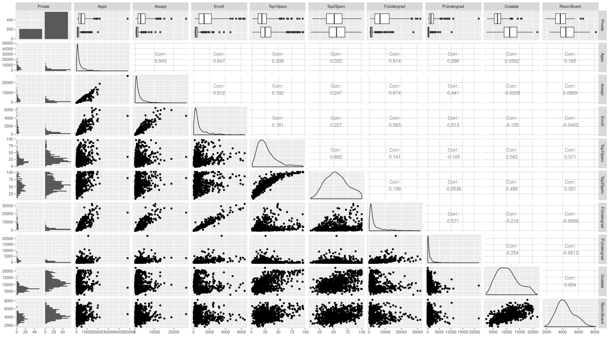
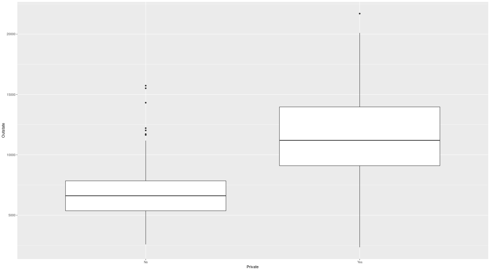
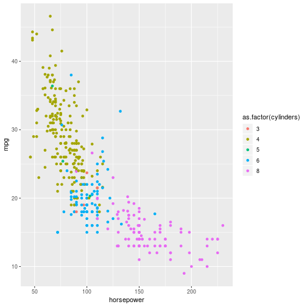

# Chapter 2 - Applied

## a)

Load in the college data frame - we convert it to a tibble.

    library(ISLR)
    library(tidyverse)

    college <- as_tibble(College)

## c) - College Data

### i)

Getting a summary:
    summary(college)

    Private        Apps           Accept          Enroll       Top10perc    
    No :212   Min.   :   81   Min.   :   72   Min.   :  35   Min.   : 1.00  
 	Yes:565   1st Qu.:  776   1st Qu.:  604   1st Qu.: 242   1st Qu.:15.00  
        	  Median : 1558   Median : 1110   Median : 434   Median :23.00  
        	  Mean   : 3002   Mean   : 2019   Mean   : 780   Mean   :27.56  
        	  3rd Qu.: 3624   3rd Qu.: 2424   3rd Qu.: 902   3rd Qu.:35.00  
        	  Max.   :48094   Max.   :26330   Max.   :6392   Max.   :96.00  

### ii)

Create a scatterplot matrix of the first ten variables.	

	library(ggally)
	college %>% ggpairs(columns = 1:10)

### iii)

Create a boxplot of *Outstate* versus *Private*

    college %>% ggplot + geom_boxplot(aes(Private, Outstate))

### iv)
Create a new variable *Elite* by binning the *Top10perc* variable. We divide universities into two groups depending on whether or not the proportion of students coming from the top 10% of their high schools exceeds 10%.

	college %>% mutate(Elite = factor(ifelse(Top10perc > 50, "Yes", "No)))

We now get a summary of the *Elite* 	

	summary(college['Elite'])
	Elite    
 	No :699  
 	Yes: 78

### v)

Create some histograms with differing bins for the quantitative variables:

* The amount of enrollments in bin widths of 100

	college %>% ggplot + geom_histogram(aes(Enroll), binwidth = 100)

* The number of PhD students in bin widths of 1

	college %>% ggplot + geom_histogram(aes(PhD), binwidth = 1)

## d) - Auto data

###	a) Which predictors are quantative and which are qualitative?

	* **Quantitative** - mpg, displacement, horsepower, weight, acceleration.
	* **Qualitative** - cylinders, year, origin, name.

### b) What is the range of each quantitative predictor?

	> range(auto['mpg'])
	[1]  9.0 46.6
	> range(auto['displacement'])
	[1]  68 455
	> range(auto['horsepower'])
	[1]  46 230
	> range(auto['weight'])
	[1] 1613 5140
	> range(auto['acceleration'])
	[1]  8.0 24.8

### c) What is the mean and standard deviation for each quantitative predictor?

	> auto %>% select(-cylinders, -year, -origin, -name) %>% summarise_all(mean)
	# A tibble: 1 x 5
	    mpg displacement horsepower weight acceleration
	  <dbl>        <dbl>      <dbl>  <dbl>        <dbl>
	1  23.4         194.       104.  2978.         15.5

	> auto %>% select(-cylinders, -year, -origin, -name) %>% summarise_all(sd)
	# A tibble: 1 x 5
	    mpg displacement horsepower weight acceleration
	  <dbl>        <dbl>      <dbl>  <dbl>        <dbl>
	1  7.81         105.       38.5   849.         2.76

### d) Remove the 10th to 85th observations. What is the range, mean and standard deviation of each predictor?

	> auto[-c(10:85),] %>% select(-cylinders, -year, -origin, -name) %>% summarise_all(mean)
	# A tibble: 1 x 5
	    mpg displacement horsepower weight acceleration
	  <dbl>        <dbl>      <dbl>  <dbl>        <dbl>
	1  24.4         187.       101.  2936.         15.7

	> auto[-c(10:85),] %>% select(-cylinders, -year, -origin, -name) %>% summarise_all(sd)
	# A tibble: 1 x 5
	    mpg displacement horsepower weight acceleration
	  <dbl>        <dbl>      <dbl>  <dbl>        <dbl>
	1  7.87         99.7       35.7   811.         2.69

### e) Some graphical representations

Relationship between the miles per gallon and the horsepower, with the colour of the points representing the number of cylinders.

	auto %>% ggplot + geom_point(aes(horsepower, mpg, colour = as.factor(cylinders)))

How many cars were produced per year, with colours representing the proportion of cylinders.

	auto %>% ggplot + geom_bar(aes(year, fill = as.factor(cylinders)))

	

