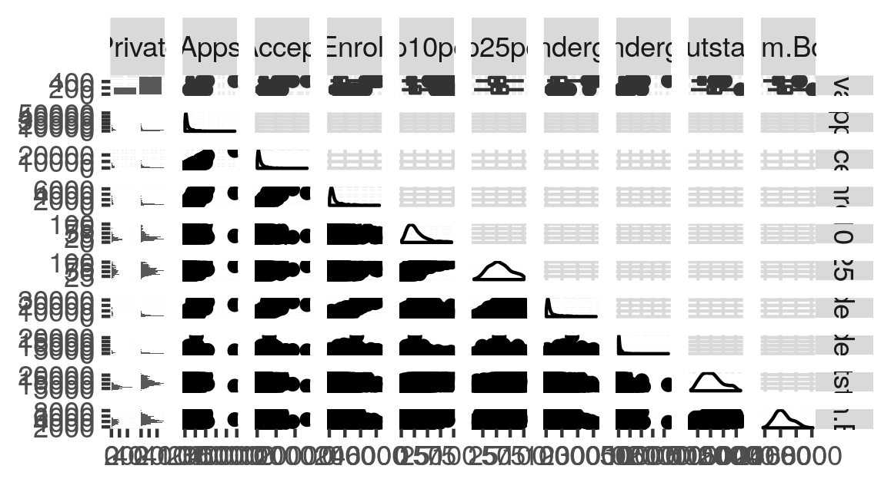
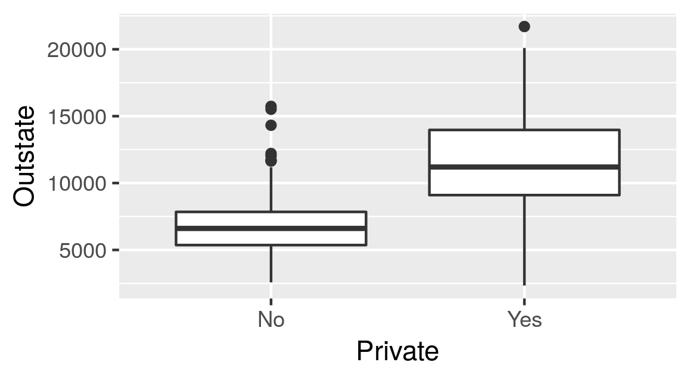
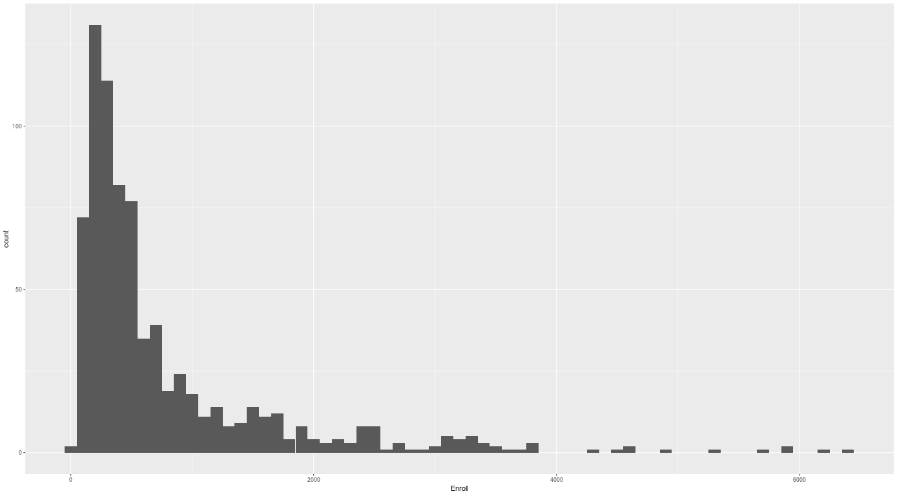
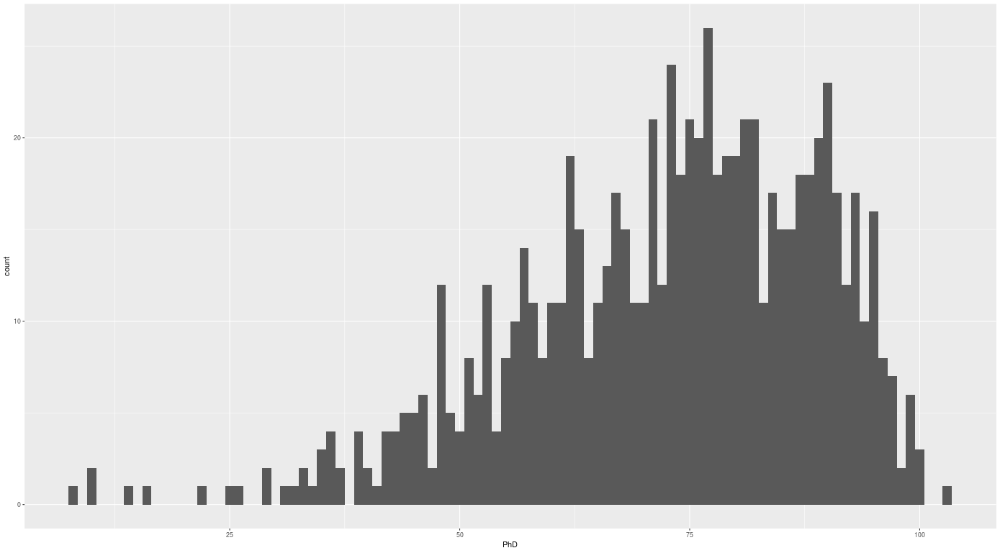

# Chapter 2 - Applied

## a)

Load in the college data frame - we convert it to a tibble.

    library(ISLR)
    library(tidyverse)

    college <- as_tibble(College)

## c)

### i)

Getting a summary:
    summary(college)

    Private        Apps           Accept          Enroll       Top10perc    
    No :212   Min.   :   81   Min.   :   72   Min.   :  35   Min.   : 1.00  
 	Yes:565   1st Qu.:  776   1st Qu.:  604   1st Qu.: 242   1st Qu.:15.00  
        	  Median : 1558   Median : 1110   Median : 434   Median :23.00  
        	  Mean   : 3002   Mean   : 2019   Mean   : 780   Mean   :27.56  
        	  3rd Qu.: 3624   3rd Qu.: 2424   3rd Qu.: 902   3rd Qu.:35.00  
        	  Max.   :48094   Max.   :26330   Max.   :6392   Max.   :96.00  

### ii)

Create a scatterplot matrix of the first ten variables.	
	library(ggally)
	college %>% ggpairs(columns = 1:10)

### iii)

Create a boxplot of *Outstate* versus *Private*
    college %>% ggplot + geom_boxplot(aes(Private, Outstate))

### iv)
Create a new variable *Elite* by binning the *Top10perc* variable. We divide universities into two groups depending on whether or not the proportion of students coming from the top 10% of their high schools exceeds 10%.

	college %>% mutate(Elite = factor(ifelse(Top10perc > 50, "Yes", "No)))

We now get a summary of the *Elite* 	

	summary(college['Elite'])
	Elite    
 	No :699  
 	Yes: 78

### v)

Create some histograms with differing bins for the quantitative variables:

* The amount of enrollments in bin widths of 100
	college %>% ggplot + geom_histogram(aes(Enroll), binwidth = 100)

* The number of PhD students in bin widths of 1
	college %>% ggplot + geom_histogram(aes(PhD), binwidth = 1)

### vi)

Some other information
