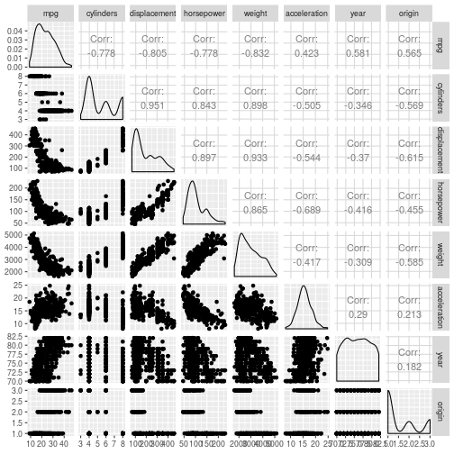
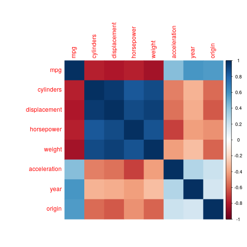

# Chapter 3 - Applied

## 8) Auto data set


### a)
*Use the `lm()` function to perform a simple linear regression with `mpg` as the response and `horsepower` as the predictor. Print the results and comment on the output.*


```r
auto <- as_tibble(Auto)
lm_auto <- auto %>% lm(mpg ~ horsepower, .)
lm_auto %>% tidy()
```

```
## # A tibble: 2 x 5
##   term        estimate std.error statistic   p.value
##   <chr>          <dbl>     <dbl>     <dbl>     <dbl>
## 1 (Intercept)   39.9     0.717        55.7 1.22e-187
## 2 horsepower    -0.158   0.00645     -24.5 7.03e- 81
```

#### i) 
*Is there a relationship between the predictor and the response?*

To determine if there is a relationship, we need to look at two items: the p-values for the coefficients, the F-statistic, and the p-value for the F-statistic:

```r
lm_auto %>% tidy()
```

```
## # A tibble: 2 x 5
##   term        estimate std.error statistic   p.value
##   <chr>          <dbl>     <dbl>     <dbl>     <dbl>
## 1 (Intercept)   39.9     0.717        55.7 1.22e-187
## 2 horsepower    -0.158   0.00645     -24.5 7.03e- 81
```

```r
lm_auto %>% glance()
```

```
## # A tibble: 1 x 11
##   r.squared adj.r.squared sigma statistic  p.value    df logLik   AIC   BIC
## *     <dbl>         <dbl> <dbl>     <dbl>    <dbl> <int>  <dbl> <dbl> <dbl>
## 1     0.606         0.605  4.91      600. 7.03e-81     2 -1179. 2363. 2375.
## # ... with 2 more variables: deviance <dbl>, df.residual <int>
```

We in the `tidy()` output we can see the p-value for the intercept and the coefficient is very small, indicating a very low probability for the null hypothesis.A

In the `glance()` output, we see the `statistic` column (the F-statistic) is high at around 600, with a small p-value. This indicates that there is a relationship.

#### ii)
*How strong is the relationship*

To test how string the relationship is, we can look at the residual standard error (RSE) and the R^2 value.

We look at the `glance()` output again and see the R^2 value is .606. Recall that the R^2 is a value between 0 and 1 that is the 'proportion of the variance explained'. We can consider the relationship reasonably strong;

#### iii)
*Is the relationship positive or negative?*
There is a negative relationship between `mpg` and `horsepower`, thus miles per gallon goes down as horsepower goes up. This aligns with our conceptual idea.

#### iv) 
*What is the predicted `mpg` associated with a `horsepower` of 98? What are the associated 95% confidence and prediction intervals?*

We use the `interval` argument to the predict function. Note that the default `level` argument of `predict()` is 0.95 (95%).

```r
predict(lm_auto, tibble(horsepower = 98), interval = 'confidence')
```

```
##        fit      lwr      upr
## 1 24.46708 23.97308 24.96108
```

```r
predict(lm_auto, tibble(horsepower = 98), interval = 'predict')
```

```
##        fit     lwr      upr
## 1 24.46708 14.8094 34.12476
```

### b)
*Plot the response and the predictor. Display the least squares regression line.*


```r
auto %>% ggplot(aes(mpg, horsepower)) + geom_point() + geom_smooth(method = 'lm', formula = 'y ~ x')
```


### c) 
*Produce diagnostic plots (Resid v Leverage, Resid v Fitted, Fitted v Std Resid) and comment on any problems*

First off, lets have a look at the residuals versus the leverage:

```r
augment(lm_auto) %>% ggplot(aes(.hat, .resid)) + geom_point()
```


There are a few points up in the top right. We take a look at the Cook's distance for the observations.


```r
augment(lm_auto) %>% mutate(i = 1:n()) %>% ggplot(aes(i, .cooksd)) + geom_bar(stat = 'identity')
```


A couple of high points but all below 1.

Now we look at the fitted versus the residuals, and also fit a quadratic regression. We see a bit of a U shape, indicating potential non-linearity in the data.

```r
augment(lm_auto) %>% ggplot(aes(.fitted, .resid)) + geom_point() + geom_smooth(method = 'lm', formula = 'y ~ poly(x,2)')
```


## 9) Multiple Linear Regression - Auto Data Set


```r
library(GGally)
library(corrplot)
```

### a)
*Produce a scatterplot matrix which includes all the data in the data set*

```r
auto %>% select(-'name') %>% ggpairs()
```



### b)
*Compute the matrix of correlations between the variables.*

```r
auto %>% select(-'name') %>% cor() %>% corrplot(method = 'color')
```



### c)
*Perform a multiple linear regression with `mpg` as the response and all other variables except `name` as the predictors.*


```r
lin_reg_auto <- lm(mpg ~ . -name, auto)
tidy(lin_reg_auto)
```

```
## # A tibble: 8 x 5
##   term          estimate std.error statistic  p.value
##   <chr>            <dbl>     <dbl>     <dbl>    <dbl>
## 1 (Intercept)  -17.2      4.64        -3.71  2.40e- 4
## 2 cylinders     -0.493    0.323       -1.53  1.28e- 1
## 3 displacement   0.0199   0.00752      2.65  8.44e- 3
## 4 horsepower    -0.0170   0.0138      -1.23  2.20e- 1
## 5 weight        -0.00647  0.000652    -9.93  7.87e-21
## 6 acceleration   0.0806   0.0988       0.815 4.15e- 1
## 7 year           0.751    0.0510      14.7   3.06e-39
## 8 origin         1.43     0.278        5.13  4.67e- 7
```

```r
glance(lin_reg_auto)
```

```
## # A tibble: 1 x 11
##   r.squared adj.r.squared sigma statistic   p.value    df logLik   AIC
## *     <dbl>         <dbl> <dbl>     <dbl>     <dbl> <int>  <dbl> <dbl>
## 1     0.821         0.818  3.33      252. 2.04e-139     8 -1023. 2065.
## # ... with 3 more variables: BIC <dbl>, deviance <dbl>, df.residual <int>
```


