# Chapter 3 - Applied

## 8) Auto data set


### a)
*Use the `lm()` function to perform a simple linear regression with `mpg` as the response and `horsepower` as the predictor. Print the results and comment on the output.*


```r
auto <- as_tibble(Auto)
lm_auto <- auto %>% lm(mpg ~ horsepower, .)
lm_auto %>% tidy()
```

```
## # A tibble: 2 x 5
##   term        estimate std.error statistic   p.value
##   <chr>          <dbl>     <dbl>     <dbl>     <dbl>
## 1 (Intercept)   39.9     0.717        55.7 1.22e-187
## 2 horsepower    -0.158   0.00645     -24.5 7.03e- 81
```

#### i) 
*Is there a relationship between the predictor and the response?*

To determine if there is a relationship, we need to look at two items: the p-values for the coefficients, the F-statistic, and the p-value for the F-statistic:

```r
lm_auto %>% tidy()
```

```
## # A tibble: 2 x 5
##   term        estimate std.error statistic   p.value
##   <chr>          <dbl>     <dbl>     <dbl>     <dbl>
## 1 (Intercept)   39.9     0.717        55.7 1.22e-187
## 2 horsepower    -0.158   0.00645     -24.5 7.03e- 81
```

```r
lm_auto %>% glance()
```

```
## # A tibble: 1 x 11
##   r.squared adj.r.squared sigma statistic  p.value    df logLik   AIC   BIC
##       <dbl>         <dbl> <dbl>     <dbl>    <dbl> <int>  <dbl> <dbl> <dbl>
## 1     0.606         0.605  4.91      600. 7.03e-81     2 -1179. 2363. 2375.
## # … with 2 more variables: deviance <dbl>, df.residual <int>
```

We in the `tidy()` output we can see the p-value for the intercept and the coefficient is very small, indicating a very low probability for the null hypothesis.A

In the `glance()` output, we see the `statistic` column (the F-statistic) is high at around 600, with a small p-value. This indicates that there is a relationship.

#### ii)
*How strong is the relationship*

To test how string the relationship is, we can look at the residual standard error (RSE) and the R^2 value.

We look at the `glance()` output again and see the R^2 value is .606. Recall that the R^2 is a value between 0 and 1 that is the 'proportion of the variance explained'. We can consider the relationship reasonably strong;

#### iii)
*Is the relationship positive or negative?*
There is a negative relationship between `mpg` and `horsepower`, thus miles per gallon goes down as horsepower goes up. This aligns with our conceptual idea.

#### iv) 
*What is the predicted `mpg` associated with a `horsepower` of 98? What are the associated 95% confidence and prediction intervals?*

We use the `interval` argument to the predict function. Note that the default `level` argument of `predict()` is 0.95 (95%).

```r
predict(lm_auto, tibble(horsepower = 98), interval = 'confidence')
```

```
##        fit      lwr      upr
## 1 24.46708 23.97308 24.96108
```

```r
predict(lm_auto, tibble(horsepower = 98), interval = 'predict')
```

```
##        fit     lwr      upr
## 1 24.46708 14.8094 34.12476
```

### b)
*Plot the response and the predictor. Display the least squares regression line.*


```r
auto %>% ggplot(aes(mpg, horsepower)) + geom_point() + geom_smooth(method = 'lm', formula = 'y ~ x')
```

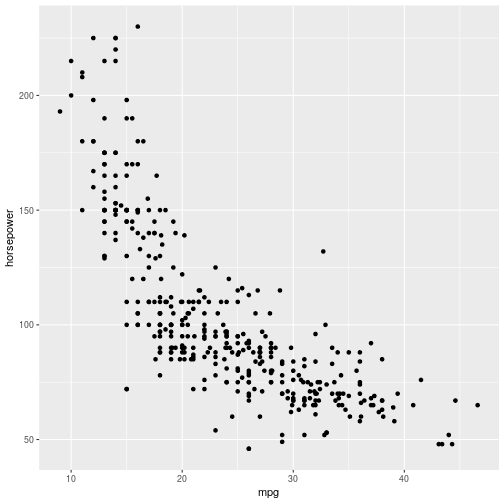

### c) 
*Produce diagnostic plots (Resid v Leverage, Resid v Fitted, Fitted v Std Resid) and comment on any problems*

First off, lets have a look at the residuals versus the leverage:

```r
augment(lm_auto) %>% ggplot(aes(.hat, .resid)) + geom_point()
```

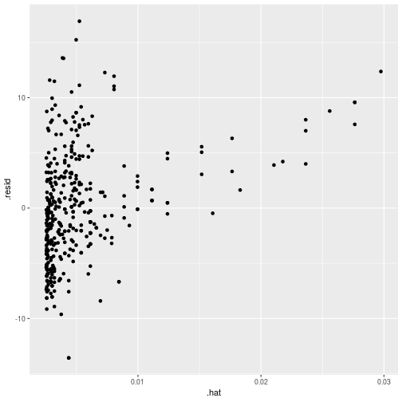

There are a few points up in the top right. We take a look at the Cook's distance for the observations.


```r
augment(lm_auto) %>% mutate(i = 1:n()) %>% ggplot(aes(i, .cooksd)) + geom_bar(stat = 'identity')
```

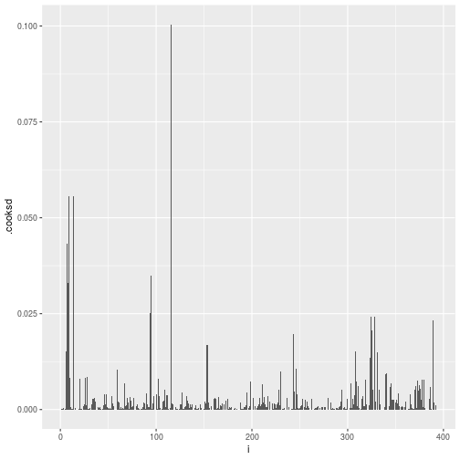

A couple of high points but all below 1.

Now we look at the fitted versus the residuals, and also fit a quadratic regression. We see a bit of a U shape, indicating potential non-linearity in the data.

```r
augment(lm_auto) %>% ggplot(aes(.fitted, .resid)) + geom_point() + geom_smooth(method = 'lm', formula = 'y ~ poly(x,2)')
```

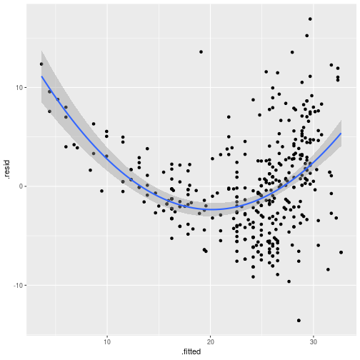

## 9) Multiple Linear Regression - Auto Data Set


```r
library(GGally)
```

```
## Error in library(GGally): there is no package called 'GGally'
```

```r
library(corrplot)
```

```
## Error in library(corrplot): there is no package called 'corrplot'
```

### a)
*Produce a scatterplot matrix which includes all the data in the data set*

```r
auto %>% select(-'name') %>% ggpairs()
```

```
## Error in ggpairs(.): could not find function "ggpairs"
```

### b)
*Compute the matrix of correlations between the variables.*

```r
auto %>% select(-'name') %>% cor() %>% corrplot(method = 'color')
```

```
## Error in corrplot(., method = "color"): could not find function "corrplot"
```

### c)
*Perform a multiple linear regression with `mpg` as the response and all other variables except `name` as the predictors.*


```r
lin_reg_auto <- lm(mpg ~ . -name, auto)
tidy(lin_reg_auto)
```

```
## # A tibble: 8 x 5
##   term          estimate std.error statistic  p.value
##   <chr>            <dbl>     <dbl>     <dbl>    <dbl>
## 1 (Intercept)  -17.2      4.64        -3.71  2.40e- 4
## 2 cylinders     -0.493    0.323       -1.53  1.28e- 1
## 3 displacement   0.0199   0.00752      2.65  8.44e- 3
## 4 horsepower    -0.0170   0.0138      -1.23  2.20e- 1
## 5 weight        -0.00647  0.000652    -9.93  7.87e-21
## 6 acceleration   0.0806   0.0988       0.815 4.15e- 1
## 7 year           0.751    0.0510      14.7   3.06e-39
## 8 origin         1.43     0.278        5.13  4.67e- 7
```

```r
glance(lin_reg_auto)
```

```
## # A tibble: 1 x 11
##   r.squared adj.r.squared sigma statistic   p.value    df logLik   AIC
##       <dbl>         <dbl> <dbl>     <dbl>     <dbl> <int>  <dbl> <dbl>
## 1     0.821         0.818  3.33      252. 2.04e-139     8 -1023. 2065.
## # … with 3 more variables: BIC <dbl>, deviance <dbl>, df.residual <int>
```
#### i)
*Is there a relationship between the predictors and the response?*
We test the null hypothesis of "are all of the regression coefficients zero?". The F-statistic 252 (far greater than 1) and has a p-value of 2e-139, indicating a low probability that this is just by chance. We can therefore say there is a relationship between the predictors and the response.

#### ii)
We look at the p-values for each of the predictors. The predictors which have a high probability of having an effect on the `mpg`, holding all others constant, appear to be `weight`, `year`, `displacement` and `origin`.

#### iii)
*What does the coefficient for the `year` variable suggest?*
The year coefficient suggests that a cars `mpg` gets larger - and therefore better - the later a car was made.

### d)
*Plot the diagnostic plots of the regression and comment on any problems with the fit.*

We go through our usual plots - first off is looking at the residuals versus the leverage:

```r
augment(lin_reg_auto) %>% mutate(i = 1:n()) %>% ggplot(aes(i, .cooksd)) + geom_bar(stat = 'identity')
```

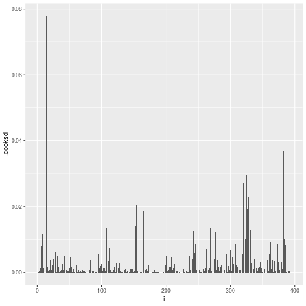

We don't see values with a significant Cook's distance. We move on to the fitted versus the residuals:

```r
augment(lin_reg_auto) %>% ggplot(aes(.fitted, .resid)) + geom_point() + geom_smooth(method = 'lm', formula = 'y~poly(x,2)')
```

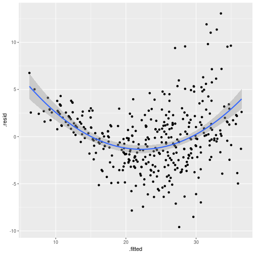
There is some evidence of the non-linearity of the results.

### e) 
*Use the '*' and ':' symbols to fit linear regressions with interaction effects. Are any interactions statistically significant?*

A '*' adds the predictors and the interaction term, whereas the `:` only adds the interaction term. I.e. `x\*y == x + y + x:y`.

Let's have a think about potential interactions - I think weight and year could interact, given the changes in materials. There could also be an f,Let's have a think about potential interactions - I think weight and year could interact, given the changes in materials. There could also be and interaction between cylinders and displacement:


```r
lm(mpg ~ weight*year + cylinders*displacement, auto) %>% tidy()
```

```
## # A tibble: 7 x 5
##   term                     estimate  std.error statistic  p.value
##   <chr>                       <dbl>      <dbl>     <dbl>    <dbl>
## 1 (Intercept)            -81.3      13.9           -5.86 9.86e- 9
## 2 weight                   0.0202    0.00467        4.33 1.88e- 5
## 3 year                     1.75      0.176          9.99 4.84e-21
## 4 cylinders               -1.49      0.400         -3.71 2.34e- 4
## 5 displacement            -0.0698    0.0127        -5.50 6.97e- 8
## 6 weight:year             -0.000347  0.0000618     -5.61 3.82e- 8
## 7 cylinders:displacement   0.00902   0.00156        5.78 1.53e- 8
```

All of the values appear to be reasonably statistically significant. In fact, if we have a look at the fitted vs residuals, it looks much better than before:

```r
lm(mpg ~ weight*year + cylinders*displacement, auto) %>% augment() %>% ggplot(aes(.fitted, .resid)) + geom_point() + geom_smooth()
```

```
## `geom_smooth()` using method = 'loess' and formula 'y ~ x'
```

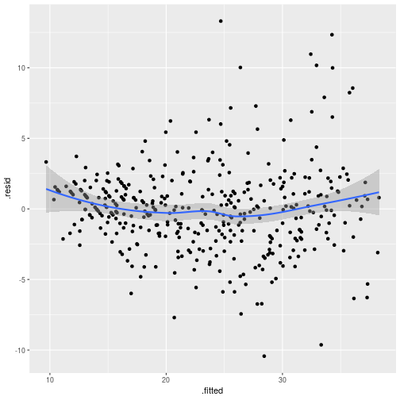

### f)
*Try different transformations of the variables and comment ont the findings.*

We try a few different transformations and pipe them through to the fitted versus residuals graph:


```r
lm(mpg ~ sqrt(horsepower), auto) %>% augment() %>% ggplot() + geom_point(aes(.fitted, .resid))
```

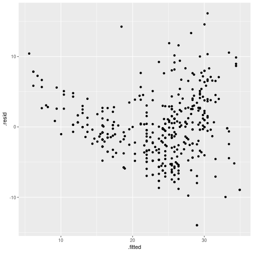

```r
lm(mpg ~ log(horsepower), auto) %>% augment() %>% ggplot() + geom_point(aes(.fitted, .resid))
```

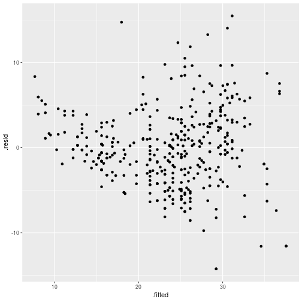

```r
lm(1/mpg ~ horsepower, auto) %>% augment() %>% ggplot() + geom_point(aes(.fitted, .resid))
```

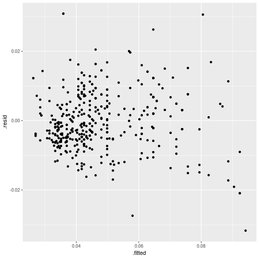

```r
lm(1/mpg ~ horsepower + weight*year, auto) %>% augment() %>% ggplot() + geom_point(aes(.fitted, .resid))
```

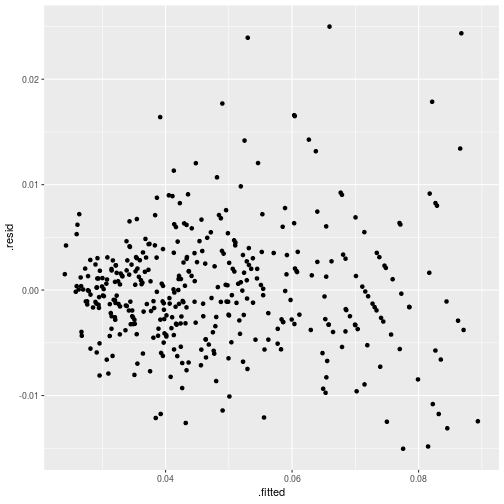

```r
lm(1/mpg ~ horsepower + weight*year, auto) %>% glance()
```

```
## # A tibble: 1 x 11
##   r.squared adj.r.squared   sigma statistic   p.value    df logLik    AIC
##       <dbl>         <dbl>   <dbl>     <dbl>     <dbl> <int>  <dbl>  <dbl>
## 1     0.883         0.882 0.00572      731. 7.39e-179     5  1471. -2929.
## # … with 3 more variables: BIC <dbl>, deviance <dbl>, df.residual <int>
```

The last one looks quite good.


## 10) Carseats Data Set

### a) 
*Fit a multiple regression model to predict `Sales` using `Price`, `Urban`, and `US`.*


```r
carseats <- as_tibble(Carseats)
cs_regress <- lm(Sales ~ Price + Urban + US, carseats)
cs_regress %>% tidy()
```

```
## # A tibble: 4 x 5
##   term        estimate std.error statistic  p.value
##   <chr>          <dbl>     <dbl>     <dbl>    <dbl>
## 1 (Intercept)  13.0      0.651     20.0    3.63e-62
## 2 Price        -0.0545   0.00524  -10.4    1.61e-22
## 3 UrbanYes     -0.0219   0.272     -0.0807 9.36e- 1
## 4 USYes         1.20     0.259      4.63   4.86e- 6
```

### b)
*Provide an interpretation of each coefficient in the model.*
* (Intercept) - the average number of sales of carseats, ignoring all other factors. 
* Price - the regression indicates a relationship between price and sales, given the low p-value of the t-statistic. An increase in price of a dollar results in a decrease of 54 carseats solds. 
* UrbanYes - given the high p-value, there doesn't appear to be a relationship between sales and whether a store is urban.
* USYes - given the low p-value, the store bein in the US results in 1200 more carseats being sold.

### c)
*Write out the model in equation form, being careful to handle the qualitative variables properly.*

`Sales = x * Price + y * Urban + z * US`, where 
`[Urban = Yes => y = 1|Urban = No =>  y = 0]` & 
`[US = Yes => z = 1|US = No => z = 0]`

### d)
*For which of the predictors can you reject the null hypothesis H 0 : βj = 0?*

The null hypothesis can be rejected for `Price` and `US`.

### e)
*On the basis of your response to the previous question, fit a smaller model that only uses the predictors for which there is evidence of association with the outcome.*


```r
cs_regress_reduced <- lm(Sales ~ Price + US, carseats)
cs_regress_reduced %>% tidy()
```

```
## # A tibble: 3 x 5
##   term        estimate std.error statistic  p.value
##   <chr>          <dbl>     <dbl>     <dbl>    <dbl>
## 1 (Intercept)  13.0      0.631       20.7  7.00e-65
## 2 Price        -0.0545   0.00523    -10.4  1.27e-22
## 3 USYes         1.20     0.258        4.64 4.71e- 6
```

### f)
*How well do the models in (a) and (e) fit the data?*

We look at the F-statistic and its assoicated p-value to determine how well the models fit:

```r
cs_regress %>% glance()
```

```
## # A tibble: 1 x 11
##   r.squared adj.r.squared sigma statistic  p.value    df logLik   AIC   BIC
##       <dbl>         <dbl> <dbl>     <dbl>    <dbl> <int>  <dbl> <dbl> <dbl>
## 1     0.239         0.234  2.47      41.5 2.39e-23     4  -928. 1865. 1885.
## # … with 2 more variables: deviance <dbl>, df.residual <int>
```

```r
cs_regress_reduced %>% glance()
```

```
## # A tibble: 1 x 11
##   r.squared adj.r.squared sigma statistic  p.value    df logLik   AIC   BIC
##       <dbl>         <dbl> <dbl>     <dbl>    <dbl> <int>  <dbl> <dbl> <dbl>
## 1     0.239         0.235  2.47      62.4 2.66e-24     3  -928. 1863. 1879.
## # … with 2 more variables: deviance <dbl>, df.residual <int>
```

We see no increase in the R-sqaured value - but we do see an increase in the F-statistic, and a decrease in its p-value.

### g)
*Using the model from (e), obtain 95 % confidence intervals for the coefficient(s).*


```r
cs_regress_reduced %>% confint()
```

```
##                   2.5 %      97.5 %
## (Intercept) 11.79032020 14.27126531
## Price       -0.06475984 -0.04419543
## USYes        0.69151957  1.70776632
```

### h)
*Is there evidence of outliers or high leverage observations in the model from (e)?*


```r
cs_regress_reduced %>% augment() %>% ggplot(aes(.fitted, .resid)) + geom_point()
```

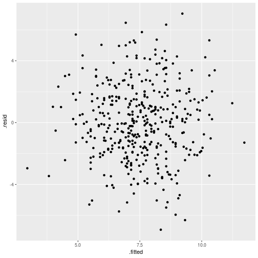

```r
cs_regress_reduced %>% augment() %>% ggplot(aes(.hat, .resid)) + geom_point()
```

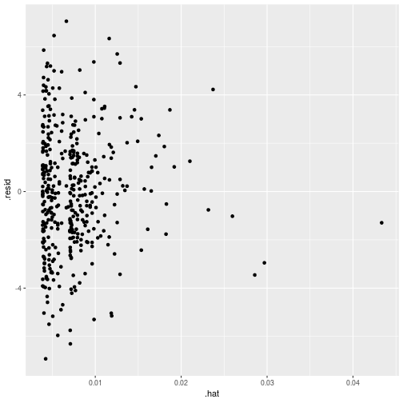

There doesn't appear to be any non-linearity in the daata, and the high leverage points don't appear to affect the data substantially.

## 11) T-statistic and null-hypothesis
*In this problem we will investigate the t-statistic for the null hypothesis H 0 : β = 0 in simple linear regression without an intercept. To begin, we generate a predictor x and a response y*


```r
set.seed(1)
linear_response <- tibble(x = rnorm(100), y = 2 * x + rnorm(100))
linear_response %>% ggplot(aes(x,y)) + geom_point()
```

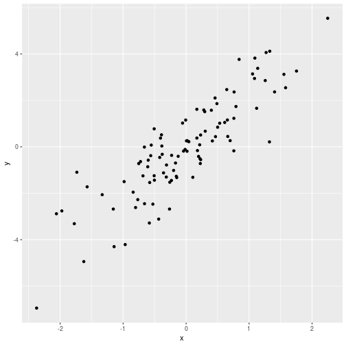

### a) 
*Perform a simple linear regression of y onto x , without an intercept. Report the coefficient estimate β̂, the standard error of this coefficient estimate, and the t-statistic and p-value associated with the null hypothesis H 0 : β = 0. Comment on these results.*


```r
lr_reg <- lm(y ~ x + 0, linear_response)
lr_reg %>% tidy()
```

```
## # A tibble: 1 x 5
##   term  estimate std.error statistic  p.value
##   <chr>    <dbl>     <dbl>     <dbl>    <dbl>
## 1 x         1.99     0.106      18.7 2.64e-34
```

The coefficient estimate is 1.99 - very close to the 2 that we used to generate the points. The standard error is .106, the t-statistic is 18.7 and the p-value is 2.64e-34. The t-statistic tells us how many standard deviations the coefficient is away from 0. The p-value gives us the probability that the null hypothesis - that the coefficient is 0 - is true.

### b) 
*Now perform a simple linear regression of x onto y without an intercept, and report on the same metrics as a)*


```r
lr_reg_reverse <- lm(x ~ y + 0, linear_response)
lr_reg_reverse %>% tidy()
```

```
## # A tibble: 1 x 5
##   term  estimate std.error statistic  p.value
##   <chr>    <dbl>     <dbl>     <dbl>    <dbl>
## 1 y        0.391    0.0209      18.7 2.64e-34
```

The coefficient estimate and the standard error have changed, which is as expected. The t-statistic and p-value remain the same.

### c)
*What is the relationship between the results obtained in (a) and (b)?*

It's the same line, thus the overall results obtained are the same.

## 12) Simple Linear Regression

### a) 
*Recall that the coefficient estimate β̂ for the linear regression of Y onto X without an intercept is given by (3.38). Under what circumstance is the coefficient estimate for the regression of X onto Y the same as the coefficient estimate for the regression of Y onto X?*

When the sum of the squares of the y observations is the same as the sum or the squares of the x observations.

### b)
Generate an example in R with n = 100 observations in which the coefficient estimate for the regression of X onto Y is different from the coefficient estimate for the regression of Y onto X.


```r
set.seed(1)
tibble(x = rnorm(100), y = 4*x) %>% lm(y ~ x, .) %>% tidy()
```

```
## Warning in summary.lm(x): essentially perfect fit: summary may be
## unreliable
```

```
## # A tibble: 2 x 5
##   term         estimate std.error statistic   p.value
##   <chr>           <dbl>     <dbl>     <dbl>     <dbl>
## 1 (Intercept) -8.88e-17  2.19e-17  -4.06e 0 0.0000999
## 2 x            4.00e+ 0  2.43e-17   1.64e17 0
```

```r
set.seed(1)
tibble(x = rnorm(100), y = 4*x) %>% lm(x ~ y, .) %>% tidy()
```

```
## Warning in summary.lm(x): essentially perfect fit: summary may be
## unreliable
```

```
## # A tibble: 2 x 5
##   term         estimate std.error statistic   p.value
##   <chr>           <dbl>     <dbl>     <dbl>     <dbl>
## 1 (Intercept) -2.22e-17  5.47e-18  -4.06e 0 0.0000999
## 2 y            2.50e- 1  1.52e-18   1.64e17 0
```

### c)
*Generate an example in R with n = 100 observations in which the coefficient estimate for the regression of X onto Y is the Asame as the coefficient estimate for the regression of Y onto X.*

To have the same coefficients, we need the sum of the squares to be the same. To do this, we generate 100 random values for `X`, and we use the same values for `Y`. However we re-order the values so we don't simply get a `y = x` function. We can use the `sample_n()` function for this:


```r
set.seed(1)
sample_data <- tibble(x = rnorm(100)) %>% 
    mutate(y = (sample_n(., 100) %>% .[['x']]))
lm(y ~ x, sample_data) %>% tidy()
```

```
## # A tibble: 2 x 5
##   term        estimate std.error statistic p.value
##   <chr>          <dbl>     <dbl>     <dbl>   <dbl>
## 1 (Intercept)  0.108      0.0909    1.19     0.237
## 2 x            0.00695    0.101     0.0688   0.945
```

```r
lm(x ~ y, sample_data) %>% tidy()
```

```
## # A tibble: 2 x 5
##   term        estimate std.error statistic p.value
##   <chr>          <dbl>     <dbl>     <dbl>   <dbl>
## 1 (Intercept)  0.108      0.0909    1.19     0.237
## 2 y            0.00695    0.101     0.0688   0.945
```

## 13) Simulated Linear Regressions

### a)
*Using the rnorm() function, create a vector, x , containing 100 observations drawn from a N (0, 1) distribution. This represents a feature, X.*


```r
x <- rnorm(100)
```

### b) 
*Using the `rnorm()` function, create a vector, `eps` , containing 100 observations drawn from a N (0, 0.25) distribution*


```r
eps <- rnorm(100, 0, .25)
```

### c) 
*Using `x` and `eps` , generate a vector y according to the model `Y = −1 + 0.5X + e`. What is the length of the vector y ? What are the values of β 0 and β 1 in this linear model?*


```r
y <- -1 + .5 * x + eps
```

The beta_0 is -1, and the beta_1 is .5

### d)
*Create a scatterplot displaying the relationship between x and y . Comment on what you observe.


```r
simulated <- tibble(x = x, y = y) 
simulated %>% ggplot(aes(x,y)) + geom_point()
```

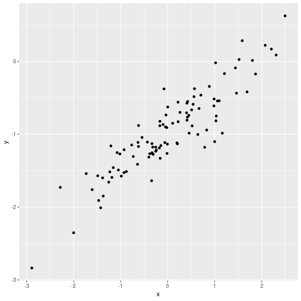

We can see an approximate linear relationship between x and y.

### e)
*Fit a least squares linear model to predict y using x . Comment on the model obtained. How do β̂ 0 and β̂ 1 compare to β 0 and β 1 ?*


```r
lm(y ~ x, simulated) %>% tidy()
```

```
## # A tibble: 2 x 5
##   term        estimate std.error statistic  p.value
##   <chr>          <dbl>     <dbl>     <dbl>    <dbl>
## 1 (Intercept)   -0.975    0.0245     -39.8 2.73e-62
## 2 x              0.495    0.0235      21.1 3.21e-38
```

We see a `beta_0` of -0.988, and a `beta_1` of 0.527 - very close to the actual values of the function. The standard error is low at 0.0248 and 0.0241 respectively.

### f)
*Display the least squares line on the scatterplot obtained in (d). Draw the population regression line on the plot, in a different color. Create a legend.


```r
simulated %>% ggplot(aes(x,y)) + 
    geom_point() + 
    geom_smooth(aes(colour = 'Regression'), method = 'lm', formula = 'y ~ x') + 
    geom_abline(aes(slope = .5, intercept = -1, colour = 'Population Mean'), size = 1) +
    labs(colour = "Lines")
```

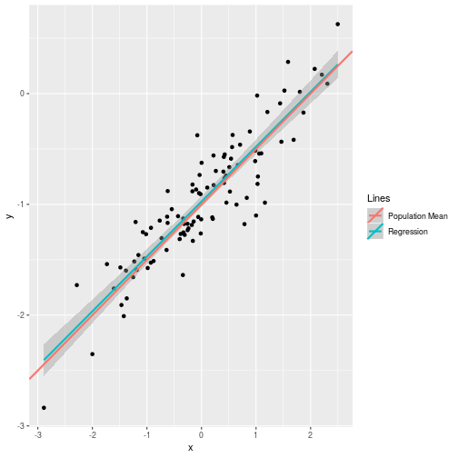

### g) 
*Now fit a polynomial regression model that predicts `y` using `x` and `x^2` . Is there evidence that the quadratic term improves the model fit? Explain your answer.*


```r
lm(y ~ poly(x,2), simulated) %>% tidy()
```

```
## # A tibble: 3 x 5
##   term        estimate std.error statistic  p.value
##   <chr>          <dbl>     <dbl>     <dbl>    <dbl>
## 1 (Intercept)  -0.964     0.0246  -39.1    3.21e-61
## 2 poly(x, 2)1   5.17      0.246    21.0    7.58e-38
## 3 poly(x, 2)2  -0.0167    0.246    -0.0677 9.46e- 1
```

```r
lm(y ~ poly(x,2), simulated) %>% glance()
```

```
## # A tibble: 1 x 11
##   r.squared adj.r.squared sigma statistic  p.value    df logLik   AIC   BIC
##       <dbl>         <dbl> <dbl>     <dbl>    <dbl> <int>  <dbl> <dbl> <dbl>
## 1     0.820         0.816 0.246      220. 8.51e-37     3 -0.220  8.44  18.9
## # … with 2 more variables: deviance <dbl>, df.residual <int>
```

We can see that the R^2 has not changed, and the RSE has increased slightly with the x^2 regression. However the F-statistic has decreased significantly with the x^2 regression, indicating a decrease in the significance of the model.

### h) & i)
*Repeat (a)–(f) after modifying the data generation process in such a way that there is less noise in the data.*

Lets create a function to do this, with the variable being how much noise is in the data.


```r
simulated_linear <- function(observations, mean, noise) {
    x <- rnorm(observations)
    eps <- rnorm(observations, mean, noise)
    y <- -1 + .5 * x + eps
    return(tibble(x = x, y = y))
}

set.seed(1)
low_and_high_noise <- bind_cols( simulated_linear(100, 0, .1), simulated_linear(100, 0, .5))
lm(y ~ x, low_and_high_noise) %>% glance()
```

```
## # A tibble: 1 x 11
##   r.squared adj.r.squared  sigma statistic  p.value    df logLik   AIC
##       <dbl>         <dbl>  <dbl>     <dbl>    <dbl> <int>  <dbl> <dbl>
## 1     0.956         0.956 0.0963     2153. 1.64e-68     2   93.2 -180.
## # … with 3 more variables: BIC <dbl>, deviance <dbl>, df.residual <int>
```

```r
lm(y ~ x, low_and_high_noise) %>% tidy()
```

```
## # A tibble: 2 x 5
##   term        estimate std.error statistic   p.value
##   <chr>          <dbl>     <dbl>     <dbl>     <dbl>
## 1 (Intercept)   -1.00    0.00970    -103.  6.63e-102
## 2 x              0.500   0.0108       46.4 1.64e- 68
```

```r
lm(y1 ~ x1, low_and_high_noise) %>% tidy()
```

```
## # A tibble: 2 x 5
##   term        estimate std.error statistic  p.value
##   <chr>          <dbl>     <dbl>     <dbl>    <dbl>
## 1 (Intercept)   -0.976    0.0495     -19.7 7.70e-36
## 2 x1             0.553    0.0481      11.5 7.27e-20
```

```r
lm(y1 ~ x1, low_and_high_noise) %>% glance()
```

```
## # A tibble: 1 x 11
##   r.squared adj.r.squared sigma statistic  p.value    df logLik   AIC   BIC
##       <dbl>         <dbl> <dbl>     <dbl>    <dbl> <int>  <dbl> <dbl> <dbl>
## 1     0.574         0.570 0.495      132. 7.27e-20     2  -70.6  147.  155.
## # … with 2 more variables: deviance <dbl>, df.residual <int>
```

Looking at the values, the low noise regression picks the exact coefficients that were used in the function. The R^2 is near 1 with a high F-statistic.

The higher noise, as expected, has low F-statistic and high p-values for the coefficients. The R^2 value is very low.


```r
low_and_high_noise %>% 
    ggplot() + 
    geom_point(aes(x, y), colour = 'red') + 
    geom_point(aes(x1, y1), colour = 'blue') + 
    geom_smooth(aes(x, y), method = 'lm', formula = 'y ~ x', colour = 'red') + 
    geom_smooth(aes(x1, y1), method = 'lm', formula = 'y ~ x', colour = 'blue')
```

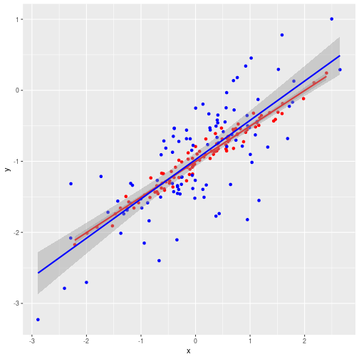

### j)
* What are the confidence intervals of the data sets? Comment on the results*


```r
lm(y ~ x, simulated) %>% confint()
```

```
##                 2.5 %     97.5 %
## (Intercept) -1.023503 -0.9262522
## x            0.448743  0.5419217
```

```r
lm(y ~ x, low_and_high_noise) %>% confint()
```

```
##                  2.5 %     97.5 %
## (Intercept) -1.0230161 -0.9845224
## x            0.4785159  0.5212720
```

```r
lm(y1 ~ x1, low_and_high_noise) %>% confint()
```

```
##                  2.5 %     97.5 %
## (Intercept) -1.0741052 -0.8774448
## x1           0.4575975  0.6486210
```

## 14) Collinearity Problem

### a) 
*Set up the data*

```r
set.seed(1)
colin_data <- tibble(
    x1 = runif(100), 
    x2 = 0.5 * x1 + rnorm(100)/10, 
    y = 2 + 2*x1 + 0.3*x2 + rnorm(100)
)
```

The beta_{0,1,2} coefficients of the model are (2,2,0.3) respectively.

### b) 
*What is the correlation between x1 and x2 ? Create a scatterplot displaying the relationship between the variables.*


```r
colin_data %>% select(x1, x2) %>% cor()
```

```
##           x1        x2
## x1 1.0000000 0.8351212
## x2 0.8351212 1.0000000
```

```r
colin_data %>% ggplot(aes(x1, x2)) + geom_point()
```

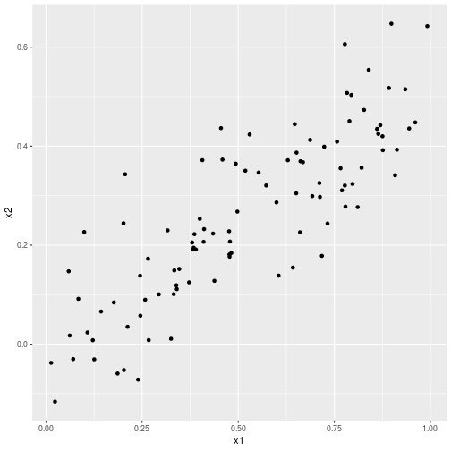

### c) 
*Using this data, fit a least squares regression to predict y using `x1` and `x2`*


```r
colin_data_reg <- lm(y ~ x1 + x2, colin_data)
colin_data_reg %>% tidy()
```

```
## # A tibble: 3 x 5
##   term        estimate std.error statistic  p.value
##   <chr>          <dbl>     <dbl>     <dbl>    <dbl>
## 1 (Intercept)     2.13     0.232     9.19  7.61e-15
## 2 x1              1.44     0.721     2.00  4.87e- 2
## 3 x2              1.01     1.13      0.891 3.75e- 1
```

```r
colin_data_reg %>% glance()
```

```
## # A tibble: 1 x 11
##   r.squared adj.r.squared sigma statistic p.value    df logLik   AIC   BIC
##       <dbl>         <dbl> <dbl>     <dbl>   <dbl> <int>  <dbl> <dbl> <dbl>
## 1     0.209         0.193  1.06      12.8 1.16e-5     3  -146.  300.  310.
## # … with 2 more variables: deviance <dbl>, df.residual <int>
```

*Can the null hypotheses `beta_1 = 0` and `beta_2 = 0` be rejected?*

Let's take the general view that a p-value of 0.05 is statistically significant. With this in mind, we can reject the null hypothesis for `x1`, but not for `x2`.


### d) and e)
*Now fit a least squares regression to predict y using only x1, with only x2. Can we reject the null hypothesis for either of these?*


```r
colin_data_reg_x1 <- lm(y ~ x1, colin_data)
colin_data_reg_x2 <- lm(y ~ x2, colin_data)
colin_data_reg_x1 %>% tidy()
```

```
## # A tibble: 2 x 5
##   term        estimate std.error statistic  p.value
##   <chr>          <dbl>     <dbl>     <dbl>    <dbl>
## 1 (Intercept)     2.11     0.231      9.15 8.27e-15
## 2 x1              1.98     0.396      4.99 2.66e- 6
```

```r
colin_data_reg_x2 %>% tidy()
```

```
## # A tibble: 2 x 5
##   term        estimate std.error statistic  p.value
##   <chr>          <dbl>     <dbl>     <dbl>    <dbl>
## 1 (Intercept)     2.39     0.195     12.3  1.68e-21
## 2 x2              2.90     0.633      4.58 1.37e- 5
```

I both instances we have a p-value below 0.05, and thus we can rejct the null hypothesis in both instances.

### f) 
*Do the results obtained in (c)–(e) contradict each other? Explain your answer.*

The results don't contradict each other. When regressing using both predictors that a colinear, it can be difficult to separate out the individual effects on the response, and the power of the hypothesi stest is reduced. (see ISL 3.36).

### g) 
*Now suppose we obtain one additional observation, which was unfortunately mismeasured. Re-fit the linear models from (c) to (e) using this new data. What effect does this new observation have on the each of the models? In each model, is this observation an outlier? A high-leverage point? Both? Explain your answers*

We add the new observation and calculate the mew regressions.


```r
colin_data_add <- colin_data %>% add_row(x1 = 0.1, x2 = 0.8, y = 6)

colin_data_reg_both <- lm(y ~ x1 + x2, colin_data_add)
colin_data_reg_x1 <- lm(y ~ x1, colin_data_add)
colin_data_reg_x2 <- lm(y ~ x2, colin_data_add)
```

We recall from 3.4 that an outlier is a point far from the value predicted by the model. We can look at residuals, but it can be difficult to decide how large a residual needs to be before it's classified as an outlier. This is where *studentised residuals* are used, where each residual is divided by e_i - its estimated standard error. Points with standardised residuals greater than 3 are possible outliers.


```r_applied_14_g_a_2
colin_data_reg_both %>% augment() %>% filter(y == 6)
colin_data_reg_x1 %>% augment() %>% filter(y == 6)
colin_data_reg_x2 %>% augment() %>% filter(y == 6)
```
Only in the regression with `x1` as the predictor could the response be considered an outlier.

Points with high leverage have an unusual x_i value, which tend to have significant impacts on the estimated regression lines. The *leverage statistic* is used to quantify leverage. We look at the `.hat` column which gives us the leverage statistic. We plot the `.hat` versus the `.std.resid`. When both `x1`, and `x2` are used in the regression, this point appears to be a high leverage point. In the `x1` regression it's not a high leverage point, and in the `x2` regression it has a bit of leverage.


```r_applied_14_g_a_3
colin_data_reg_both %>% augment() %>% ggplot() + geom_point(aes(.hat, .std.resid))
colin_data_reg_x1 %>% augment() %>% ggplot() + geom_point(aes(.hat, .std.resid))
colin_data_reg_x2 %>% augment() %>% ggplot() + geom_point(aes(.hat, .std.resid))
```

## 15) Boston Data Set
*We will now try to predict per capita crime rate using the other variables in this data set.*

### a)
*For each predictor, fit a simple linear regression model to predict the response. Describe your results. In which of the models is there a statistically significant association between the predictor and the response? Create some plots to back up your assertions.*


```r
library(MASS)
```

```
## 
## Attaching package: 'MASS'
```

```
## The following object is masked from 'package:dplyr':
## 
##     select
```

```r
boston <- as_tibble(Boston)

boston_regress <- tibble(predictor = names(boston)[-1]) %>% 
        mutate(predictor %>% map(function(x) lm(paste('crim ~', x), boston) %>% tidy())) %>% unnest() %>% filter(term != '(Intercept)')
boston_regress %>% print(n = 26)
```

```
## # A tibble: 13 x 6
##    predictor term    estimate std.error statistic  p.value
##    <chr>     <chr>      <dbl>     <dbl>     <dbl>    <dbl>
##  1 zn        zn       -0.0739   0.0161      -4.59 5.51e- 6
##  2 indus     indus     0.510    0.0510       9.99 1.45e-21
##  3 chas      chas     -1.89     1.51        -1.26 2.09e- 1
##  4 nox       nox      31.2      3.00        10.4  3.75e-23
##  5 rm        rm       -2.68     0.532       -5.04 6.35e- 7
##  6 age       age       0.108    0.0127       8.46 2.85e-16
##  7 dis       dis      -1.55     0.168       -9.21 8.52e-19
##  8 rad       rad       0.618    0.0343      18.0  2.69e-56
##  9 tax       tax       0.0297   0.00185     16.1  2.36e-47
## 10 ptratio   ptratio   1.15     0.169        6.80 2.94e-11
## 11 black     black    -0.0363   0.00387     -9.37 2.49e-19
## 12 lstat     lstat     0.549    0.0478      11.5  2.65e-27
## 13 medv      medv     -0.363    0.0384      -9.46 1.17e-19
```

### b)
*Fit a multiple regression model to predict the response using all of the predictors. Describe your results. For which predictors can we reject the null hypothesis H 0 : β j = 0?*


```r
(boston_mult_regress <- lm(crim ~ ., boston) %>% tidy() %>% arrange(p.value))
```

```
## # A tibble: 14 x 5
##    term         estimate std.error statistic  p.value
##    <chr>           <dbl>     <dbl>     <dbl>    <dbl>
##  1 rad           0.588     0.0880     6.68   6.46e-11
##  2 dis          -0.987     0.282     -3.50   5.02e- 4
##  3 medv         -0.199     0.0605    -3.29   1.09e- 3
##  4 zn            0.0449    0.0187     2.39   1.70e- 2
##  5 (Intercept)  17.0       7.23       2.35   1.89e- 2
##  6 black        -0.00754   0.00367   -2.05   4.07e- 2
##  7 nox         -10.3       5.28      -1.95   5.12e- 2
##  8 lstat         0.126     0.0757     1.67   9.62e- 2
##  9 ptratio      -0.271     0.186     -1.45   1.47e- 1
## 10 indus        -0.0639    0.0834    -0.766  4.44e- 1
## 11 tax          -0.00378   0.00516   -0.733  4.64e- 1
## 12 rm            0.430     0.613      0.702  4.83e- 1
## 13 chas         -0.749     1.18      -0.635  5.26e- 1
## 14 age           0.00145   0.0179     0.0810 9.35e- 1
```

From the results of the regression with all predictors, taking < 5e-2 to be statistically significant, `rad` (index of accessibility to radial highways.), `dis` (weighted mean of distances to five Boston employment centres.), `medv` (median value of owner-occupied homes in $1000s), `zn` (proportion of residential land zoned for lots over 25,000 sq.ft), and `black` (1000(Bk - 0.63)^2 where Bk is the proportion of blacks by town) appear to have statistical significance.

### c) 
How do your results from (a) compare to your results from (b)? Create a plot displaying the univariate regression coefficients from (a) on the x-axis, and the multiple regression coefficients from (b) on the y-axis. That is, each predictor is displayed as a single point in the plot. Its coefficient in a simple linear regression model is shown on the x-axis, and its coefficient estimate in the multiple linear regression model is shown on the y-axis.*


```r
boston_regress %>% 
    inner_join(boston_mult_regress, by = 'term') %>% 
    ggplot(aes(estimate.x, estimate.y)) + geom_point()
```

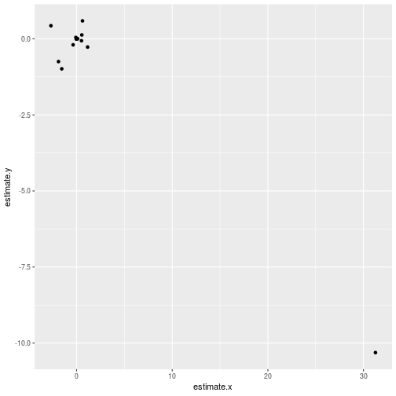
