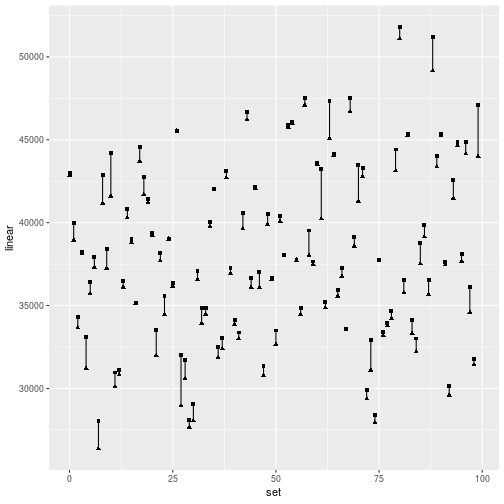

# Chapter 3 - Conceptual

## 1) Null Hypothesis

*Describe the null hypothesis to which the p-values given in table 3.4 correspond. Explain the conclusions you can draw based on these values. Explaination should be phrased in terms of `sales`, `TV`, `radio`, and `newspaper`.*

The p-value is a value between 0 and 1 that gives a probability that the null hypothesis is true. 

The null hypothesis for the next three rows of is "The advertising spend on {`TV`, `radio`, `newspaper`} has no influence on the amount of `sales`.

From the values, we can reject the null hypothesis for the `Intercept`, `TV` and `radio`, but cannot reject it for `newspaper`.

## 2) KNN

*Carefully explain the differences between the KNN classifier and KNN regression methods.*

The KNN classifier and the KNN regression are related. The classifier estimates a qualitative class for an observation based on its `K` nearest neighbours.

The KNN regression identifies `K` training ovservations that are closest to `x0` (represented by `N0`) and then estimates `f(x0)` using the average of all of the training responses in `N0`.


## 3) Predictors

Consider a data set with five predictors {X1, ..., X5} = (GPA, IQ, Gender, Interaction between GPA and IQ, Interaction between GPA and Gender). The response is starting salary after graduation (in thousands of dollars).

Suppose we use least squares fit and get B0 = 50, B1 = 20. B2 = 0.07, B3 = 35, B4 = 0.01, B5 = -10.

### a) Which answer is correct

1)  For a fixed value of IQ and GPA, males earn more on average than females
2)  For a fixed value of IQ and GPA, females earn more on average than males
3)  For a fixed value of IQ and GPA, males earn more on average provided that the GPA is high enough.
4)  For a fixed value of IQ and GPA, females earn more on average provided that the GPA is high enough.

To answer this, we fix B1, B2 and B4, so we're dependent on B3 = 35 and B5 = -10. B3 shows males earning more than females (we assume the dummy variable is 1 for males, 0 for females). B5 shows a negative correllation between males and GPA. Taking these two together, 3 is the correct answer.

### b) Predict the salary of a female with IQ 110 and a G.P.A of 4.0

f(x)    = 50 + 20*4.0 + 0.07*110 + 35*(0) + 0.01*(4.0 * 110) + -10(0 * 4.0)
        = 50 + 80 + 7.7 + 0 + 4.4 + 0
        = 142.1

### c) True or false: since the coefficient for the GPA/IQ interaction term is very small, there is very little evidence of an interaction effect.

The absolute value of the coefficient can't used to determine interaction, as it relies on the underlying units. The p-value of the regression coefficient is used to determine if the term is statistically significant or not.

## 4) Consider a set of dat (n = 100) with a single predictor and a quantitative response. A linear regression is fit as well as a cubic regression.

### a) Suppose the true relationship is linear. Consider the training residual sum of squares (RSS) for the linear regssion and for the cubic. Would we expect one to be lower, the same, or not enough information to tell?

The residual sum of squares is a measure of the discrepency between the data an the estimation model. Even though the true relationship is linear, the cubic regression will fit the test data better as it has higher flexibility / lower bias. 

### b) Answer a) using test rather than training RSS

We would expect on the long run that, because the relationship is linear, than the RSS for the linear regression would be lower.

### c) Suppose that the true relationship is not linear, but we don't know how far it is from linear. Consider the training RSS for the linear and the cubic. Would we expect one to be lower, the same, or not enough information.

Again, we would expect the cubic regression to fit the test data better as it has a higher flexibility.

### d) Answer c) using test rather than training RSS.

Given we don't know 'how far from linear' the data is, there isn't enough information to answer this correctly.

### Aside

Out of interests sake, lets generate 100 points of training data where f(x) = 3x + E. We then fit both a linear and a cubic regression to it. 


```r
library(tidyverse)

f_x <- tibble(x = c(1:100)) %>% rowwise() %>% mutate(y = 3*x + rnorm(1, 0, 10))
linear <- lm(y ~ x, data = f_x)
cubic <- lm(y ~ poly(x,3), data = f_x)
```
We then calculate the RSS with `deviance()`.

```r
deviance(linear)
```

```
## [1] 11174.78
```

```r
deviance(cubic)
```

```
## [1] 11066.78
```

We can see that the cubic (in this instance) has a lower RSS. But does this always hold true?

We create a function which returns a tibble of n observations in s sets, based on a function passed to it:


```r
generate_observations <- function(observations, sets, func) {
  a <- tibble(x = 1:(observations * sets)) %>% rowwise() %>% mutate(y = func(x), set = x %% sets)
  return(a)
}
```

We then group by each set and summarise on the RSS of a linear and cubic regression. When we graph this, we can see the linear RSS (denoted by the circle) looks to always be larger than the cubic RSS (denoted by the triangle).

```r
generate_observations(100, 100, function(x) 3 * x + rnorm(1,0,20)) %>% 
    group_by(set) %>% 
    summarise(linear = lm(y~x) %>% deviance(), cubic = lm(y~poly(x,3)) %>% deviance()) %>% 
    ggplot + 
    geom_point(aes(set, linear), shape = 'square') + 
    geom_point(aes(set, cubic), shape = 'triangle') + 
    geom_segment(aes(x = set, y = linear, xend = set, yend = cubic), lineend = 'butt')
```



Even generating 10,000 different sets of 100 observations, we don't see a linear RSS below that of a cubic RSS:


```r
generate_observations(100, 10000, function(x) 3 * x + rnorm(1,0,20)) %>% 
    group_by(set) %>% 
    summarise(linear = lm(y~x) %>% deviance(), cubic = lm(y~poly(x,3)) %>% deviance()) %>% 
    mutate(rss_diff = linear - cubic) %>% 
    arrange(rss_diff)
```

```
## # A tibble: 10,000 x 4
##      set linear  cubic rss_diff
##    <dbl>  <dbl>  <dbl>    <dbl>
##  1  5335 34663. 34663.  0.00427
##  2  4768 32481. 32480.  0.152  
##  3  7398 42744. 42744.  0.170  
##  4  3926 33448. 33448.  0.240  
##  5  8443 43568. 43567.  0.489  
##  6  7440 40615. 40614.  0.553  
##  7  9045 35066. 35066.  0.653  
##  8  6299 32981. 32980.  0.723  
##  9  1649 33182. 33181.  0.820  
## 10  1766 27668. 27667.  0.827  
## # … with 9,990 more rows
```

