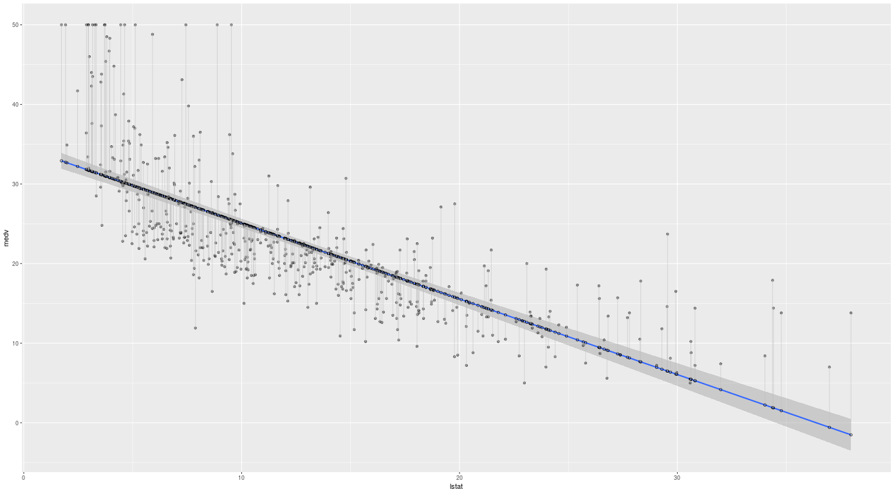

# Chapter 3 - Lab

Load the required libraries, and convert the the Boston data to a tibble:
```{r setup, message = FALSE}
library(tidyverse)
library(broom)
library(MASS)
library(ISLR)

boston <- as.tibble(Boston)
```

Calculate the linear regression of lstat (lower status of population) on to medv (median value of owner-occupied homes) and tidy it using broom:

```{r}    
lm_boston <- lm(medv ~ lstat, boston) %>% tidy

lm_boston

summary(lm_boston)
confint(lm_boston)
```

The `predict()` method is given the result of the linear regression and some predictors. It returns a data frame with the predicted response variable.

	> predict(lm_boston, data.frame( lstat = c(1,20,40) ))
	        1         2         3 
	33.603792 15.552854 -3.448133 

Not that the name of the predictor must match the name given in the linear regression.

Lets add the prediction and the residuals for each of our lstat observations:

	> boston <- boston %>% mutate(medv_lm = predict(lm_boston))
	> boston <- boston %>% mutate(medv_resid = residuals(lm_boston))

We now graph these:

	boston %>% ggplot(aes(lstat, medv)) + 
		geom_smooth(method = 'lm') + 
		geom_point(alpha = .4) + 
		geom_point(aes(lstat, medv_lm), shape = 1) + 
		geom_segment(aes(xend = lstat, yend = medv_lm), alpha = .5, colour = 'grey')




	


