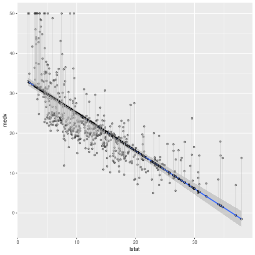

# Chapter 3 - Lab

Load the required libraries, and convert the the Boston data to a tibble:

```r
library(tidyverse)
library(broom)
library(MASS)
library(ISLR)

boston <- as.tibble(Boston)
```

Calculate the linear regression of lstat (lower status of population) on to medv (median value of owner-occupied homes) and tidy it using broom:


```r
lm_boston <- lm(medv ~ lstat, boston)

lm_boston
```

```
## 
## Call:
## lm(formula = medv ~ lstat, data = boston)
## 
## Coefficients:
## (Intercept)        lstat  
##       34.55        -0.95
```

```r
summary(lm_boston)
```

```
## 
## Call:
## lm(formula = medv ~ lstat, data = boston)
## 
## Residuals:
##     Min      1Q  Median      3Q     Max 
## -15.168  -3.990  -1.318   2.034  24.500 
## 
## Coefficients:
##             Estimate Std. Error t value Pr(>|t|)    
## (Intercept) 34.55384    0.56263   61.41   <2e-16 ***
## lstat       -0.95005    0.03873  -24.53   <2e-16 ***
## ---
## Signif. codes:  0 '***' 0.001 '**' 0.01 '*' 0.05 '.' 0.1 ' ' 1
## 
## Residual standard error: 6.216 on 504 degrees of freedom
## Multiple R-squared:  0.5441,	Adjusted R-squared:  0.5432 
## F-statistic: 601.6 on 1 and 504 DF,  p-value: < 2.2e-16
```

```r
confint(lm_boston)
```

```
##                 2.5 %     97.5 %
## (Intercept) 33.448457 35.6592247
## lstat       -1.026148 -0.8739505
```

The `predict()` method is given the result of the linear regression and some predictors. It returns a data frame with the predicted response variable.


```r
predict(lm_boston, data.frame( lstat = c(1,20,40) ))
```

```
##         1         2         3 
## 33.603792 15.552854 -3.448133
```

Note that the name of the predictor must match the name given in the linear regression.

Lets add the prediction and the residuals for each of our lstat observations:


```r
boston <- boston %>% mutate(medv_pred = predict(lm_boston))
boston <- boston %>% mutate(medv_resid = residuals(lm_boston))
```

We now graph these:


```r
boston %>% ggplot(aes(lstat, medv)) + 
    geom_smooth(method = 'lm') + 
    geom_point(alpha = .4) + 
    geom_point(aes(lstat, medv_lm), shape = 1) + 
    geom_segment(aes(xend = lstat, yend = medv_lm), alpha = .5, colour = 'grey')
```

```
## Error in FUN(X[[i]], ...): object 'medv_lm' not found
```




	


