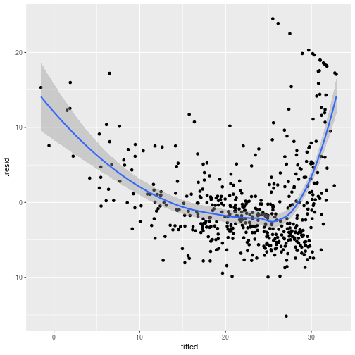
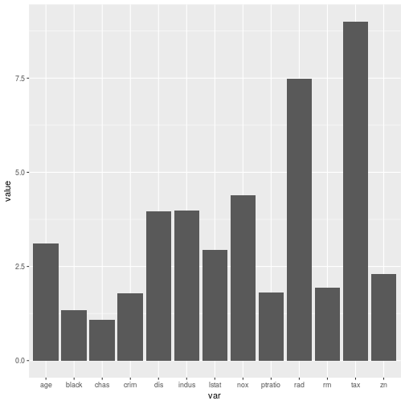

# Chapter 3 - Lab

## Simple Linear Regression

Load the required libraries, and convert the the Boston data to a tibble:

```r
library(tidyverse)
library(broom)
library(MASS)

boston <- as.tibble(Boston)
```

Calculate the linear regression of lstat (lower status of population) on to medv (median value of owner-occupied homes).


```r
lm_boston <- lm(medv ~ lstat, boston)

lm_boston
```

```
## 
## Call:
## lm(formula = medv ~ lstat, data = boston)
## 
## Coefficients:
## (Intercept)        lstat  
##       34.55        -0.95
```

```r
summary(lm_boston)
```

```
## 
## Call:
## lm(formula = medv ~ lstat, data = boston)
## 
## Residuals:
##     Min      1Q  Median      3Q     Max 
## -15.168  -3.990  -1.318   2.034  24.500 
## 
## Coefficients:
##             Estimate Std. Error t value Pr(>|t|)    
## (Intercept) 34.55384    0.56263   61.41   <2e-16 ***
## lstat       -0.95005    0.03873  -24.53   <2e-16 ***
## ---
## Signif. codes:  0 '***' 0.001 '**' 0.01 '*' 0.05 '.' 0.1 ' ' 1
## 
## Residual standard error: 6.216 on 504 degrees of freedom
## Multiple R-squared:  0.5441,	Adjusted R-squared:  0.5432 
## F-statistic: 601.6 on 1 and 504 DF,  p-value: < 2.2e-16
```

```r
confint(lm_boston)
```

```
##                 2.5 %     97.5 %
## (Intercept) 33.448457 35.6592247
## lstat       -1.026148 -0.8739505
```

We can extract some of the key variables of the regression using the `augment()` function:

```r
augment(lm_boston)
```

```
## # A tibble: 506 x 9
##     medv lstat .fitted .se.fit  .resid    .hat .sigma   .cooksd .std.resid
##  * <dbl> <dbl>   <dbl>   <dbl>   <dbl>   <dbl>  <dbl>     <dbl>      <dbl>
##  1  24    4.98   29.8    0.406  -5.82  0.00426   6.22   1.89e-3    -0.939 
##  2  21.6  9.14   25.9    0.308  -4.27  0.00246   6.22   5.82e-4    -0.688 
##  3  34.7  4.03   30.7    0.433   3.97  0.00486   6.22   1.00e-3     0.641 
##  4  33.4  2.94   31.8    0.467   1.64  0.00564   6.22   1.98e-4     0.264 
##  5  36.2  5.33   29.5    0.396   6.71  0.00406   6.21   2.38e-3     1.08  
##  6  28.7  5.21   29.6    0.399  -0.904 0.00413   6.22   4.40e-5    -0.146 
##  7  22.9 12.4    22.7    0.276   0.155 0.00198   6.22   6.20e-7     0.0250
##  8  27.1 19.2    16.4    0.374  10.7   0.00362   6.20   5.44e-3     1.73  
##  9  16.5 29.9     6.12   0.724  10.4   0.0136    6.20   1.94e-2     1.68  
## 10  18.9 17.1    18.3    0.326   0.592 0.00274   6.22   1.25e-5     0.0954
## # ... with 496 more rows
```

Using this, we can generate a plot with:

* The fitted line using `geom_smooth()`.
* The (lstat, medv) x/y points.
* The predicted value of medv given the linear regression.
* Segments linking the actual and predicted values of medv.


```r
augment(lm_boston) %>% ggplot(aes(lstat, medv)) + 
    geom_smooth(method = 'lm') + 
    geom_point(alpha = .4) + 
    geom_point(aes(lstat, .fitted), shape = 1) + 
    geom_segment(aes(xend = lstat, yend = .fitted), alpha = .5, colour = 'grey')
```


### Predicted versus Residuals

We plot the predited values versus the residuals to get an idea if the


```r
augment(lm_boston) %>% 
    ggplot(aes(.fitted, .resid)) + 
    geom_point() + 
    geom_smooth()
```

```
## `geom_smooth()` using method = 'loess' and formula 'y ~ x'
```



We can see a U shape, indicating non-linearity in the data.

### Leverage


```r
augment(lm_boston) %>% 
    mutate(index = c(1:nrow(augment(lm_boston)))) %>% 
    ggplot(aes(index, .hat)) + 
    geom_point()
```


## Multiple Linear Regression

To perform a linear regression with multiple variables, add the predictors together with `+`:


```r
mult_lm_boston <- lm(medv ~ lstat + age, data = boston)
summary(mult_lm_boston)
```

```
## 
## Call:
## lm(formula = medv ~ lstat + age, data = boston)
## 
## Residuals:
##     Min      1Q  Median      3Q     Max 
## -15.981  -3.978  -1.283   1.968  23.158 
## 
## Coefficients:
##             Estimate Std. Error t value Pr(>|t|)    
## (Intercept) 33.22276    0.73085  45.458  < 2e-16 ***
## lstat       -1.03207    0.04819 -21.416  < 2e-16 ***
## age          0.03454    0.01223   2.826  0.00491 ** 
## ---
## Signif. codes:  0 '***' 0.001 '**' 0.01 '*' 0.05 '.' 0.1 ' ' 1
## 
## Residual standard error: 6.173 on 503 degrees of freedom
## Multiple R-squared:  0.5513,	Adjusted R-squared:  0.5495 
## F-statistic:   309 on 2 and 503 DF,  p-value: < 2.2e-16
```

To perform a regression against all of the predictors, the `.` can be used:


```r
mult_lm_boston <- lm(medv ~ ., boston)
summary(mult_lm_boston)
```

```
## 
## Call:
## lm(formula = medv ~ ., data = boston)
## 
## Residuals:
##     Min      1Q  Median      3Q     Max 
## -15.595  -2.730  -0.518   1.777  26.199 
## 
## Coefficients:
##               Estimate Std. Error t value Pr(>|t|)    
## (Intercept)  3.646e+01  5.103e+00   7.144 3.28e-12 ***
## crim        -1.080e-01  3.286e-02  -3.287 0.001087 ** 
## zn           4.642e-02  1.373e-02   3.382 0.000778 ***
## indus        2.056e-02  6.150e-02   0.334 0.738288    
## chas         2.687e+00  8.616e-01   3.118 0.001925 ** 
## nox         -1.777e+01  3.820e+00  -4.651 4.25e-06 ***
## rm           3.810e+00  4.179e-01   9.116  < 2e-16 ***
## age          6.922e-04  1.321e-02   0.052 0.958229    
## dis         -1.476e+00  1.995e-01  -7.398 6.01e-13 ***
## rad          3.060e-01  6.635e-02   4.613 5.07e-06 ***
## tax         -1.233e-02  3.760e-03  -3.280 0.001112 ** 
## ptratio     -9.527e-01  1.308e-01  -7.283 1.31e-12 ***
## black        9.312e-03  2.686e-03   3.467 0.000573 ***
## lstat       -5.248e-01  5.072e-02 -10.347  < 2e-16 ***
## ---
## Signif. codes:  0 '***' 0.001 '**' 0.01 '*' 0.05 '.' 0.1 ' ' 1
## 
## Residual standard error: 4.745 on 492 degrees of freedom
## Multiple R-squared:  0.7406,	Adjusted R-squared:  0.7338 
## F-statistic: 108.1 on 13 and 492 DF,  p-value: < 2.2e-16
```

To perform a regression with all predictors except one:

```r
mult_lm_boston <- lm(medv ~ .-age, boston)
```

### Variance Inflation Factors


```r
library(car)
vif(mult_lm_boston) %>% 
    as.tibble() %>% 
    mutate(var = names(vif(mult_lm_boston))) %>% 
    ggplot(aes(var, value)) + 
    geom_bar(stat = "identity")
```



## Interaction Terms

To include an interaction term in `lm()`, you can use `pred_1:pred_2`. To include the predictors and the interaction term you can use `pred_1*pred_2`, which is shorthand for `pred_1 + pred_2 + pred_1:pred2`.


```r
mult_lm_boston <- lm(medv ~ lstat*age, boston)
summary(mult_lm_boston)
```

```
## 
## Call:
## lm(formula = medv ~ lstat * age, data = boston)
## 
## Residuals:
##     Min      1Q  Median      3Q     Max 
## -15.806  -4.045  -1.333   2.085  27.552 
## 
## Coefficients:
##               Estimate Std. Error t value Pr(>|t|)    
## (Intercept) 36.0885359  1.4698355  24.553  < 2e-16 ***
## lstat       -1.3921168  0.1674555  -8.313 8.78e-16 ***
## age         -0.0007209  0.0198792  -0.036   0.9711    
## lstat:age    0.0041560  0.0018518   2.244   0.0252 *  
## ---
## Signif. codes:  0 '***' 0.001 '**' 0.01 '*' 0.05 '.' 0.1 ' ' 1
## 
## Residual standard error: 6.149 on 502 degrees of freedom
## Multiple R-squared:  0.5557,	Adjusted R-squared:  0.5531 
## F-statistic: 209.3 on 3 and 502 DF,  p-value: < 2.2e-16
```

## Non-linear Transformations of Predictors

The `lm()` function can accommodate non-linear transformations of the predictors. For example to perform a polynomial regression of `lstat` on to `medv`:


```r
poly_lm_boston <- lm(medv ~ lstat + poly(lstat,2), boston)
```


## Qualitative Predictors


```r
library(ISLR)
carseats <- as.tibble(Carseats)
```


```r
lm_carseats <- carseats %>% lm(data = ., Sales ~ . + Income:Advertising + Price:Age)

tidy(lm_carseats)
```

```
## # A tibble: 14 x 5
##    term                estimate std.error statistic   p.value
##    <chr>                  <dbl>     <dbl>     <dbl>     <dbl>
##  1 (Intercept)         6.58      1.01         6.52  2.22e- 10
##  2 CompPrice           0.0929    0.00412     22.6   1.64e- 72
##  3 Income              0.0109    0.00260      4.18  3.57e-  5
##  4 Advertising         0.0702    0.0226       3.11  2.03e-  3
##  5 Population          0.000159  0.000368     0.433 6.65e-  1
##  6 Price              -0.101     0.00744    -13.5   1.74e- 34
##  7 ShelveLocGood       4.85      0.153       31.7   1.38e-109
##  8 ShelveLocMedium     1.95      0.126       15.5   1.34e- 42
##  9 Age                -0.0579    0.0160      -3.63  3.18e-  4
## 10 Education          -0.0209    0.0196      -1.06  2.88e-  1
## 11 UrbanYes            0.140     0.112        1.25  2.13e-  1
## 12 USYes              -0.158     0.149       -1.06  2.91e-  1
## 13 Income:Advertising  0.000751  0.000278     2.70  7.29e-  3
## 14 Price:Age           0.000107  0.000133     0.801 4.24e-  1
```


	


