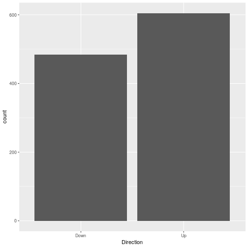

# Chapter 4 - Applied


## 10) 'Weekly' Data Set

### a)
*Produce some numerical and graphical summaries of the Weekly data. Do there appear to be any patterns?*


```r
weekly <- as_tibble(Weekly)
weekly %>% ggplot() + geom_bar(aes(Direction))
```




### b)
*Use the full data set to perform a logistic regression with Direction as the response and the five lag variables plus Volume as predictors. Use the summary function to print the results. Do any of the predictors appear to be statistically significant? If so, which ones?*


```r
glm_weekly <- weekly %>% 
    select(-Year, -Today, -Volume) %>% 
    glm(Direction ~ ., ., family = binomial)

glm_weekly %>% tidy()
```

```
## # A tibble: 6 x 5
##   term        estimate std.error statistic  p.value
##   <chr>          <dbl>     <dbl>     <dbl>    <dbl>
## 1 (Intercept)   0.230     0.0620     3.71  0.000205
## 2 Lag1         -0.0401    0.0264    -1.52  0.128   
## 3 Lag2          0.0602    0.0267     2.25  0.0245  
## 4 Lag3         -0.0151    0.0266    -0.566 0.571   
## 5 Lag4         -0.0268    0.0264    -1.01  0.311   
## 6 Lag5         -0.0135    0.0264    -0.512 0.609
```

The Lag2 variable is the only variable with a statistically significant p-value (0.025).

### c)
*Compute the confusion matrix and overall fraction of correct predictions. Explain what the confusion matrix is telling you about the types of mistakes made by logistic regression.*


```r
weekly %>% 
    mutate(Prediction = ifelse(predict(glm_weekly, type = 'response') < .5, 'Down', 'Up')) %>% 
    group_by(Direction, Prediction) %>% 
    tally() 
```

```
## # A tibble: 4 x 3
## # Groups:   Direction [?]
##   Direction Prediction     n
##   <fct>     <chr>      <int>
## 1 Down      Down          49
## 2 Down      Up           435
## 3 Up        Down          41
## 4 Up        Up           564
```

We can see that the logistic regression does well to predict when the market goes up, but not when the market goes down.

### d)
*Now fit the logistic regression model using a training data period from 1990 to 2008, with Lag2 as the only predictor. Compute the confusion matrix and the overall fraction of correct predictions for the held out data (that is, the data from 2009 and 2010).*


```r
glm_weekly_90_08 <- weekly %>% 
    dplyr::filter(Year >= 1990 && Year <= 2008) %>% 
    select(Direction, Lag2) %>% 
    glm(Direction~Lag2,., family = 'binomial')

weekly %>% 
    dplyr::filter(Year > 2008) %>% 
    mutate(Prediction = ifelse(predict(glm_weekly_90_08, ., type = 'response') < .5, "Down", "Up")) %>% 
    group_by(Direction, Prediction) %>% 
    tally()
```

```
## # A tibble: 4 x 3
## # Groups:   Direction [?]
##   Direction Prediction     n
##   <fct>     <chr>      <int>
## 1 Down      Down           9
## 2 Down      Up            34
## 3 Up        Down           5
## 4 Up        Up            56
```
