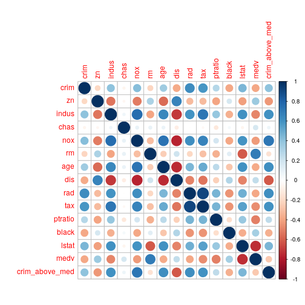

# Chapter 4 - Applied


## 10) 'Weekly' Data Set

### a)
*Produce some numerical and graphical summaries of the Weekly data. Do there appear to be any patterns?*


```r
weekly <- as_tibble(Weekly)
weekly %>% ggplot() + geom_bar(aes(Direction))
```


### b)
*Use the full data set to perform a logistic regression with Direction as the response and the five lag variables plus Volume as predictors. Use the summary function to print the results. Do any of the predictors appear to be statistically significant? If so, which ones?*


```r
glm_weekly <- weekly %>% 
    select(-Year, -Today, -Volume) %>% 
    glm(Direction ~ ., ., family = binomial)

glm_weekly %>% tidy()
```

```
## # A tibble: 6 x 5
##   term        estimate std.error statistic  p.value
##   <chr>          <dbl>     <dbl>     <dbl>    <dbl>
## 1 (Intercept)   0.230     0.0620     3.71  0.000205
## 2 Lag1         -0.0401    0.0264    -1.52  0.128   
## 3 Lag2          0.0602    0.0267     2.25  0.0245  
## 4 Lag3         -0.0151    0.0266    -0.566 0.571   
## 5 Lag4         -0.0268    0.0264    -1.01  0.311   
## 6 Lag5         -0.0135    0.0264    -0.512 0.609
```

The Lag2 variable is the only variable with a statistically significant p-value (0.025).

### c)
*Compute the confusion matrix and overall fraction of correct predictions. Explain what the confusion matrix is telling you about the types of mistakes made by logistic regression.*


```r
weekly %>% 
    mutate(Prediction = ifelse(predict(glm_weekly, type = 'response') < .5, 'Down', 'Up')) %>% 
    group_by(Direction, Prediction) %>% 
    tally() 
```

```
## # A tibble: 4 x 3
## # Groups:   Direction [?]
##   Direction Prediction     n
##   <fct>     <chr>      <int>
## 1 Down      Down          49
## 2 Down      Up           435
## 3 Up        Down          41
## 4 Up        Up           564
```

We can see that the logistic regression does well to predict when the market goes up, but not when the market goes down.

### d)
*Now fit the logistic regression model using a training data period from 1990 to 2008, with Lag2 as the only predictor. Compute the confusion matrix and the overall fraction of correct predictions for the held out data (that is, the data from 2009 and 2010).*


```r
glm_weekly_90_08 <- weekly %>% 
    dplyr::filter(Year >= 1990 && Year <= 2008) %>% 
    glm(Direction~Lag2,., family = 'binomial')

weekly %>% 
    dplyr::filter(Year > 2008) %>% 
    mutate(Prediction = ifelse(predict(glm_weekly_90_08, ., type = 'response') < .5, "Down", "Up")) %>% 
    group_by(Direction, Prediction) %>% 
    tally()
```

```
## # A tibble: 4 x 3
## # Groups:   Direction [?]
##   Direction Prediction     n
##   <fct>     <chr>      <int>
## 1 Down      Down           9
## 2 Down      Up            34
## 3 Up        Down           5
## 4 Up        Up            56
```

### e)
*Repeat (d) using LDA.*


```r
lda_weekly_90_08 <- weekly %>% 
    dplyr::filter(Year <= 2008) %>% 
    lda(Direction~Lag2, .)

weekly %>% 
    dplyr::filter(Year > 2008) %>% 
    mutate(Prediction = ifelse(predict(lda_weekly_90_08, .)$x < .5, "Down", "Up")) %>% 
    group_by(Direction, Prediction) %>% 
    tally()
```

```
## # A tibble: 4 x 3
## # Groups:   Direction [?]
##   Direction Prediction     n
##   <fct>     <chr>      <int>
## 1 Down      Down          25
## 2 Down      Up            18
## 3 Up        Down          37
## 4 Up        Up            24
```

### f)
*Repeat (d) using QDA.*


```r
qda_weekly_90_08 <- weekly %>% 
    dplyr::filter(Year <= 2008) %>% 
    qda(Direction~Lag2, .)

weekly %>%
    dplyr::filter(Year > 2008) %>%
    mutate(Prediction = predict(qda_weekly_90_08, .)$class) %>%
    group_by(Direction, Prediction) %>%
    tally()
```

```
## # A tibble: 2 x 3
## # Groups:   Direction [?]
##   Direction Prediction     n
##   <fct>     <fct>      <int>
## 1 Down      Up            43
## 2 Up        Up            61
```

### g)

```r
library(class)
weekly_train <- weekly %>% dplyr::filter(Year <= 2008) %>% dplyr::select(Lag2)
weekly_test <- weekly %>% dplyr::filter(Year > 2008) %>% dplyr::select(Lag2)
weekly_K <- weekly %>% dplyr::filter(Year <= 2008) %>% dplyr::select(Direction) %>% as_vector()
weekly %>% dplyr::filter(Year > 2008) %>% mutate(Prediction = knn(weekly_train, weekly_test, weekly_K, 1)) %>% group_by(Direction, Prediction) %>% tally()
```

```
## # A tibble: 4 x 3
## # Groups:   Direction [?]
##   Direction Prediction     n
##   <fct>     <fct>      <int>
## 1 Down      Down          21
## 2 Down      Up            22
## 3 Up        Down          30
## 4 Up        Up            31
```

### h)
*Which of these methods appears to provide the best results on this data?*

The error rates are:
* Logistic: (34 + 5) / 104 = 37.5%
* LDA: (18 + 37)/104 = 52.8%
* QDA: (43 / 104) = 41.3%
* KNN: (22 + 29) / 104 = 49%

THe logistic regression provides the bes

### i)
*Experiment with different combinations of predictors, including possible transformations and interactions, for each of the methods. Report the variables, method, and associated confusion matrix that appears to provide the best results on the heldout data. Note that you should also experiment with values for K in the KNN classifier.*

## 11) Auto Data Set

### a)
*Create a binary variable, mpg01 , that contains a 1 if mpg contains a value above its median, and a 0 if mpg contains a value below its median. You can compute the median using the median() function. Note you may find it helpful to use the data.frame() function to create a single data set containing both mpg01 and the other Auto variables.*


```r
auto <- as_tibble(Auto) %>% mutate(mpg01 = ifelse(mpg >= median(mpg), 1, 0))
```

### b)
*Explore the data graphically in order to investigate the association between mpg01 and the other features. Which of the other features seem most likely to be useful in predicting mpg01 ? Scatterplots and boxplots may be useful tools to answer this question. Describe your findings.*


```r
library(corrplot)
```

```
## corrplot 0.84 loaded
```

```r
auto %>% dplyr::select(-name) %>% cor() %>% corrplot()
```


```r
auto %>% ggplot() + geom_point(aes(horsepower, displacement, colour = as.factor(mpg01)))
```


We see a strong negative correlation between mpg01 and cylinders, displacement, horsepower and weight.

### c)
*Split the data into a training set and a test set.*

We keep all the data in the same tibble, but use a random binomial to split the set:

```r
set.seed(1)
auto <- auto %>% dplyr::mutate(training_set = rbinom(n = n(), 1, .5) == 1)
```

### d)
*Perform LDA on the training data in order to predict mpg01 using the variables that seemed most associated with mpg01 in (b). What is the test error of the model obtained?*


```r
mpg.lda <- auto %>% dplyr::filter(training_set) %>% lda(mpg01 ~ cylinders+displacement+horsepower+weight, .)
auto <- auto %>% mutate(Prediction = predict(mpg.lda, .)$class)
auto %>% dplyr::filter(!training_set) %>% group_by(mpg01, Prediction) %>% tally()
```

```
## # A tibble: 4 x 3
## # Groups:   mpg01 [?]
##   mpg01 Prediction     n
##   <dbl> <fct>      <int>
## 1     0 0             91
## 2     0 1             14
## 3     1 0              6
## 4     1 1            101
```

The test error is 14 + 6 /  212 or 9.4%

### e)
*Perform QDA on the training data in order to predict mpg01 using the variables that seemed most associated with mpg01 in (b). What is the test error of the model obtained?*


```r
mpg.qda <- auto %>% qda(mpg01 ~ cylinders+displacement+horsepower+weight, .)
auto <- auto %>% mutate(qda_prediction = predict(mpg.qda, .)$class)
auto %>% dplyr::filter(!training_set) %>% group_by(mpg01, qda_prediction) %>% tally()
```

```
## # A tibble: 4 x 3
## # Groups:   mpg01 [?]
##   mpg01 qda_prediction     n
##   <dbl> <fct>          <int>
## 1     0 0                 96
## 2     0 1                  9
## 3     1 0                 10
## 4     1 1                 97
```

The test error is 9 + 10 / 212 or 8.9%

### f)
*Perform logistic regression on the training data in order to predict mpg01 using the variables that seemed most associated with mpg01 in (b). What is the test error of the model obtained?*


```r
mpg.logistic <- auto %>% glm(mpg01 ~ cylinders+displacement+horsepower+weight, ., family = binomial)
auto <- auto %>% mutate(lgstc_prediction = ifelse(predict(mpg.logistic, ., type = 'response') < .5, '0', '1'))
auto %>% dplyr::filter(!training_set) %>% group_by(mpg01, lgstc_prediction) %>% tally()
```

```
## # A tibble: 4 x 3
## # Groups:   mpg01 [?]
##   mpg01 lgstc_prediction     n
##   <dbl> <chr>            <int>
## 1     0 0                   93
## 2     0 1                   12
## 3     1 0                   10
## 4     1 1                   97
```

The test error is 12 + 10 / 212 or 10%.

### g)
*Perform KNN on the training data, with several values of K, in order to predict mpg01 . Use only the variables that seemed most associated with mpg01 in (b). What test errors do you obtain? Which value of K seems to perform the best on this data set?*


```r
auto_knn_train <- auto %>% 
    dplyr::filter(training_set) %>% 
    dplyr::select(mpg01, cylinders, displacement, horsepower, weight)

auto_knn_test <- auto %>% 
    dplyr::filter(!training_set) %>% 
    dplyr::select(mpg01, cylinders, displacement, horsepower, weight)

auto_knn_K <- auto %>% 
    dplyr::filter(training_set) %>% 
    dplyr::select(mpg01) %>% as_vector()

auto %>% dplyr::filter(!training_set) %>% 
    add_column(knn.pred = knn(auto_knn_train, auto_knn_test, auto_knn_K, k = 1)) %>% 
    group_by(mpg01, knn.pred) %>% 
    tally()
```

```
## # A tibble: 4 x 3
## # Groups:   mpg01 [?]
##   mpg01 knn.pred     n
##   <dbl> <fct>    <int>
## 1     0 0           91
## 2     0 1           14
## 3     1 0            8
## 4     1 1           99
```

```r
auto %>% dplyr::filter(!training_set) %>% 
    add_column(knn.pred = knn(auto_knn_train, auto_knn_test, auto_knn_K, k = 5)) %>% 
    group_by(mpg01, knn.pred) %>% 
    tally()
```

```
## # A tibble: 4 x 3
## # Groups:   mpg01 [?]
##   mpg01 knn.pred     n
##   <dbl> <fct>    <int>
## 1     0 0           88
## 2     0 1           17
## 3     1 0            8
## 4     1 1           99
```

```r
auto %>% dplyr::filter(!training_set) %>% 
    add_column(knn.pred = knn(auto_knn_train, auto_knn_test, auto_knn_K, k = 20)) %>% 
    group_by(mpg01, knn.pred) %>% 
    tally()
```

```
## # A tibble: 4 x 3
## # Groups:   mpg01 [?]
##   mpg01 knn.pred     n
##   <dbl> <fct>    <int>
## 1     0 0           87
## 2     0 1           18
## 3     1 0            6
## 4     1 1          101
```

Test error rates:
* k = 1: 10.3%
* k = 5: 11.7%
* k = 10: 12.2%

## 12) Writing Functions

### a)
*Write a function, Power() , that prints out the result of raising 2 to the 3rd power.*

Trivial - skipping

### b)
*Create a new function, Power2() , that allows you to pass any two numbers, x and a , and prints out the value of x^a .*


```r
to_power <- function(x, y) { return(x^y) }
print(to_power(2,3))
```

```
## [1] 8
```

### c)
*Using the Power2() function that you just wrote, compute 10pow3, 8pow17, and 131pow3.*

```r
print(to_power(10,3))
```

```
## [1] 1000
```

```r
print(to_power(8,17))
```

```
## [1] 2.2518e+15
```

```r
print(to_power(131,3))
```

```
## [1] 2248091
```

### d) 
*Now create a new function, Power3() , that actually returns the result x^a as an R object*

Trivial - skipping

### e)
*Now using the Power3() function, create a plot of f (x) = xpow2*


```r
tibble(x = -100:100, y = to_power(x, 2)) %>% ggplot(aes(x,y)) + geom_line()
```


### f) 
*Create a function, PlotPower() , that allows you to create a plot of x against y*


```r
plot_power <- function(x,y) {
    tibble(x = x, y = to_power(x, y)) %>% ggplot(aes(x,y)) + geom_line()
}

plot_power(-100:100, 1)
```


```r
plot_power(-100:100, 2)
```


```r
plot_power(-100:100, 3)
```


```r
plot_power(-100:100, 4)
```


## 13) Boston Data Set

*Using the Boston data set, fit classification models in order to predict whether a given suburb has a crime rate above or below the median. Explore logistic regression, LDA, and KNN models using various subsets of the predictors. Describe your findings.*

Let's create a function which let's us run the logistic, LDA and QDA in one go. It takes the data frame, the formula, and the fraction of the table to use for training. It returns the data frame with prediction columns added.


```r
multi_regression <- function(data, formula, fraction = .5) {
    train <- sample_frac(data, fraction)
    logistic.reg <- glm(formula, train, family = 'binomial')
    lda.reg <- lda(formula, train)
    qda.reg <- qda(formula, train)

    ret_data <- data %>% 
        mutate(
            logistic.pred = ifelse(predict(logistic.reg, ., type = 'response') < .5, 0, 1), 
            lda.pred = predict(lda.reg, .)$class, 
            qda.pred = predict(qda.reg, .)$class
        ) 
    
    return(ret_data)
}
```

Now let's run this across the Boston data set. We at a qualitative coding variable which denotes whether the crime rate is above or below the median. We then take a look at the correllation matrix:


```r
boston <- as_tibble(Boston)
boston <- boston %>% mutate(crim_above_med = crim > median(.[['crim']]))

boston %>% cor() %>% corrplot()
```



We see a positive correlation with indus, nox, age, rad and tax. Let's regress on these:


```r
set.seed(1)
boston_reg <- boston %>% multi_regression(crim_above_med ~ indus + nox + age + rad + tax)
boston_reg %>% summarise(logistic_error = mean(as.logical(logistic.pred) != crim_above_med))
```

```
## # A tibble: 1 x 1
##   logistic_error
##            <dbl>
## 1          0.101
```

```r
boston_reg %>% summarise(lda_error = mean(lda.pred != crim_above_med))
```

```
## # A tibble: 1 x 1
##   lda_error
##       <dbl>
## 1     0.156
```

```r
boston_reg %>% summarise(qda_error = mean(qda.pred != crim_above_med))
```

```
## # A tibble: 1 x 1
##   qda_error
##       <dbl>
## 1     0.168
```


