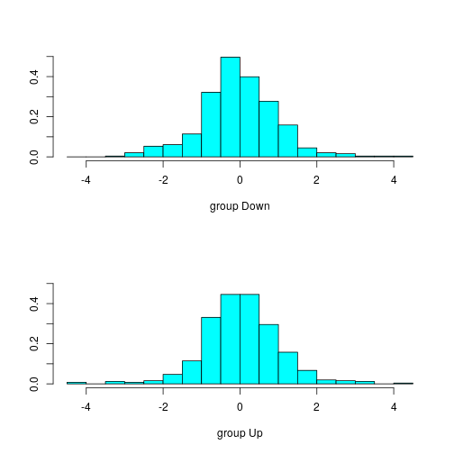

# Chapter 4 - Lab - Logistic Regression, LDA, QDA, and KNN

## 4.6.1 - Stock Market Data

We examine some numerical and graphical summaries of the `Smarket` data. We first   


```r
library(tidyverse)
library(broom)
library(ISLR)
```


```r
(smarket <- as_tibble(Smarket))
```

```
## # A tibble: 1,250 x 9
##     Year   Lag1   Lag2   Lag3   Lag4   Lag5 Volume  Today Direction
##  * <dbl>  <dbl>  <dbl>  <dbl>  <dbl>  <dbl>  <dbl>  <dbl> <fct>    
##  1  2001  0.381 -0.192 -2.62  -1.06   5.01    1.19  0.959 Up       
##  2  2001  0.959  0.381 -0.192 -2.62  -1.06    1.30  1.03  Up       
##  3  2001  1.03   0.959  0.381 -0.192 -2.62    1.41 -0.623 Down     
##  4  2001 -0.623  1.03   0.959  0.381 -0.192   1.28  0.614 Up       
##  5  2001  0.614 -0.623  1.03   0.959  0.381   1.21  0.213 Up       
##  6  2001  0.213  0.614 -0.623  1.03   0.959   1.35  1.39  Up       
##  7  2001  1.39   0.213  0.614 -0.623  1.03    1.44 -0.403 Down     
##  8  2001 -0.403  1.39   0.213  0.614 -0.623   1.41  0.027 Up       
##  9  2001  0.027 -0.403  1.39   0.213  0.614   1.16  1.30  Up       
## 10  2001  1.30   0.027 -0.403  1.39   0.213   1.23  0.287 Up       
## # ... with 1,240 more rows
```

We take a look at the pairwise correlations between the predictors in the set, removing `Direction` because it is quantative.

```r
smarket %>% select(-Direction) %>% cor() %>% tidy()
```

```
## Warning: 'tidy.matrix' is deprecated.
## See help("Deprecated")
```

```
## # A tibble: 8 x 9
##   .rownames   Year     Lag1     Lag2     Lag3     Lag4     Lag5  Volume
##   <chr>      <dbl>    <dbl>    <dbl>    <dbl>    <dbl>    <dbl>   <dbl>
## 1 Year      1       0.0297   0.0306   0.0332   0.0357   0.0298   0.539 
## 2 Lag1      0.0297  1       -0.0263  -0.0108  -0.00299 -0.00567  0.0409
## 3 Lag2      0.0306 -0.0263   1       -0.0259  -0.0109  -0.00356 -0.0434
## 4 Lag3      0.0332 -0.0108  -0.0259   1       -0.0241  -0.0188  -0.0418
## 5 Lag4      0.0357 -0.00299 -0.0109  -0.0241   1       -0.0271  -0.0484
## 6 Lag5      0.0298 -0.00567 -0.00356 -0.0188  -0.0271   1       -0.0220
## 7 Volume    0.539   0.0409  -0.0434  -0.0418  -0.0484  -0.0220   1     
## 8 Today     0.0301 -0.0262  -0.0103  -0.00245 -0.00690 -0.0349   0.0146
## # ... with 1 more variable: Today <dbl>
```

The correlations are all close to zero, with the only larger correlation being between `Year` and `Volume`, as the amount of trades have increased over time:

```r
smarket %>% group_by(Year) %>% summarise(sum(Volume))
```

```
## # A tibble: 5 x 2
##    Year `sum(Volume)`
##   <dbl>         <dbl>
## 1  2001          297.
## 2  2002          360.
## 3  2003          349.
## 4  2004          359.
## 5  2005          483.
```

## 4.6.2 - Logistic Regression

We now use a logistic regression model in order to predict `Direction` using `Lag1 .. Lag5` and `Volume`. 

We recall that trying to use a straight line to fit a binary response that is coded 0|1, there are always p(X) < 0 for some values of X. To avoid this, we must model p(X) with a functon that gives us outputs between 0 and 1. The logistic regression uses the [logistic function](https://en.wikipedia.org/wiki/Logistic_function).

We use the `glm()`, or *generalised linear models* function to achieve this.

Le


```r
smarket.glm <- glm(Direction ~ Lag1 + Lag2 + Lag3 + Lag4 + Lag5 + Volume, smarket, family = binomial)
smarket.glm %>% tidy() %>% arrange(p.value)
```

```
## # A tibble: 7 x 5
##   term        estimate std.error statistic p.value
##   <chr>          <dbl>     <dbl>     <dbl>   <dbl>
## 1 Lag1        -0.0731     0.0502    -1.46    0.145
## 2 Volume       0.135      0.158      0.855   0.392
## 3 Lag2        -0.0423     0.0501    -0.845   0.398
## 4 (Intercept) -0.126      0.241     -0.523   0.601
## 5 Lag3         0.0111     0.0499     0.222   0.824
## 6 Lag5         0.0103     0.0495     0.208   0.835
## 7 Lag4         0.00936    0.0500     0.187   0.851
```

Looking at the p-values for the predictors, the smallest one is `Lag1` with 0.15, which is larger than our general 0.05 consideration for statistical significance. The negative correlation tells us that if the stock market went up yesterday, it's more likely to go down today.

The `predict()` function can be used to predict the probability that the stocket market will go up given the values of the predictors. The `type = response` option tells R to output probabilities of the form `P(Y = 1|X)` - the probability that Y equals 1 given X. If no data is given to `predict()`, it computes the probabilities for the training data.

Lets add these probabilities as a column `glm.pred` to the `smarket` data.


```r
(smarket <- smarket %>% add_column(glm.pred = predict(smarket.glm, type = "response")))
```

```
## # A tibble: 1,250 x 10
##     Year   Lag1   Lag2   Lag3   Lag4   Lag5 Volume  Today Direction
##    <dbl>  <dbl>  <dbl>  <dbl>  <dbl>  <dbl>  <dbl>  <dbl> <fct>    
##  1  2001  0.381 -0.192 -2.62  -1.06   5.01    1.19  0.959 Up       
##  2  2001  0.959  0.381 -0.192 -2.62  -1.06    1.30  1.03  Up       
##  3  2001  1.03   0.959  0.381 -0.192 -2.62    1.41 -0.623 Down     
##  4  2001 -0.623  1.03   0.959  0.381 -0.192   1.28  0.614 Up       
##  5  2001  0.614 -0.623  1.03   0.959  0.381   1.21  0.213 Up       
##  6  2001  0.213  0.614 -0.623  1.03   0.959   1.35  1.39  Up       
##  7  2001  1.39   0.213  0.614 -0.623  1.03    1.44 -0.403 Down     
##  8  2001 -0.403  1.39   0.213  0.614 -0.623   1.41  0.027 Up       
##  9  2001  0.027 -0.403  1.39   0.213  0.614   1.16  1.30  Up       
## 10  2001  1.30   0.027 -0.403  1.39   0.213   1.23  0.287 Up       
## # ... with 1,240 more rows, and 1 more variable: glm.pred <dbl>
```

We add another column with the probabilities converted into class labels `Up` and `Down`.


```r
(smarket <- smarket %>% mutate(Pred = ifelse(glm.pred < .5, "Down", "Up")))
```

```
## # A tibble: 1,250 x 11
##     Year   Lag1   Lag2   Lag3   Lag4   Lag5 Volume  Today Direction
##    <dbl>  <dbl>  <dbl>  <dbl>  <dbl>  <dbl>  <dbl>  <dbl> <fct>    
##  1  2001  0.381 -0.192 -2.62  -1.06   5.01    1.19  0.959 Up       
##  2  2001  0.959  0.381 -0.192 -2.62  -1.06    1.30  1.03  Up       
##  3  2001  1.03   0.959  0.381 -0.192 -2.62    1.41 -0.623 Down     
##  4  2001 -0.623  1.03   0.959  0.381 -0.192   1.28  0.614 Up       
##  5  2001  0.614 -0.623  1.03   0.959  0.381   1.21  0.213 Up       
##  6  2001  0.213  0.614 -0.623  1.03   0.959   1.35  1.39  Up       
##  7  2001  1.39   0.213  0.614 -0.623  1.03    1.44 -0.403 Down     
##  8  2001 -0.403  1.39   0.213  0.614 -0.623   1.41  0.027 Up       
##  9  2001  0.027 -0.403  1.39   0.213  0.614   1.16  1.30  Up       
## 10  2001  1.30   0.027 -0.403  1.39   0.213   1.23  0.287 Up       
## # ... with 1,240 more rows, and 2 more variables: glm.pred <dbl>,
## #   Pred <chr>
```

We'll now create a 'confusion' matrix. In base R this is done using `table()`. but we'll use dplyr functions. We also compute the fraction of days for which the prediction was correct.

```r
smarket %>% group_by(Direction, Pred) %>% tally()
```

```
## # A tibble: 4 x 3
## # Groups:   Direction [?]
##   Direction Pred      n
##   <fct>     <chr> <int>
## 1 Down      Down    145
## 2 Down      Up      457
## 3 Up        Down    141
## 4 Up        Up      507
```

```r
smarket %>% summarise(mean(Direction == Pred))
```

```
## # A tibble: 1 x 1
##   `mean(Direction == Pred)`
##                       <dbl>
## 1                     0.522
```

This 0.522, or 52%, means the training error rate is 48%. Training error rates tend to underestimate the test error rate. In order to better assess the model, we'll *hold out* some of the data. We'll train our model on the years 2001 - 2004, and test it against 2005.


```r
smarket_training <- smarket %>% 
    filter(Year < 2005) %>% 
    glm(Direction ~ Lag1 + Lag2 + Lag3 + Lag4 + Lag5 + Volume, ., family = binomial)

smarket_test <- smarket %>% 
    filter(Year == 2005) %>% 
    mutate(Prob = predict(smarket_training, ., type = 'response'), Pred = ifelse(Prob < .5, 'Down', 'Up'))

smarket_test %>% group_by(Direction, Pred) %>% tally()
```

```
## # A tibble: 4 x 3
## # Groups:   Direction [?]
##   Direction Pred      n
##   <fct>     <chr> <int>
## 1 Down      Down     77
## 2 Down      Up       34
## 3 Up        Down     97
## 4 Up        Up       44
```

```r
smarket_test %>% summarise(mean(Direction == Pred))
```

```
## # A tibble: 1 x 1
##   `mean(Direction == Pred)`
##                       <dbl>
## 1                     0.480
```

We can see that we're now at a mean of 0.48, or 48%, which means our error rate is 52%. This is worse that just guessing.

Let's reduce the regression to only using `Lag1` and `Lag2`, which had the lowest p-values.


```r
smarket_training <- smarket %>% 
    filter(Year < 2005) %>% 
    glm(Direction ~ Lag1 + Lag2, ., family = binomial)

smarket_test <- smarket %>% 
    filter(Year == 2005) %>% 
    mutate(Prob = predict(smarket_training, ., type = 'response'), Pred = ifelse(Prob < .5, 'Down', 'Up'))

smarket_test %>% group_by(Direction, Pred) %>% tally()
```

```
## # A tibble: 4 x 3
## # Groups:   Direction [?]
##   Direction Pred      n
##   <fct>     <chr> <int>
## 1 Down      Down     35
## 2 Down      Up       76
## 3 Up        Down     35
## 4 Up        Up      106
```

```r
smarket_test %>% summarise(mean(Direction == Pred))
```

```
## # A tibble: 1 x 1
##   `mean(Direction == Pred)`
##                       <dbl>
## 1                     0.560
```

Slightly better, with 56% of the daily movements predicted. Let's see what the predictions are for certain values of `Lag1` and `Lag2`:

```r
predict(smarket_training, tibble(Lag1 = c(1.2, 1.5), Lag2 = c(1.1, -0.8)), type = 'response')
```

```
##         1         2 
## 0.4791462 0.4960939
```

## 4.6.3 - Linear Discriminant Analysis

Now we perform linear discriminant analysis on the data. Logistic regression involves directly modeling Pr(Y = k|X = x) using the logistic function for the case of two response classes.

In the LDA approach, the conditional distribution of the predictors X is modeled in each of the response classes Y, and then use Bayes' theorem to flip these around into estimates for Pr(Y = X|X=x).


```r
library(MASS)
```

There doesn't appear to be any broom tidyers for this, so we'll have to do it in a semi base R way.


```r
(smarket_lda_fit <- smarket %>% filter(Year < 2005) %>% lda(Direction ~ Lag1 + Lag2, .))
```

```
## Call:
## lda(Direction ~ Lag1 + Lag2, data = .)
## 
## Prior probabilities of groups:
##     Down       Up 
## 0.491984 0.508016 
## 
## Group means:
##             Lag1        Lag2
## Down  0.04279022  0.03389409
## Up   -0.03954635 -0.03132544
## 
## Coefficients of linear discriminants:
##             LD1
## Lag1 -0.6420190
## Lag2 -0.5135293
```

```r
plot(smarket_lda_fit)
```



We see the prior probabilities of the groups, and the group means which are the average of each predictor within each class. We also see a plot of the linear dicriminants by computing the function with the coefficients over the training data.


```r
(smarket_test <- smarket_test %>% mutate(lda.pred = predict(smarket_lda_fit, .)$class))
```

```
## # A tibble: 252 x 13
##     Year   Lag1   Lag2   Lag3   Lag4   Lag5 Volume  Today Direction
##    <dbl>  <dbl>  <dbl>  <dbl>  <dbl>  <dbl>  <dbl>  <dbl> <fct>    
##  1  2005 -0.134  0.008 -0.007  0.715 -0.431  0.787 -0.812 Down     
##  2  2005 -0.812 -0.134  0.008 -0.007  0.715  1.51  -1.17  Down     
##  3  2005 -1.17  -0.812 -0.134  0.008 -0.007  1.72  -0.363 Down     
##  4  2005 -0.363 -1.17  -0.812 -0.134  0.008  1.74   0.351 Up       
##  5  2005  0.351 -0.363 -1.17  -0.812 -0.134  1.57  -0.143 Down     
##  6  2005 -0.143  0.351 -0.363 -1.17  -0.812  1.48   0.342 Up       
##  7  2005  0.342 -0.143  0.351 -0.363 -1.17   1.49  -0.61  Down     
##  8  2005 -0.61   0.342 -0.143  0.351 -0.363  1.49   0.398 Up       
##  9  2005  0.398 -0.61   0.342 -0.143  0.351  1.56  -0.863 Down     
## 10  2005 -0.863  0.398 -0.61   0.342 -0.143  1.51   0.6   Up       
## # ... with 242 more rows, and 4 more variables: glm.pred <dbl>,
## #   Pred <chr>, Prob <dbl>, lda.pred <fct>
```

```r
smarket_test %>% group_by(Direction, lda.pred) %>% tally()
```

```
## # A tibble: 4 x 3
## # Groups:   Direction [?]
##   Direction lda.pred     n
##   <fct>     <fct>    <int>
## 1 Down      Down        35
## 2 Down      Up          76
## 3 Up        Down        35
## 4 Up        Up         106
```

```r
smarket_test %>% summarise(mean(Direction != lda.pred))
```

```
## # A tibble: 1 x 1
##   `mean(Direction != lda.pred)`
##                           <dbl>
## 1                         0.440
```


### 4.6.4 - Quadratic Discriminant Analysis

We now apply QDA to the stock market data in the same manner.


```r
(smarket_qda_fit <- smarket %>% filter(Year < 2005) %>% qda(Direction ~ Lag1 + Lag2, .))
```

```
## Call:
## qda(Direction ~ Lag1 + Lag2, data = .)
## 
## Prior probabilities of groups:
##     Down       Up 
## 0.491984 0.508016 
## 
## Group means:
##             Lag1        Lag2
## Down  0.04279022  0.03389409
## Up   -0.03954635 -0.03132544
```

```r
(smarket_test <- smarket_test %>% mutate(qda.pred = predict(smarket_qda_fit, .)$class))
```

```
## # A tibble: 252 x 14
##     Year   Lag1   Lag2   Lag3   Lag4   Lag5 Volume  Today Direction
##    <dbl>  <dbl>  <dbl>  <dbl>  <dbl>  <dbl>  <dbl>  <dbl> <fct>    
##  1  2005 -0.134  0.008 -0.007  0.715 -0.431  0.787 -0.812 Down     
##  2  2005 -0.812 -0.134  0.008 -0.007  0.715  1.51  -1.17  Down     
##  3  2005 -1.17  -0.812 -0.134  0.008 -0.007  1.72  -0.363 Down     
##  4  2005 -0.363 -1.17  -0.812 -0.134  0.008  1.74   0.351 Up       
##  5  2005  0.351 -0.363 -1.17  -0.812 -0.134  1.57  -0.143 Down     
##  6  2005 -0.143  0.351 -0.363 -1.17  -0.812  1.48   0.342 Up       
##  7  2005  0.342 -0.143  0.351 -0.363 -1.17   1.49  -0.61  Down     
##  8  2005 -0.61   0.342 -0.143  0.351 -0.363  1.49   0.398 Up       
##  9  2005  0.398 -0.61   0.342 -0.143  0.351  1.56  -0.863 Down     
## 10  2005 -0.863  0.398 -0.61   0.342 -0.143  1.51   0.6   Up       
## # ... with 242 more rows, and 5 more variables: glm.pred <dbl>,
## #   Pred <chr>, Prob <dbl>, lda.pred <fct>, qda.pred <fct>
```

```r
smarket_test %>% group_by(Direction, qda.pred) %>% tally()
```

```
## # A tibble: 4 x 3
## # Groups:   Direction [?]
##   Direction qda.pred     n
##   <fct>     <fct>    <int>
## 1 Down      Down        30
## 2 Down      Up          81
## 3 Up        Down        20
## 4 Up        Up         121
```

```r
smarket_test %>% summarise(mean(Direction != qda.pred))
```

```
## # A tibble: 1 x 1
##   `mean(Direction != qda.pred)`
##                           <dbl>
## 1                         0.401
```

We now have an error rate of 40.1%, which is reasonably good considering the nature of the stock market.

### 4.6.5 - K-nearest Neighbours
