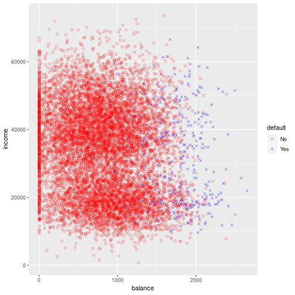
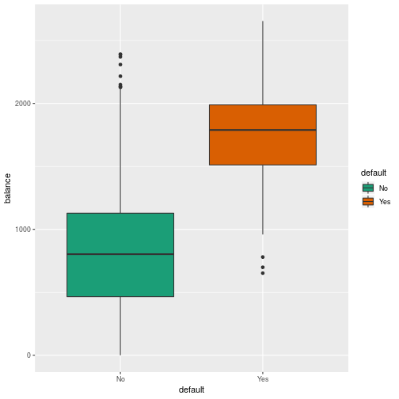
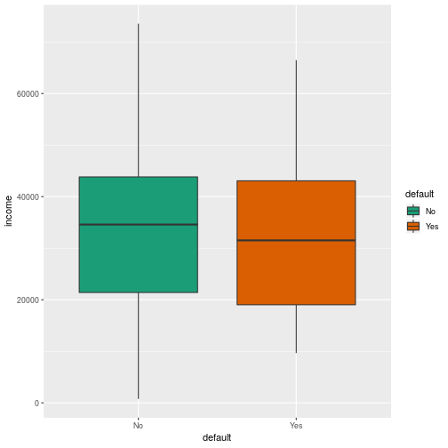
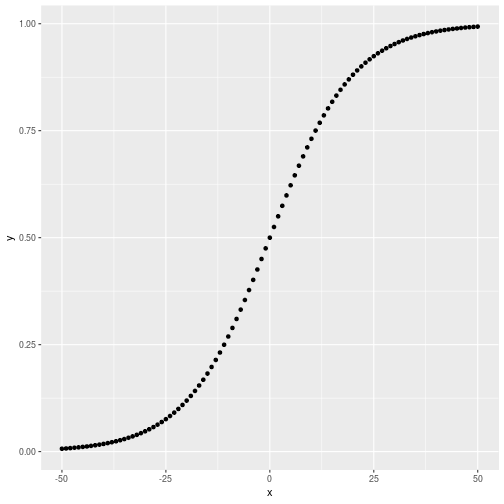
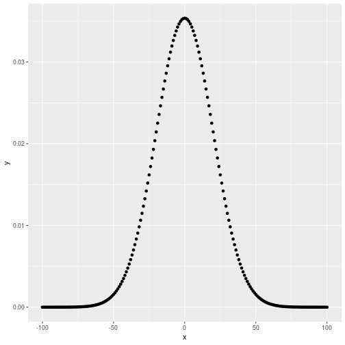

# 4 - Classification

In many situations, the response variable in a regression may be qualitative instead of quantitative. These are often referred to as **categorical**.

The process for predicting categorical variables is called **classification**. 

We'll be using the `Default` data set, which has annual incomes and monthly credit card balances, with a categorical variable indicating whether an individual defaulted in that month.


```r
library(tidyverse)
library(broom)
library(ISLR)
```


```r
default <- as_tibble(Default)
default %>% ggplot() + 
    geom_point(aes(balance, income, colour = default, shape = default), alpha = .5) + 
    scale_shape_manual(values = c(1,4)) + 
    scale_color_manual(values = c('red', 'blue'))
```



```r
default %>% ggplot() + 
    geom_boxplot(aes(default, balance, fill = default)) + 
    scale_fill_brewer(palette="Dark2")
```



```r
default %>% ggplot() + 
    geom_boxplot(aes(default, income, fill = default)) + 
    scale_fill_brewer(palette="Dark2")
```



## 4.2 - Why Not Linear?

* When the categorical variable has more than two values, encoding using {1,2,3,...,v} implies an ordering on the outcomes.
* For a binary response, least squares regression makes sense, but some of the estimates can be outside of the [0,1] interval. This makes them difficult to interpret as probabilities.

## 4.3 -Logistic Regression 

Rather than modelling a response directly, logistic regression models the **probability** that `Y` belongs to a particular category. 

### 4.3.1 - The Logistic Model

We wish to model $p(X) = Pr(Y = 1|X)$. We use a function that gives outputs between 0 and 1 for all values of X. In logistic regression, we use the **logistic function**

$$ p(X) = \frac{e^{\beta_0+\beta_1X}}{1 + e^{\beta_0+\beta_1X}} $$


```r
tibble(x = -50:50, y = exp(.1* x) / (1 + exp(.1*x))) %>% 
    ggplot(aes(x,y)) + 
    geom_point()
```



To fit the model, a method called **maximum likelyhood** is used. After some manipulation we have $\frac{p(X)}{1 - p(x)} = e^{β_0+β_1X}$. The quantity on the left is called the *odds*, and it takeson values between 0 and infinity. By taking the log of each side, we have the **log-odds** or **logit** on the left, and that it is linear in X. In a logistic regression model, increasing $X$ by one unit changes the log odds by $\beta_1$.

### 4.3.2 - Estimating the Regression Coefficients

Maximum likelyhood seeks estimates for the coefficients such that the predicticed probability $\hat{p}(x_i)$ corresponds as closely as possible to the observed status. 

Let's run the model against the default data:


```r
glm(default ~ balance, family = binomial, default) %>% tidy()
```

```
## # A tibble: 2 x 5
##   term         estimate std.error statistic   p.value
##   <chr>           <dbl>     <dbl>     <dbl>     <dbl>
## 1 (Intercept) -10.7      0.361        -29.5 3.62e-191
## 2 balance       0.00550  0.000220      25.0 1.98e-137
```

We see the $\beta_1$ is 0.0055, meaning an increase in balance is associated with an increase in the probability of default. It increases the log-odds of default by 0.0055. The **z-statistic** plays the same role as the **t-statistic** in a linear regression.

### 4.3.3 - Making Predictions

Once the coefficients have been determined, you can calculate the probability of the response given a value of the predictor. For qualitative predictors, the same binary encoding used in a linear regression can be used.

### 4.3.4 - Multiple Logistic Regression

The multiple logistic regression is modelled in a similar way to the linear regression - except the additional coefficients are in the exponent to the Euler constant of the logistic function.

The logistic regression can also be performed for more than one response variable. 

## 4.4 - Linear Discriminant Analysis

In the logistic regression, the conditional probability of the response $Y$ is modelled given the predictor(s) $X$. In **linear disriminant analysis** we model the distribution of the predictors $X$ separately in each of the response classes $Y$, the use **Bayes' Theorem** to flip these round to estimates for $Pr(Y = k|X = x)$.

Why?

* When the classes are well separated, the parameter estimates for the logistic regression are unstable. LDA does not suffer from this problem.
* If `n` is small and the dsitribution of predictors `X` is approximately normal, LDA is mmore stable.
* LDA is popular if there are more than two response classes.

### 4.4.1 - Using Bayes' Theorem

* $K$ classes
* Let $\pi_k$ represent the **prior probability** than a randomly chosen observation comes from the *k*th class.
* Let $f_k(X) = Pr(X = x|Y=k)$ denote the **density function** of *X* for an observation that comes from the *k*th class.
* Bayes' theorem states that:

$$ p_k(X) = Pr(Y = k|X = x) = \frac{\pi_kf_k(x)}{\sum_{l=1}^K\pi_lf_l(x)} $$

Estimating $\pi_k$ is easy if we have a random sample - we calculate the fraction of training observations that belong to the kth class. Estimating $f_k(X)$ is more challenging. If we can estimate this function, we can develop a classifier that approximates the Bayes classifier.

$p_k(X)$ is the **posterior probability** that $X = x$ is in class k. 

### 4.4.2 - LDA with p = 1

We would like an estimate for $f_k(x)$ that we can use in the formula to calculate $p_k(x)$. We assume the function is normal or **Gaussian**. In the one dimensional setting the Gaussian density takes the form:

$$ f_k(x) = -\frac{1}{\sqrt{2\pi}\sigma_k}exp\Bigg(-\frac{1}{2\sigma^2_k}(x - \mu_k)^2\Bigg) $$


```r
norm_mean <- 0
std_dev <- 20 
tibble(
    x = -100:100, 
    y = (1 / (sqrt(2) * std_dev)) * exp((-1 / (2 * std_dev^2)) * (x - norm_mean)^2)
) %>% ggplot(aes(x,y)) + geom_point()
```



We further assume that $\sigma^2$ is that same amongst all classes. We can plug the Gaussian $f_k(x)$ into the $p_l(x)$ to get our formula.

Even if we are certain that $X$ is Gaussian, we still have to estimate the means, standard deviations and variance. The LDA classifier estimates:
* **Mean**: $\hat{\mu}_k = \frac{1}{n_k}\sum_{i:yi = k}x_i$
  * The average of all the training observations in the $k$th class
* **Variance**: $\hat{\sigma}^2 = \frac{1}{n - K}\sum_{k=1}^K\sum_{i:y_i=k}(x_i - \hat{\mu_k})^2$
  * The weighted average of the sample variances for each of the `K` classes.A
* **Prior Probability**: $\hat{\pi}_k = n_k / n$

The LDA classifier plugs in these estimates and assigns an observations $X = x$ to the class for which the following formula is largest:

$$ \hat{\delta}_k(x) = x \cdot \frac{\hat{\mu}_k}{\hat{\sigma}^2} - \frac{\hat{\mu}^2_k}{2\hat{\sigma}^2} + log(\hat{\pi}_k) $$


### 4.4.3 - LDA with p > 1

We assume $X = (X_1, X_2, \ldots, X_p)$ is drawn from a *multivariate Gaussian* distribution, with a class specific mean vector and a common covariance matrix.

To indicate that a *p*-dimensional random variable $ X $ has a multi-variate Gaussian distribution, we wrtie $X \sim N(\mu, \sigma)$. Here $E(X) = \mu$ is the mean of $X$ (a vector with *p* components, and $Cov(X) = \sigma$ is the *p* x *p* covariance matrix of X

Formally the multivariate Gaussian density is defined as:

$$ f(x) = \frac{1}{(2\pi)^{p/2}|\Sigma|^{1/2}}exp\Bigg(-\frac{1}{2}(x - \mu)^{T}\Sigma^{-1}(x - \mu)\Bigg) $$

In the case of p > 1 predictors, the LDA classifier assumes that the observations in the kth class are drawn a multivariate Gaussian distribution $N(\mu_k,\sigma)$, where $\mu_k$ is a class-specific mean vector, and $\sigma$ is a covariance matrix.

The Bayes classifier assigns an observation $X = x$ to the class for which the following formula is largest - the vector/matrix form of the p = 1 formula.

$$ \delta_k(x) = x^T\Sigma^{-1}\mu_k - \frac{1}{2}\mu_k^T\Sigma^{-1}\mu_k+log\pi_k $$


#### Sensitivity & Specificity

Used in medicine and biology:
* **Sensitivity**: true positives
* **Specificity**: true negatives

The LDA is appoximating a Bayes classifier, which has the lowest **total** error rate, irrespective of the class (false positive, false negative) that they come from. The Bayes, and the LDA, use a 50% threshold for the posterior probability in order to assign an observation to a class. This threshold can be altered to get better class specific results, while potentially increasing the overall error rate.

### 4.4.4 - Quadratic Discriminant Analysis

LDA assumes that the observations have
* Multivariate gaussian distribution
* Class specific mean vector
* Covariance matrix common to all K classes.

QDA provides an alternative approach - it's still assuming a Gaussian distribution, however it assumes that each class has its own covariance matrix, i.e. $X \sim N(\mu_k,\Sigma_k)$.

Why does it matter whether or not we assume that the K classes share a common covariance matrix? The answer is the bias-variance trade-off. Estimating a covariance matrix for each class is Kp(p+1)/2 parameters. By assuming a common covariance matrix, there are Kp linear coefficients. The LDA is much less flexible than the QDA, and has lower variance. 
Generally, LDA tends to be better than QDA if there are relatively fewer training observations and so reducing variance is cruicial.

## 4.5 - A Comparison of Classification Methods

Both the logistic regression and LDA produce linear decision boundaries. The difference is that the logistic coefficients are estimated using **maximum likelyhood** and the LDA coefficients are computed using the estimated mean and variance from a normal distribution.

LDA assumes a Gaussian distribution with a common covariance matrix in each class, and can provide improvements over logistic regression when this holds. Logistic regression can perform better than LDA if the assumptions do not hold.

KNN is a completely non-parameteric approach, so this can dominate logistic and LDA when the decision boundary is highly non-linear. However it doesn't tell us which predictors are important, as we don't get a table of coefficients.

QDA servers as compromise between the non-parametric KNN and the linear LDA and logistic regression.
