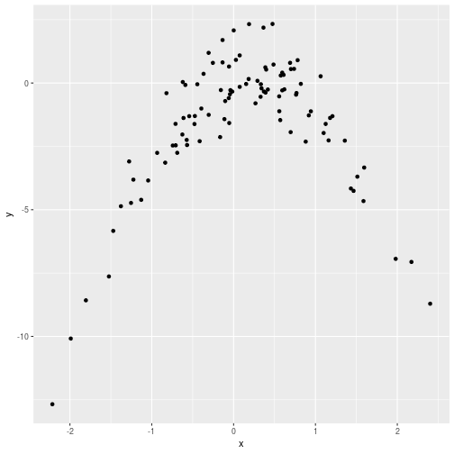
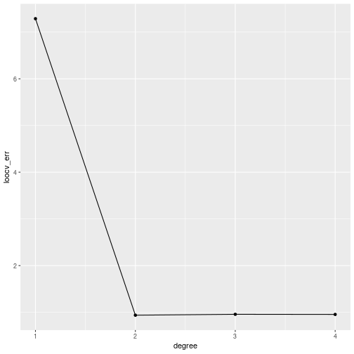

# Chapter 5 - Applied


```r
library(ISLR)
library(MASS)
library(broom)
library(modelr)
library(tidyverse)
```


## 5)

*In Chapter 4, we used logistic regression to predict the probability of default using income and balance on the Default data set. We will now estimate the test error of this logistic regression model using the validation set approach. Do not forget to set a random seed before beginning your analysis.*

### a)
*Fit a logistic regression model that uses income and balance to predict default.*


```r
default <- as.tibble(Default)
default.log <- glm(default~balance, data = default, family = binomial)
```

### b)
*Using the validation set approach, estimate the test error of this model. In order to do this, you must perform the following steps:*

#### i)
*Split the sample set into a training set and a validation set.*

```r
set.seed(1)
default_split <- resample_partition(default, c(train = 0.5, test = 0.5))
```

#### ii)
*Fit a multiple logistic regression model using only the training observations.*

```r
default_split_train <- glm(default ~ balance, data = as.tibble(default_split$train), family = binomial)
```

#### iii)
*Obtain a prediction of default status for each individual in the validation set by computing the posterior probability of default for that individual, and classifying the individual to the default category if the posterior probability is greater than 0.5.*

```r
as.tibble(default_split$test) %>% 
    mutate(pred_default = ifelse(predict(default_split_train, ., type = 'response') < 0.5, "No", "Yes"))
```

```
## # A tibble: 5,001 x 5
##    default student balance income pred_default
##    <fct>   <fct>     <dbl>  <dbl> <chr>       
##  1 No      No        1074. 31767. No          
##  2 No      No         529. 35704. No          
##  3 No      Yes        920.  7492. No          
##  4 No      No         826. 24905. No          
##  5 No      Yes        809. 17600. No          
##  6 No      No        1161. 37469. No          
##  7 No      No         237. 28252. No          
##  8 No      No        1113. 23810. No          
##  9 No      No           0  50265. No          
## 10 No      Yes        528. 17637. No          
## # ... with 4,991 more rows
```

#### iv)
*Compute the validation set error, which is the fraction of the observations in the validation set that are misclassified.*

```r
as.tibble(default_split$test) %>% 
    mutate(pred_default = ifelse(predict(default_split_train, ., type = 'response') < 0.5, "No", "Yes")) %>% 
    group_by(default, pred_default) %>% 
    tally()
```

```
## # A tibble: 4 x 3
## # Groups:   default [?]
##   default pred_default     n
##   <fct>   <chr>        <int>
## 1 No      No            4821
## 2 No      Yes             11
## 3 Yes     No             122
## 4 Yes     Yes             47
```

Out of 5001 observations, 11 + 122 are incorrect. The error rate is therefore (11 + 122) / 5001 = 2.65%

### c)
*Repeat the process in (b) three times, using three different splits of the observations into a training set and a validation set. Comment on the results obtained.*

We'll be a bit lazy with this and use a for loop.


```r
set.seed(2)
for (i in 1:3) {
    default_split <- resample_partition(default, c(train = 0.5, test = 0.5))
    default_split_train <- glm(default ~ balance, data = as.tibble(default_split$train), family = binomial)
    as.tibble(default_split$test) %>% 
        mutate(pred_default = ifelse(predict(default_split_train, ., type = 'response') < 0.5, "No", "Yes")) %>% 
        group_by(default, pred_default) %>% 
        tally() %>% 
        print()
}
```

```
## # A tibble: 4 x 3
## # Groups:   default [?]
##   default pred_default     n
##   <fct>   <chr>        <int>
## 1 No      No            4827
## 2 No      Yes             24
## 3 Yes     No              99
## 4 Yes     Yes             51
## # A tibble: 4 x 3
## # Groups:   default [?]
##   default pred_default     n
##   <fct>   <chr>        <int>
## 1 No      No            4826
## 2 No      Yes             23
## 3 Yes     No             113
## 4 Yes     Yes             39
## # A tibble: 4 x 3
## # Groups:   default [?]
##   default pred_default     n
##   <fct>   <chr>        <int>
## 1 No      No            4807
## 2 No      Yes             20
## 3 Yes     No             125
## 4 Yes     Yes             49
```

We get error rates of 2.4%, 2.8% and 2.7%.

### d)
*Now consider a logistic regression model that predicts the prob ability of default using income , balance , and a dummy variable for student . Estimate the test error for this model using the validation set approach. Comment on whether or not including a dummy variable for student leads to a reduction in the test error rate.*

We modify the formula in the `glm()` to be `default ~ balance + student`. We then run the three validation set tests and get error percentages of 2.4%, 2.7% and 2.7%. There seems to be no reduction in the error rate by adding in the student variable.


## 6)
*We continue to consider the use of a logistic regression model to predict the probability of default using income and balance on the Default data set. In particular, we will now compute estimates for the standard errors of the income and balance logistic regression co efficients in two different ways: (1) using the bootstrap, and (2) using the standard formula for computing the standard errors in the glm() function.*

### a)
*Using the summary() and glm() functions, determine the estimated standard errors for the coefficients associated with income and balance in a multiple logistic regression model that uses both predictors.*


```r
glm(default ~ income + balance, data = default, family = 'binomial') %>% tidy()
```

```
## # A tibble: 3 x 5
##   term           estimate  std.error statistic   p.value
##   <chr>             <dbl>      <dbl>     <dbl>     <dbl>
## 1 (Intercept) -11.5       0.435         -26.5  2.96e-155
## 2 income        0.0000208 0.00000499      4.17 2.99e-  5
## 3 balance       0.00565   0.000227       24.8  3.64e-136
```

We see the standard error for the coefficients is 0.00000499 for income and 0.000227 for balance.

### b) & c)
*Use the bootstrap to estimate the standard errors of the logistic regression coefficients*


```r
set.seed(1)
default %>% 
    modelr::bootstrap(n = 20) %>% 
    mutate(model = map(strap, ~glm(default~income+balance, data = .x, family = 'binomial'))) %>% 
    mutate(tidy = map(model, ~tidy(.x))) %>% 
    unnest(tidy) %>% 
    group_by(term) %>% 
    summarise(avg_stderr = mean(std.error))
```

```
## # A tibble: 3 x 2
##   term        avg_stderr
##   <chr>            <dbl>
## 1 (Intercept) 0.429     
## 2 balance     0.000225  
## 3 income      0.00000498
```

We see the average standard error to be 0.000225 for balance and 0.00000498 for income.

### d)
*Comment on the estimated standard errors.*

The difference in the standard errors from the bootstrap compared to the formula is small: a 1% different from balance and a .2% difference for income.

## 7)
*Compute the LOOCV error for a simple logistic regression model on the Weekly data set.*

### a) 
*Fit a logistic regression model that predicts Direction using Lag1 and Lag2*


```r
weekly <- as.tibble(Weekly)
weekly.logistic <- glm(Direction ~ Lag1 + Lag2, data = weekly, family = 'binomial')
```

### b)
*Fit a logistic regression model that predicts Direction using Lag1 and Lag2 using all but the first observation.*

```r
weekly.logistic.loo <- glm(Direction ~ Lag1 + Lag2, data = weekly[-1,], family = 'binomial')
```

### c)
*Use the model from (b) to predict the direction of the first observation.*


```r
weekly[1,] %>% 
    mutate(Prediction = ifelse(predict(weekly.logistic.loo, ., type = 'response') > 0.5, "Up", "Down")) %>% 
    select(Direction, Prediction)
```

```
## # A tibble: 1 x 2
##   Direction Prediction
##   <fct>     <chr>     
## 1 Down      Up
```

The prediction was 'Up', but the true direction was 'Down'.

### d)
*Write a for loop from i = 1 to i = n, where n is the number of observations in the data set, that performs each of the following steps:*
    * Fit a logistic regression model using all but the ith observation to predict Direction using Lag1 and Lag2 .
    * Compute the posterior probability of the market moving up for the ith observation.
    * Use the posterior probability for the ith observation in order to predict whether or not the market moves up.


```r
weekly %>% 
    crossv_kfold(k = nrow(.)) %>% 
    mutate(model = map(train, ~glm(Direction ~ Lag1 + Lag2, data = .x, family = 'binomial'))) %>% 
    mutate(prediction = map2_chr(model, test, ~ifelse(predict(.x, .y, type = 'response') > 0.5, "Up", "Down"))) %>% 
    mutate(test_direction = map_chr(test, ~as.character(as.tibble(.x)[['Direction']]))) %>% 
    summarise(error = mean(prediction != test_direction))
```

```
## # A tibble: 1 x 1
##   error
##   <dbl>
## 1 0.450
```

## 8)
*We will now perform cross-validation on a simulated data set.*

### a) 
*Generate a simulated data set*


```r
set.seed(1)
(simulated <- tibble(x = rnorm(100), y = x - 2*x^2 + rnorm(100)))
```

```
## # A tibble: 100 x 2
##         x      y
##     <dbl>  <dbl>
##  1 -0.626 -2.03 
##  2  0.184  0.158
##  3 -0.836 -3.14 
##  4  1.60  -3.34 
##  5  0.330 -0.542
##  6 -0.820 -0.400
##  7  0.487  0.729
##  8  0.738  0.558
##  9  0.576  0.297
## 10 -0.305  1.19 
## # ... with 90 more rows
```

In this daya set, *n* is 100 and *p* is 2.

### b)
*Create a scatterplot of X against Y . Comment on what you find.*


```r
simulated %>% 
    ggplot(aes(x, y)) + 
    geom_point()
```



We see that Y appears have a quadratic relationship to X.

### c)
*Compute the LOOCV errors that result from fitting `Y ~ poly(X, d)` where `d = {1 .. 4}`.*

In our pipeline, we create a tibble with a degree column and four rows. We then generate a kfold set with k being the number of rows in the dataset, which then becomes a LOOCV set.

We unnest all of the sets and fit a model based on the degree on each sample's training set. We then predict the y_hat value using the model and the test set.

We extract out the real y value from the test set, calculate the MSE, then calculate the LOOCV error based on the degree.


```r
(results <- tibble(degree = 1:4) %>%
    mutate(sim_loocv = map(degree, ~crossv_kfold(simulated, k = nrow(simulated)))) %>%
    unnest(sim_loocv) %>%
    mutate(model = map2(degree, train, ~lm(y ~ poly(x,.x), data = .y))) %>%
    mutate(y_hat = map2_dbl(model, test, ~predict(.x, .y))) %>%
    mutate(y = map_dbl(test, ~as.tibble(.x)[['y']])) %>%
    mutate(mse = (y - y_hat)^2) %>%
    group_by(degree) %>%
    summarise(loocv_err = sum(mse) / n())
)
```

```
## # A tibble: 4 x 2
##   degree loocv_err
##    <int>     <dbl>
## 1      1     7.29 
## 2      2     0.937
## 3      3     0.957
## 4      4     0.954
```

```r
results %>% ggplot(aes(degree, loocv_err)) + geom_point() + geom_line()
```



### d) 

Skipped

### e) 
*Which of the models in (c) had the smallest LOOCV error? Is this what you expected? Explain your answer.*

The model with a second degree polynomial provided the lowest error. This is to be expected given that the response variable is explicitly quadratically realted to *x*.

### f)


```r
tibble(degree = 1:4) %>%
    mutate(sim_loocv = map(degree, ~crossv_kfold(simulated, k = nrow(simulated)))) %>%
    unnest(sim_loocv) %>%
    mutate(model = map2(degree, train, ~lm(y ~ poly(x,.x), data = .y))) %>%
    mutate(tidy = map(model, ~tidy(.x))) %>%
    unnest(tidy) %>%
    group_by(degree, term) %>%
    summarise(avg_p.value = mean(p.value))
```

```
## # A tibble: 14 x 3
## # Groups:   degree [?]
##    degree term         avg_p.value
##     <int> <chr>              <dbl>
##  1      1 (Intercept)     4.84e- 8
##  2      1 poly(x, .x)     2.24e- 2
##  3      2 (Intercept)     2.75e-28
##  4      2 poly(x, .x)1    7.00e- 6
##  5      2 poly(x, .x)2    3.43e-42
##  6      3 (Intercept)     4.95e-28
##  7      3 poly(x, .x)1    7.45e- 6
##  8      3 poly(x, .x)2    8.45e-42
##  9      3 poly(x, .x)3    7.81e- 1
## 10      4 (Intercept)     4.70e-28
## 11      4 poly(x, .x)1    6.87e- 6
## 12      4 poly(x, .x)2    9.06e-42
## 13      4 poly(x, .x)3    7.81e- 1
## 14      4 poly(x, .x)4    1.98e- 1
```

We can see that across all degrees, *x* and *x^2* terms have the strongest statisitical significance. The *x^3* and *x^4* have very little.


## 9)
*We will now consider the Boston housing data set.*

### a) 
*Based on this data set, provide an estimate for the population mean of medv . Call this estimate mu_hat*


```r
boston <- as.tibble(Boston)
boston %>% summarise(medv_mu_hat = mean(medv))
```

```
## # A tibble: 1 x 1
##   medv_mu_hat
##         <dbl>
## 1        22.5
```

The estimate for the population mean is 22.5

### b)
*Provide an estimate of the standard error of mu_hat. Interpret this result.*

```r
boston %>% summarise(sd = sd(medv), stderr = sd/sqrt(n()))
```

```
## # A tibble: 1 x 2
##      sd stderr
##   <dbl>  <dbl>
## 1  9.20  0.409
```

The standard error is 0.409 - therefore we would expect, with 95% probability, that the real population mean is in the range [22.5 - 1.96 * 0.409, 22.5 + 1.96 * 0.409] = [21.698, 23.302].

### c)
*Now estimate the standard error of mu_hat sing the bootstrap. How does this compare to your answer from (b)?


```r
set.seed(1)
boston %>% 
    modelr::bootstrap(n = 1000) %>% 
    mutate(medv_mu_hat = map_dbl(strap, ~mean(as.tibble(.x)[['medv']]))) %>% 
    summarise(
        sd = sd(medv_mu_hat), 
    )
```

```
## # A tibble: 1 x 1
##      sd
##   <dbl>
## 1 0.416
```

We see the SD across the bootstraps is 0.416 - close to the 0.409 from b).

### d)
*Based on your bootstrap estimate from (c), provide a 95 % confidence interval for the mean of medv. Compare it to the results obtained using t.test(Boston$medv).*

Our calculate SD is 0.416, so our 95% confidence interval is [22.53 - 1.96 * 0.416, 22.53 + 196 * 0.416] = [21.71464 23.34536].

Compared to :

```r
t.test(boston$medv) %>% tidy()
```

```
## # A tibble: 1 x 8
##   estimate statistic   p.value parameter conf.low conf.high method
##      <dbl>     <dbl>     <dbl>     <dbl>    <dbl>     <dbl> <chr> 
## 1     22.5      55.1 9.37e-216       505     21.7      23.3 One S…
## # ... with 1 more variable: alternative <chr>
```

### e)
*Based on this data set, provide an estimate, μ̂ med , for the median value of medv in the population.*


```r
boston %>% summarise(median = median(medv))
```

```
## # A tibble: 1 x 1
##   median
##    <dbl>
## 1   21.2
```


### f)
*We now would like to estimate the standard error of μ̂ med . Unfortunately, there is no simple formula for computing the standard error of the median. Instead, estimate the standard error of the median using the bootstrap.*


```r
set.seed(1)
boston %>% 
    modelr::bootstrap(n = 1000) %>% 
    mutate(median_medv = map_dbl(strap, ~median(as.tibble(.x)[['medv']]))) %>% 
    summarise(median_std_err = sd(median_medv))
```

```
## # A tibble: 1 x 1
##   median_std_err
##            <dbl>
## 1          0.383
```

We see the standard error for the median is 0.383.

### g)
*Based on this data set, provide an estimate for the tenth percentile of medv in Boston suburbs.*


```r
quantile(boston$medv, probs = c(.1))
```

```
##   10% 
## 12.75
```

### h)
*Use the bootstrap to estimate the standard error of this 10% quantile*


```r
set.seed(1)
boston %>% 
    modelr::bootstrap(n = 1000) %>% 
    mutate(ten_pc_quantile = map_dbl(strap, ~quantile(as.tibble(.x)$medv, c(0.1))[['10%']])) %>% 
    summarise(quant_std_err = sd(ten_pc_quantile))
```

```
## # A tibble: 1 x 1
##   quant_std_err
##           <dbl>
## 1         0.498
```

We estimated standard error is 0.498.


