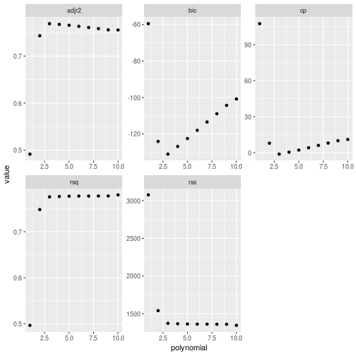
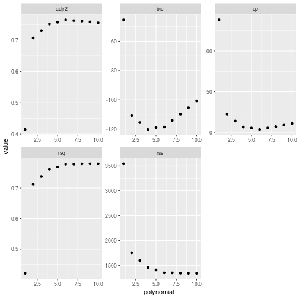
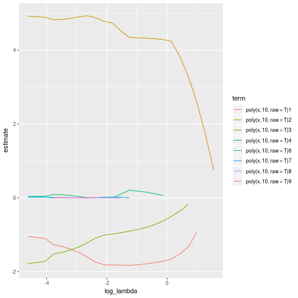
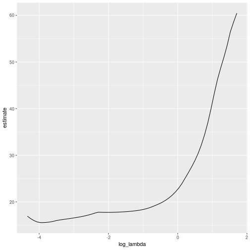

# Applied


```r
library(tidyverse)
library(leaps)
library(broom)
library(glmnet)
library(modelr)
library(ISLR)
```

## 8 - Subset Selection

### a)
*Use the rnorm() function to generate a predictor $X$ of length $n = 100$, as well as a noise vector of length $n = 100$.*

```r
set.seed(1)
subset_selection = tibble(x = rnorm(100), e = rnorm(100, 0, 4))
```

### b)
*Generate a response vector Y of length n = 100 according to a cubic model*

```r
subset_selection <- subset_selection %>%
    mutate(y = 4 - 2*x + 6*x^2 - x^3 + e)
```

### c)
*Use the regsubsets() function to perform best subset selection in order to choose the best model containing the predictors $X, X^2, \ldots, X^10$. What is the best model obtained according to $C_p$, BIC, and adjusted $R^2$?*


```r
bestsub_result <- subset_selection %>%
    regsubsets(y ~ poly(x, 10, raw = T), data = ., nvmax = 10)

bestsub_result %>% summary() %>% .$cp %>% which.min()
```

```
## [1] 3
```

```r
bestsub_result %>% summary() %>% .$bic %>% which.min()
```

```
## [1] 3
```

```r
bestsub_result %>% summary() %>% .$adjr2 %>% which.max()
```

```
## [1] 3
```

```r
bestsub_metrics <- bestsub_result %>%
    summary() %>%
    rbind() %>%
    as.tibble() %>%
    dplyr::select(rsq, rss, adjr2, cp, bic) %>%
    unnest() %>%
    rownames_to_column('polynomial') %>%
    mutate(polynomial = as.integer(polynomial))

bestsub_metrics
```

```
## # A tibble: 10 x 6
##    polynomial   rsq   rss adjr2       cp    bic
##         <int> <dbl> <dbl> <dbl>    <dbl>  <dbl>
##  1          1 0.497 3076. 0.492  108.     -59.5
##  2          2 0.748 1540. 0.743    7.89  -124. 
##  3          3 0.776 1372. 0.769   -1.24  -131. 
##  4          4 0.777 1366. 0.767    0.418 -127. 
##  5          5 0.777 1361. 0.766    2.09  -123. 
##  6          6 0.779 1353. 0.764    3.55  -119. 
##  7          7 0.779 1350. 0.762    5.31  -114. 
##  8          8 0.780 1346. 0.760    7.09  -110. 
##  9          9 0.780 1345. 0.758    9.00  -105. 
## 10         10 0.780 1345. 0.755   11     -101.
```
We see that all three have chosen a third degree polynomial.

*Show some plots to provide evidencefor your answer, and report the coefficients of the best model obtained.* 


```r
bestsub_metrics %>%
    gather(key = 'metric', value = 'value', c(rsq, rss, adjr2, cp, bic)) %>%
    ggplot(aes(polynomial, value)) +
    geom_point() +
    facet_wrap(~metric, scales = 'free')
```


We can see that in all of the graphs, the 'elbow' of the graph is at polynomial order 3.


```r
coefficients(bestsub_result, id = 3)
```

```
##           (Intercept) poly(x, 10, raw = T)2 poly(x, 10, raw = T)3 
##             4.2777703             5.3728654            -3.1085786 
## poly(x, 10, raw = T)5 
##             0.3731805
```

We see the coefficients are reasonably close to the 4, -2, 6 and -1, however it's chosen the 2nd, 3rd and 5th monomials.

### d)
*Repeat (c), using forward stepwise selection and also using backwards stepwise selection. How does your answer compare to the results in (c)?*


```r
fw_result <- subset_selection %>%
    regsubsets(y ~ poly(x, 10, raw = T), data = ., nvmax = 10, method = 'forward')

bw_result <- subset_selection %>%
    regsubsets(y ~ poly(x, 10, raw = T), data = ., nvmax = 10, method = 'backward')

fw_result %>% summary() %>% .$cp %>% which.min()
```

```
## [1] 3
```

```r
fw_result %>% summary() %>% .$bic %>% which.min()
```

```
## [1] 3
```

```r
fw_result %>% summary() %>% .$adjr2 %>% which.max()
```

```
## [1] 3
```

```r
bw_result %>% summary() %>% .$cp %>% which.min()
```

```
## [1] 6
```

```r
bw_result %>% summary() %>% .$bic %>% which.min()
```

```
## [1] 4
```

```r
bw_result %>% summary() %>% .$adjr2 %>% which.max()
```

```
## [1] 6
```

We see the forward stepwise has chosen the 3rd degree polynomial, however the backward selection has chosen polynomials of degree 6, 4 and 6.


```r
fw_metrics <- fw_result %>%
    summary() %>%
    rbind() %>%
    as.tibble() %>%
    dplyr::select(rsq, rss, adjr2, cp, bic) %>%
    unnest() %>%
    rownames_to_column('polynomial') %>%
    mutate(polynomial = as.integer(polynomial))

fw_metrics
```

```
## # A tibble: 10 x 6
##    polynomial   rsq   rss adjr2       cp    bic
##         <int> <dbl> <dbl> <dbl>    <dbl>  <dbl>
##  1          1 0.497 3076. 0.492  108.     -59.5
##  2          2 0.748 1540. 0.743    7.89  -124. 
##  3          3 0.776 1372. 0.769   -1.24  -131. 
##  4          4 0.777 1366. 0.767    0.418 -127. 
##  5          5 0.777 1363. 0.765    2.18  -122. 
##  6          6 0.777 1361. 0.763    4.09  -118. 
##  7          7 0.777 1361. 0.760    6.06  -113. 
##  8          8 0.778 1360. 0.758    7.97  -109. 
##  9          9 0.778 1359. 0.755    9.96  -104. 
## 10         10 0.780 1345. 0.755   11     -101.
```

```r
bw_metrics <- bw_result %>%
    summary() %>%
    rbind() %>%
    as.tibble() %>%
    dplyr::select(rsq, rss, adjr2, cp, bic) %>%
    unnest() %>%
    rownames_to_column('polynomial') %>%
    mutate(polynomial = as.integer(polynomial))

fw_metrics
```

```
## # A tibble: 10 x 6
##    polynomial   rsq   rss adjr2       cp    bic
##         <int> <dbl> <dbl> <dbl>    <dbl>  <dbl>
##  1          1 0.497 3076. 0.492  108.     -59.5
##  2          2 0.748 1540. 0.743    7.89  -124. 
##  3          3 0.776 1372. 0.769   -1.24  -131. 
##  4          4 0.777 1366. 0.767    0.418 -127. 
##  5          5 0.777 1363. 0.765    2.18  -122. 
##  6          6 0.777 1361. 0.763    4.09  -118. 
##  7          7 0.777 1361. 0.760    6.06  -113. 
##  8          8 0.778 1360. 0.758    7.97  -109. 
##  9          9 0.778 1359. 0.755    9.96  -104. 
## 10         10 0.780 1345. 0.755   11     -101.
```

We now have a look at the graphs:


```r
fw_metrics %>%
    gather(key = 'metric', value = 'value', c(rsq, rss, adjr2, cp, bic)) %>%
    ggplot(aes(polynomial, value)) +
    geom_point() +
    facet_wrap(~metric, scales = 'free')
```



```r
bw_metrics %>%
    gather(key = 'metric', value = 'value', c(rsq, rss, adjr2, cp, bic)) %>%
    ggplot(aes(polynomial, value)) +
    geom_point() +
    facet_wrap(~metric, scales = 'free')
```



We now look at the coefficients chosen for the 3 degree polynomial with forward selection, and for the 4 and 6 degree for backward selection:

```r
coefficients(fw_result, id = 3)
```

```
##           (Intercept) poly(x, 10, raw = T)2 poly(x, 10, raw = T)3 
##             4.2777703             5.3728654            -3.1085786 
## poly(x, 10, raw = T)5 
##             0.3731805
```

```r
coefficients(bw_result, id = 3)
```

```
##           (Intercept) poly(x, 10, raw = T)3 poly(x, 10, raw = T)4 
##              5.673300             -1.530438              2.344011 
## poly(x, 10, raw = T)6 
##             -0.233447
```

```r
coefficients(bw_result, id = 4)
```

```
##           (Intercept) poly(x, 10, raw = T)3 poly(x, 10, raw = T)4 
##             5.6086515            -3.1371491             2.7793143 
## poly(x, 10, raw = T)5 poly(x, 10, raw = T)6 
##             0.3976656            -0.3430995
```

```r
coefficients(bw_result, id = 6)
```

```
##            (Intercept)  poly(x, 10, raw = T)3  poly(x, 10, raw = T)4 
##             4.91443615            -3.20149653             8.81233356 
##  poly(x, 10, raw = T)5  poly(x, 10, raw = T)6  poly(x, 10, raw = T)8 
##             0.40512626            -5.16224256             1.18920171 
## poly(x, 10, raw = T)10 
##            -0.09246571
```

The forward stepwise has chosed coefficients close to the real ones. The backwards stepwise has not done as well.

### e)
*Now fit a lasso model to the simulated data, again using $X, X^2 ,\ldots, X^10$ as predictors. Use cross-validation to select the optimal value of $\lambda$.*

We first generate our lasso model - we remove the intercept from the model matrix.


```r
cubic_data <- subset_selection

cubic_predictors <- model.matrix(y ~ poly(x, 10, raw = T), data = cubic_data)[,-1]
cubic_response <- cubic_data$y

cubic_lasso <- glmnet(cubic_predictors, cubic_response, alpha = 1, lambda = 10 ^ seq(10, -2, length = 100))
```

Let's now have a look at the graph of the coefficients:

```r
cubic_lasso %>%
    tidy() %>%
    dplyr::filter(term != '(Intercept)') %>%
    mutate(log_lambda = log(lambda)) %>%
    ggplot(aes(log_lambda, estimate, colour = term)) +
    geom_line()
```



We now run a cross-validation on this with `glmnet()`:


```r
set.seed(1)
cubic_lasso_cv <- cv.glmnet(cubic_predictors, cubic_response, alpha = 1)

cubic_lasso_cv %>%
    tidy() %>%
    mutate(log_lambda = log(lambda)) %>%
    ggplot(aes(log_lambda, estimate)) +
    geom_line()
```



```r
cubic_lasso_cv$lambda.min
```

```
## [1] 0.02075291
```

*Report the resulting coefficient estimates, and discuss the results obtained.*


```r
best_lasso <- glmnet(cubic_predictors, cubic_response, alpha = 1)
```

### f)
**Now generate a response vector Y according to the model**
$$ Y = \beta_0 + \beta_7X^7 + e $$
*and perform best subset selection and the lasso. Discuss the results obtained.*

We choose $\beta_7$ to be 9.


```r
septic_response <- subset_selection %>%
    mutate(y = 4 + 9*x^7 + e)

septic_best_sub <- septic_response %>%
    regsubsets(y ~ poly(x, 10, raw = T), data = ., nvmax = 10)

septic_best_sub %>% summary() %>% .$cp %>% which.min()
```

```
## [1] 2
```

```r
septic_best_sub %>% summary() %>% .$bic %>% which.min()
```

```
## [1] 1
```

```r
septic_best_sub %>% summary() %>% .$adjr2 %>% which.max()
```

```
## [1] 4
```

```r
coefficients(septic_best_sub, id = 1)
```

```
##           (Intercept) poly(x, 10, raw = T)7 
##              3.835761              9.003082
```

```r
coefficients(septic_best_sub, id = 2)
```

```
##           (Intercept) poly(x, 10, raw = T)2 poly(x, 10, raw = T)7 
##             4.2819615            -0.5668337             9.0062208
```

```r
coefficients(septic_best_sub, id = 4)
```

```
##           (Intercept) poly(x, 10, raw = T)1 poly(x, 10, raw = T)2 
##             4.3050098             1.1656064            -0.6470685 
## poly(x, 10, raw = T)3 poly(x, 10, raw = T)7 
##            -1.0106107             9.0365350
```

We see the BIC picks the one variable model with a coefficient very close to the original coefficient.

We now try a lasso:


```r
septic_x <- model.matrix(y ~ poly(x, 10, raw = T), data = septic_response)[,-1]
septic_y <- septic_response$y

septic_lasso_cv <- cv.glmnet(septic_x, septic_y, alpha = 1)
septic_lasso_cv$lambda.min
```

```
## [1] 17.45735
```

```r
glmnet(septic_x, septic_y, alpha = 1, lambda = septic_lasso_cv$lambda.min) %>% coefficients()
```

```
## 11 x 1 sparse Matrix of class "dgCMatrix"
##                                s0
## (Intercept)            5.04829526
## poly(x, 10, raw = T)1  .         
## poly(x, 10, raw = T)2  .         
## poly(x, 10, raw = T)3  .         
## poly(x, 10, raw = T)4  .         
## poly(x, 10, raw = T)5  .         
## poly(x, 10, raw = T)6  .         
## poly(x, 10, raw = T)7  8.66594284
## poly(x, 10, raw = T)8  .         
## poly(x, 10, raw = T)9  0.00885059
## poly(x, 10, raw = T)10 .
```

The lasso correctly picks the seventh degree polynomial, and is also close to the real value.

## 9
*In this exercise, we will predict the number of applications received using the other variables in the College data set.*

### a)
*Split the data set into a training set and a test set.*


```r
set.seed(1)
college <- College %>%
    as.tibble() %>%
    nest() %>%
    mutate(partition = map(data, ~resample_partition(.x, c(train = .5, test = .5))))

college
```

```
## # A tibble: 1 x 2
##   data                partition 
##   <list>              <list>    
## 1 <tibble [777 × 18]> <list [2]>
```

### b)
*Fit a linear model using least squares on the training set, and report the test error obtained.*


```r
college <- college %>%
    mutate(
        lm = map(partition, ~lm(Apps ~ ., data = .x$train)),
        lm.mse = map2(partition, lm, ~mse(.y, .x$test))
    ) %>%
    select(-lm) %>%
    unnest(lm.mse)

college
```

```
## # A tibble: 1 x 3
##   data                partition    lm.mse
##   <list>              <list>        <dbl>
## 1 <tibble [777 × 18]> <list [2]> 1407766.
```

### c)
*Fit a ridge regression model on the training set, with $\lambda$ chosen by cross-validation. Report the test error obtained.*


```r
set.seed(1)
college <- college %>%
    mutate(rr = map(partition, ~cv.glmnet(
        model.matrix(Apps ~ ., .x$train),
        as.tibble(.x$train)$Apps,
        alpha = 0,
        lambda = 10 ^ seq(10, -2, length = 100)
    ))) %>%
    mutate(
        rr.pred = map2(
            partition,
            rr,
            ~predict(.y, s = .y$lambda.min, newx = model.matrix(Apps ~ ., .x$test)
        )),
        rr.mse = map2(partition, rr.pred, ~mean((as.tibble(.x$test)$Apps - .y)^2))
    ) %>%
    select(-c(rr, rr.pred)) %>%
    unnest(rr.mse)

college
```

```
## # A tibble: 1 x 4
##   data                partition    lm.mse   rr.mse
##   <list>              <list>        <dbl>    <dbl>
## 1 <tibble [777 × 18]> <list [2]> 1407766. 1422683.
```

### d)
*Fit a lasso model on the training set, with $\lambda$ chosen by crossvalidation. Report the test error obtained, along with the number of non-zero coefficient estimates.*


```r
set.seed(1)
college <- college %>%
    mutate(lasso = map(partition, ~cv.glmnet(
        model.matrix(Apps ~ ., .x$train),
        as.tibble(.x$train)$Apps,
        alpha = 1,
        lambda = 10 ^ seq(10, -2, length = 100)
    ))) %>%
    mutate(
        lasso.pred = map2(
            partition,
            lasso,
            ~predict(.y, s = .y$lambda.min, newx = model.matrix(Apps ~ ., .x$test)
        )),
        lasso.mse = map2(partition, lasso.pred, ~mean((as.tibble(.x$test)$Apps - .y)^2))
    ) %>%
    select(-c(lasso, lasso.pred)) %>%
    unnest(lasso.mse)

college
```

```
## # A tibble: 1 x 5
##   data                partition    lm.mse   rr.mse lasso.mse
##   <list>              <list>        <dbl>    <dbl>     <dbl>
## 1 <tibble [777 × 18]> <list [2]> 1407766. 1422683.  1458869.
```

### e)
*Fit a PCR model on the training set, with M chosen by crossvalidation. Report the test error obtained, along with the value of M selected by cross-validation.*


```r
set.seed(1)
college <- college %>%
    mutate(
        pcr = map(partition, ~pcr(Apps ~ ., data = .x$train, scale = T, validation = 'CV')),
        pcr.pred = map2(partition, pcr, ~predict(.y, .x$test, ncomp = 5)),
        pcr.mse = map2(partition, pcr.pred, ~mean((as.tibble(.x$test)$Apps - .y)^2))
    ) %>%
    select(-c(pcr, pcr.pred)) %>%
    unnest(pcr.mse)
```

```
## Error in mutate_impl(.data, dots): Evaluation error: could not find function "pcr".
```

### f)
*Fit a PLS model on the training set, with M chosen by crossvalidation. Report the test error obtained, along with the value of M selected by cross-validation.*


```r
college %>%
    mutate(
        pls = map(partition, ~plsr(Apps ~ ., data = .x$train, scale = T, validation = 'CV')),
        pls.pred = map2(partition, pls, ~predict(.y, .x$test, ncomp = 7)),
        pls.mse = map2(partition, pls.pred, ~mean((as.tibble(.x$test)$Apps - .y)^2))
    ) %>%
    select(-c(pls, pls.pred)) %>%
    unnest(pls.mse)
```

```
## Error in mutate_impl(.data, dots): Evaluation error: could not find function "plsr".
```

```r
college
```

```
## # A tibble: 1 x 5
##   data                partition    lm.mse   rr.mse lasso.mse
##   <list>              <list>        <dbl>    <dbl>     <dbl>
## 1 <tibble [777 × 18]> <list [2]> 1407766. 1422683.  1458869.
```
### g)
*Comment on the results obtained. How accurately can we predict the number of college applications received? Is there much difference among the test errors resulting from these five approaches?*


```r
college %>%
    select(-c(data, partition)) %>%
    gather(key = 'method', value = 'mse', c(lm.mse, rr.mse, lasso.mse, pcr.mse, pls.mse)) %>%
    ggplot() +
    geom_bar(aes(method, mse), stat = 'identity')
```

```
## Error in map_lgl(.x, .p, ...): object 'pcr.mse' not found
```
