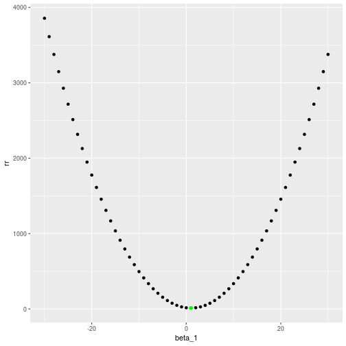
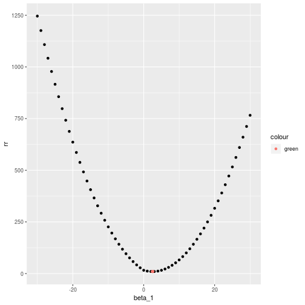

# Conceptual

## 1)
*We perform best subset, forward stepwise, and backward stepwise selection on a single data set. For each approach, we obtain $p + 1$ models, containing $0, 1, 2,\ldots,p$ predictors. Explain your answers:*

### a)
*Which of the three models with k predictors has the smallest training RSS?*

As the best-subset fits every combination of predictors, it will have the smallest training RSS.

### b)
*Which of the three models with k predictors has the smallest test RSS?*

Best subset may have the smallest test RSS because it considers more models. However it also may be overfitting the training data, and one of the other models may find a better model for the test data.

### c)
*True or False:*

#### i)
*The predictors in the $k$-variable model identified by forward stepwise are a subset of the predictors in the $(k+1)$ variable model identified by forward stepwise selection.*

In each step, forward stepwise augments with one additional predictor, hence the statement is **true**.

#### ii)
*The predictors in the k-variable model identified by backward stepwise are a subset of the predictors in the (k + 1) variable model identified by backward stepwise selection.*

In each step the backward stepwise the least useful predictor is removed, hence the answer is **true**.

#### iii)
*The predictors in the k-variable model identified by backward stepwise are a subset of the predictors in the (k + 1) variable model identified by forward stepwise selection.*

Forward and backward stepwise are independent functions, thus the above statement is **false**.

#### iv)
*The predictors in the k-variable model identified by forward stepwise are a subset of the predictors in the (k +1)-variable model identified by backward stepwise selection.*

**False**.

#### v)
*The predictors in the k-variable model identified by best subset are a subset of the predictors in the (k + 1)-variable model identified by best subset selection.*

Best subset chooses the best model for each $k$, therefore the above statement is **false**.

## 2)
*For parts (a) through (c), indicate which of i. through iv. is correct. Justify your answer.*

### a)
*The lasso, relative to least squares, is:*

Less flexible and hence will give improved prediction accuracy when its increase in bias is less than its decrease in variance.

The lasso reduces the flexibility, decreasing the variance and increasing the bias.

### b)
*The ridge regression, relative to least squares, is:*

Less flexible and hence will give improved prediction accuracy when its increase in bias is less than its decrease in variance.

Same as a)

### c)
*Non-linear methods, relative to least squares, are:*

More flexible, and will give improves accuracy when its increase in variance is less than it's decrease in bias.

## 3)
*Suppose we estimate the regression coefficients in a linear regression model by minimizing:*

$$ \sum_{i=1}^n\bigg(y_i - \beta_0 - \sum_{j=1}^p\beta_jx_{ij}\bigg) $$ subject to $$ \sum_{j=1}^p\lvert\beta_j\rvert \le s $$


*for a particular value of $s$. For parts (a) through (e), indicate which of i. through v. is correct. Justify your answer.*

### a)
*As we increase s from 0, the training RSS will:*

When $s = 0$ we have the intercept, which is the expected mean value. As $s \to \infty$, we end up with a standard least squares. We should see a decrease in the bias and therefore a steady decrease in the training RSS as we approach a least squares regression.


### b) 
*Repeat for the test RSS*

When $s = 0$ we have a very high test RSS. As $s$ increases we see the model start to fit the test data and thus the test RSS decreases. However there is a point where the variance starts to increase faster than the bias is decreasing and it starts to overfit the training data. At this point the test RSS will start to increase again.

### c)
*Repeat for variance*

When $s = 0$ the variance is very low. As $s$ increases, the variance steadily increases as the model starts to fit the training data.

### d)
*Repeat for squared bias*

When $s = 0$, the bias is very high, and as $s$ increases the bias steadily decreases as the model fits the training data better.

### e)
*Repeat for irreducible error*

The irreducible error is a constant and does not change as $s$ increases is it is by definition independent of the model and this independent of the value of $s$.

## 4)
*Suppose we estimate the regression coefficients in a linear regression model by minimizing:*

$$ \sum_{i=1}^n\bigg(y_i - \beta_0 - \sum_{j=1}^p\beta_jx_{ij}\bigg) + \lambda\sum_{j=1}^p\beta_j^2 $$

for a particular value of $\lambda$.

### a)
*As we increase λ from 0, the training RSS will:*

When $\lambda = 0$, we have the standard partial least squares. As $\lambda \to \infty$ we applying a shrinking penaty which is small when $\beta_j$ is close to zero and therefore shrinks $\beta_j$ close to zero. As $\lambda$ increases, the bias increases and thus we should see a steady increase in the training RSS.

### b)
*The test RSS will:*

As we increase $\lambda$, we see an increase in bias but a decrease in variance up until a point where the coefficients are shrunk too. At the end of the scale when $\lambda \to \infty$ we approach the null model.

Therefore we should see an initial decrease in the test RSS up to a point, then an increase in the test RSS.

### c)
*The variance will:*
As we constrain the coefficients we see the variance steadily decrease.

### d)
*The squared bias will:*
As we constrain the coefficients we see a steady increase in the bias.

### e)
*The irreducible error will:*
The irreducible error is independent of the model and therefore is a constant.

## 5)
It is well-known that ridge regression tends to give similar coefficient values to correlated variables, whereas the lasso may give quite different coefficient values to correlated variables. We will now explore this property in a very simple setting.

Suppose that $n = 2, p = 2, x_{11} = x_{12} , x_{21} = x_{22}$. 

Furthermore, suppose that $y_1 + y_2 = 0$ and $x_{11} + x_{21} = 0$ and $x_{12} + x_{22} = 0$, so that the estimate for the intercept in a least squares, ridge regression, or lasso model is zero: $β̂_0 = 0$.

### a)
*Write out the ridge regression optimization problem in this setting.*

The ridge regression seeks to minimise:
$$ \sum_{i=1}^n\bigg(y_i - \hat{\beta}_0 - \sum_{j=1}^p\hat{\beta}_jx_{ij}\bigg)^2 + \lambda\sum_{j=1}^p\hat{\beta}_j^2 $$

If we expand this out we end up with:

$$ (y_1 - \hat{\beta}_0 - \hat{\beta}_1x_{11} + \hat{\beta}_2x_{12})^2 + (y_2 - \hat{\beta}_0 - \hat{\beta}_1x_{21} + \hat{\beta}_2x_{22})^2 + \lambda\hat{\beta}_1^2 + \lambda{\beta}_2^2$$

We remove the $\beta_0$:

$$ (y_1 - \hat{\beta}_1x_{11} + \hat{\beta}_2x_{12})^2 + (y_2 - \hat{\beta}_1x_{21} + \hat{\beta}_2x_{22})^2 + \lambda\hat{\beta}_1^2 + \lambda{\beta}_2^2$$

### b)

TODO


## 6)
*We now explore the simplified ridge regression and lasso*

In this scenario we have:
* $n = p$
* An $\mathbf{X}$ diagonal matrix with 1s on the diagonal and 0s on the off-diagonal elements.
* A regression without the intercept.

In this case the least squares is minimising $\sum_{j=1}^p(y_j - \beta_j)^2$  and the solution is given by $\hat{\beta}_j = y_j$.

The ridge regression (6.12) is therefore m $\sum_{j=1}^p(y_j - \beta_j)^2 + \lambda\sum_{j=1}^p\beta_j^2$

The lasoo (6.13) is therefore m $\sum_{j=1}^p(y_j - \beta_j)^2 + \lambda\sum_{j=1}^p\lvert\beta_j\rvert$

### a)
*Consider (6.12) with $p = 1$. For some choice of $y_1$ and $λ \gt 0$, plot (6.12) as a function of $\beta_1$ . Your plot should confirm that (6.12) is solved by (6.14).*


```r
library(tidyverse)
```

Taking 6.12 with $p = 1$, we end up with the following formula:
$$ (y_1 - \beta_1)^2 + \lambda\beta_1^2 $$ 

6.14 is: 

$$ \hat{\beta}_j = y_j / (1 + \lambda) $$

Let's assume $y = 4$ and $\lambda = 3$, we have:


```r
y_1 = 4
lambda = 3
beta_hat = y_1 / (1 + lambda)
tibble(beta_1 = -30:30, rr = (y_1 - beta_1)^2 + lambda*beta_1^2) %>%
    ggplot(aes(beta_1, rr)) +
    geom_point() + 
    geom_point(aes(beta_hat, (y_1 - beta_hat)^2 + lambda*beta_hat^2), colour = 'green')
```



We see the estimates lambda at the minimum of the curve.

### b)
*Consider (6.13) with $p = 1$. For some choice of $y_1$ and $\lambda > 0$, plot (6.13) as a function of $\beta_1$ . Your plot should confirm that (6.13) is solved by (6.15).*

Taking 6.13 with $p = 1$ we have:

$$ (y_1 - \beta_1)^2 + \lambda\lvert\beta_1\rvert $$ 

6.15 with $y_j \gt -\lambda/2$ is $y_j - \lambda/2$


```r
y_1 = 4
lambda = 3
beta_hat = y_1 - lambda/2
tibble(beta_1 = -30:30, rr = (y_1 - beta_1)^2 + lambda*abs(beta_1)) %>%
    ggplot(aes(beta_1, rr)) +
    geom_point() +
    geom_point(aes(beta_hat, (y_1 - beta_hat)^2 + lambda*abs(beta_hat), colour = 'green'))
```




