# Chapter 6 - Lab


```r
library(broom)
library(ISLR)
library(leaps)
library(tidyverse)
```

## 6.5.1 - Best Subset Selection

We wish to predict a baseball player's salary on the bassis of various statistics associated with the performance in the previous year. Let's remove the players for which the salary is missing from the dataset.


```r
hitters <- Hitters %>% na.omit() %>% as.tibble()
```

We use the `regsubsets()` function to perform a best subset selection by identifying the best model that contains a given number of predictors.


```r
hitter_regsub <- regsubsets(Salary ~ ., hitters)
summary(hitter_regsub)
```

```
## Subset selection object
## Call: regsubsets.formula(Salary ~ ., hitters)
## 19 Variables  (and intercept)
##            Forced in Forced out
## AtBat          FALSE      FALSE
## Hits           FALSE      FALSE
## HmRun          FALSE      FALSE
## Runs           FALSE      FALSE
## RBI            FALSE      FALSE
## Walks          FALSE      FALSE
## Years          FALSE      FALSE
## CAtBat         FALSE      FALSE
## CHits          FALSE      FALSE
## CHmRun         FALSE      FALSE
## CRuns          FALSE      FALSE
## CRBI           FALSE      FALSE
## CWalks         FALSE      FALSE
## LeagueN        FALSE      FALSE
## DivisionW      FALSE      FALSE
## PutOuts        FALSE      FALSE
## Assists        FALSE      FALSE
## Errors         FALSE      FALSE
## NewLeagueN     FALSE      FALSE
## 1 subsets of each size up to 8
## Selection Algorithm: exhaustive
##          AtBat Hits HmRun Runs RBI Walks Years CAtBat CHits CHmRun CRuns
## 1  ( 1 ) " "   " "  " "   " "  " " " "   " "   " "    " "   " "    " "  
## 2  ( 1 ) " "   "*"  " "   " "  " " " "   " "   " "    " "   " "    " "  
## 3  ( 1 ) " "   "*"  " "   " "  " " " "   " "   " "    " "   " "    " "  
## 4  ( 1 ) " "   "*"  " "   " "  " " " "   " "   " "    " "   " "    " "  
## 5  ( 1 ) "*"   "*"  " "   " "  " " " "   " "   " "    " "   " "    " "  
## 6  ( 1 ) "*"   "*"  " "   " "  " " "*"   " "   " "    " "   " "    " "  
## 7  ( 1 ) " "   "*"  " "   " "  " " "*"   " "   "*"    "*"   "*"    " "  
## 8  ( 1 ) "*"   "*"  " "   " "  " " "*"   " "   " "    " "   "*"    "*"  
##          CRBI CWalks LeagueN DivisionW PutOuts Assists Errors NewLeagueN
## 1  ( 1 ) "*"  " "    " "     " "       " "     " "     " "    " "       
## 2  ( 1 ) "*"  " "    " "     " "       " "     " "     " "    " "       
## 3  ( 1 ) "*"  " "    " "     " "       "*"     " "     " "    " "       
## 4  ( 1 ) "*"  " "    " "     "*"       "*"     " "     " "    " "       
## 5  ( 1 ) "*"  " "    " "     "*"       "*"     " "     " "    " "       
## 6  ( 1 ) "*"  " "    " "     "*"       "*"     " "     " "    " "       
## 7  ( 1 ) " "  " "    " "     "*"       "*"     " "     " "    " "       
## 8  ( 1 ) " "  "*"    " "     "*"       "*"     " "     " "    " "
```

The asterisk indicates a given variable is included in the model. By default it goes up to eight variables, `nvmax` can be used to increase/decrease this.

The summary function also returns the $R^2$, RSS, adjusted $R^2$, $C_p$ and BIC. Let's extract these values out as a tibble.


```r
(
hitters %>% 
    regsubsets(Salary ~ ., .) %>% 
    summary() %>% 
    rbind() %>% 
    as.tibble() %>% 
    dplyr::select(rsq, rss, adjr2, cp, bic) %>% 
    unnest() %>%
    mutate(nvar = row_number())
)
```

```
## # A tibble: 8 x 6
##     rsq       rss adjr2     cp    bic  nvar
##   <dbl>     <dbl> <dbl>  <dbl>  <dbl> <int>
## 1 0.321 36179679. 0.319 104.    -90.8     1
## 2 0.425 30646560. 0.421  50.7  -129.      2
## 3 0.451 29249297. 0.445  38.7  -136.      3
## 4 0.475 27970852. 0.467  27.9  -142.      4
## 5 0.491 27149899. 0.481  21.6  -144.      5
## 6 0.509 26194904. 0.497  14.0  -148.      6
## 7 0.514 25906548. 0.501  13.1  -145.      7
## 8 0.529 25136930. 0.514   7.40 -148.      8
```

Let's graph the RSS, adjusted $R^2$, $C_p$ and BIC to help us select a model. We'll also increase `nvmax` to all 19 variables other than `Salary`.


```r
hitters %>% 
    regsubsets(Salary ~ ., ., nvmax = 19) %>% 
    summary() %>% 
    rbind() %>% 
    as.tibble() %>% 
    dplyr::select(rsq, rss, adjr2, cp, bic) %>% 
    unnest() %>% 
    dplyr::mutate(nvar = row_number()) %>% 
    gather(func, 'value', -nvar) %>% 
    ggplot() + 
    geom_line(aes(nvar, value)) + 
    facet_wrap(~func, scales = 'free')
```

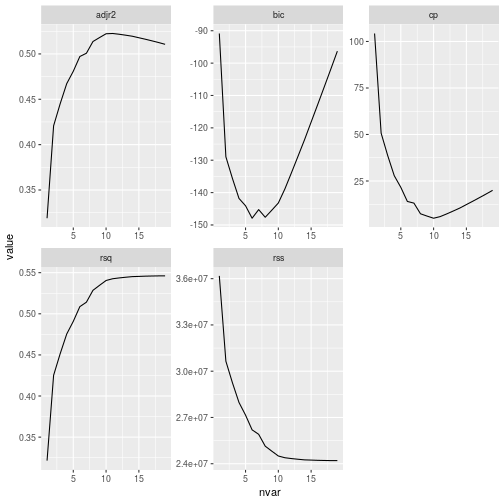


## 6.5.2 - Forward and Backward Stepwise Selection

The `regsubsets()` function can also be used for forward and backward stepwise.


```r
hitters %>%
    regsubsets(Salary ~ ., ., nvmax = 19, method = 'backward') %>%
    summary() %>%
    rbind() %>%
    as.tibble() %>%
    dplyr::select(rsq, rss, adjr2, cp, bic) %>%
    unnest() %>%
    dplyr::mutate(nvar = row_number()) %>%
    gather(func, 'value', -nvar) %>%
    ggplot() +
    geom_line(aes(nvar, value)) +
    facet_wrap(~func, scales = 'free')
```

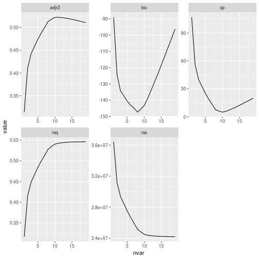


```r
hitters %>%
    regsubsets(Salary ~ ., ., nvmax = 19, method = 'backward') %>%
    summary() %>%
    rbind() %>%
    as.tibble() %>%
    dplyr::select(rsq, rss, adjr2, cp, bic) %>%
    unnest() %>%
    dplyr::mutate(nvar = row_number()) %>%
    gather(func, 'value', -nvar) %>%
    ggplot() +
    geom_line(aes(nvar, value)) +
    facet_wrap(~func, scales = 'free')
```


## 6.5.3 - Chosing Among Models

We can use validation set and cross-validation to choose the correct model.

In order for the approaches to yield accurate estimates of the test error, we must use *only the training observations* to perform all aspects of model fitting, including variable selection. If the full data set is used for the best subset selection step, the validation set errors and cross-validation errors obtained will not be accurate estimates of the test error.

There is no built in `predict()` method for the `regsubsets` class, so we first write our own.

This takes the `regsubsets` object, the `data`, and the `ncoefs` or number of coefficients to predict on. 

TODO 

## 6.6 - Ridge Regression and Lasso

The `glmnet` package can be used to perform ridge regression and lasso. The main function is `glmnet()`. It is different to other model fitting methods, in particular we must pass an `x` matrix as well as a `y` vector. We don't use the `y ~ x` syntax.


```r
library(glmnet)
library(modelr)
```


```r
x <- hitters %>% model.matrix(Salary ~ ., .) 
y <- hitters$Salary
```

The `glmnet()` function has an `alpha` parameter that determines what type of model is fit. If `alpha = 0` then a ridge regresion model is fit. If `alpha = 1` then a lasso is fit.

Let's fit a ridge regression model with an alpha between $10^10$ and $10^-2$:


```r
ridge.mod <- glmnet(x, y, alpha = 0, lambda = 10 ^ seq(10, -2, length = 100))
```

By default, the `glmnet()` function standardises the variables to the same scale.

Associated with each $\lambda$ is a vector of ridge regression coefficients, stored in a matrix and accessible using `coef()`.

We can also tidy the model:

```r
ridge.mod %>% tidy()
```

```
## # A tibble: 2,000 x 5
##    term         step estimate      lambda   dev.ratio
##    <chr>       <dbl>    <dbl>       <dbl>       <dbl>
##  1 (Intercept)     1  5.36e+2 10000000000 0.000000276
##  2 AtBat           1  5.44e-8 10000000000 0.000000276
##  3 Hits            1  1.97e-7 10000000000 0.000000276
##  4 HmRun           1  7.96e-7 10000000000 0.000000276
##  5 Runs            1  3.34e-7 10000000000 0.000000276
##  6 RBI             1  3.53e-7 10000000000 0.000000276
##  7 Walks           1  4.15e-7 10000000000 0.000000276
##  8 Years           1  1.70e-6 10000000000 0.000000276
##  9 CAtBat          1  4.67e-9 10000000000 0.000000276
## 10 CHits           1  1.72e-8 10000000000 0.000000276
## # ... with 1,990 more rows
```

Let's take a look at some of the terms and how they change depending on the value of the lambda. We take the tidy model and filter out a few terms. We take the log of the lambda and use that as our x axis. The y axis is our coefficient estimate.


```r
ridge.mod %>% 
    tidy() %>% 
    dplyr::filter(term %in% c('AtBat', 'Hits', 'Walks', 'Years', 'Salary', 'Runs')) %>% 
    mutate(log_lambda = log(lambda)) %>% 
    ggplot(aes(x = log_lambda, y = estimate, colour = term)) + 
    geom_line()
```

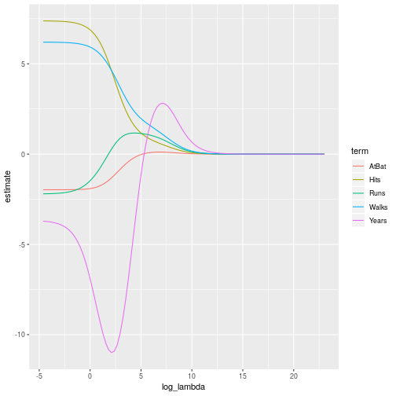

The `predict()` function can be used for a number of purposes. We can obtain the ridge regression coefficients for a new value of $\lambda$, say 50:

```r
predict(ridge.mod, s = 50, type = 'coefficients')[1:10,]
```

```
##  (Intercept)  (Intercept)        AtBat         Hits        HmRun 
## 48.766103292  0.000000000 -0.358099859  1.969359286 -1.278247981 
##         Runs          RBI        Walks        Years       CAtBat 
##  1.145891632  0.803829228  2.716185796 -6.218319217  0.005447837
```

Let's create a training and a test set and extract out the `x` and `y` training model matrix and vector respectively.


```r
set.seed(1)
hitters.resample <- 
    hitters %>% 
    resample_partition(c('train' = .5, 'test' = .5))

x.train <- 
    hitters.resample$train %>% 
    model.matrix(Salary ~ ., .)

y.train <- 
    hitters.resample$train %>% 
    as.tibble() %>% 
    .$Salary
```

We now fit the model to the training set and generate the predictions using `predict()` with a $\lambda = 4$.


```r
x.test <- hitters.resample$test %>% 
    model.matrix(Salary ~ ., .)

y.test <- as.tibble(hitters.resample$test) %>% 
    .$Salary

y.prediction <- predict(ridge.mod, s = 4, newx = x.test)
mean((y.prediction - y.test)^2)
```

```
## [1] 113895.5
```

Let's try predicting with a very large $\lambda$, which should take all of the coefficients to zero so we're only fitting the intercept:


```r
y.prediction <- predict(ridge.mod, s = 1e10, newx = x.test)
mean((y.prediction - y.test)^2)
```

```
## [1] 238591.4
```

We see the MSE increase. Now we compare against a regular least squres to determine whether there is a benefit in using $\lambda = 4$. A normal least squares is the same as having a $\lambda = 0$. We have to add `exact = T` becuase (from the manual):

*If exact=FALSE (default), then the predict function uses linear interpolation to make predictions for values of s (lambda) that do not coincide with those used in the fitting algorithm. While this is often a good approximation, it can sometimes be a bit coarse. 

With exact=TRUE, these different values of s are merged (and sorted) with object$lambda, and the model is refit before predictions are made. In this case, it is required to supply the original data x= and y= as additional named arguments to predict() or coef(). The workhorse predict.glmnet() needs to update the model, and so needs the data used to create it.*


```r
y.prediction <- predict(ridge.mod, s = 0, newx = x.test, exact = TRUE, x = x.train, y = y.train)
mean((y.prediction - y.test)^2)
```

```
## [1] 153964.5
```

So fitting with a $\lambda = 4$ leads to a lower test MSE.

In general it would be better to use cross validation to determine the $\lambda$. We can use the `cv.glmnet()` to do this. By default is does ten folds. We see the $\lambda$ with the smallest cross validation error is 27. We plug this back in and see an MSE of 121,165.


```r
set.seed(1)
cv.out <- cv.glmnet(x.train, y.train, alpha = 0) 
cv.out %>% 
    tidy() %>%
    mutate(log_lambda = log(lambda)) %>% 
    ggplot(aes(x = log_lambda, y = estimate)) + 
    geom_line() + 
    geom_point()
```

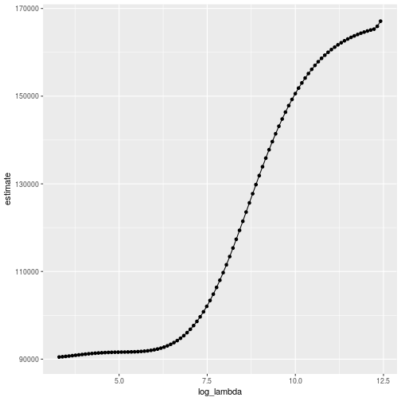

```r
cv.out$lambda.min
```

```
## [1] 27.11101
```

```r
y.prediction <- predict(ridge.mod, s = 27, newx = x.test)
mean((y.prediction - y.test)^2)
```

```
## [1] 121165.3
```

### 6.6.6 - The Lasso

Let's see whether the lasso can yield either a more accurate or a more interpretable model than ridge regression. We continue to use the `glmnet()` function, but we set `alpha = 1`. Ither than than that most of the steps are the same.


```r
lasso.mod <- glmnet(x.train, y.train, alpha = 1, lambda = 10^seq(10, -2, length = 100))
lasso.mod %>%
    tidy() %>%
    dplyr::filter(term %in% c('AtBat', 'Hits', 'Walks', 'Years', 'Salary', 'Runs')) %>%
    mutate(log_lambda = log(lambda)) %>%
    ggplot(aes(x = log_lambda, y = estimate, colour = term)) +
    geom_line()
```

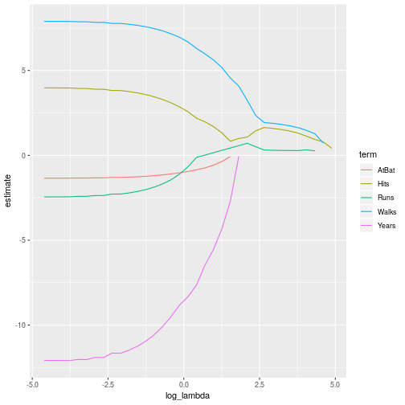

We can see that the coefficients we have chosen will eventually go to zero. We run a cross-validation and compute the test error.


```r
set.seed(1)
lasso.cv <- cv.glmnet(x.train, y.train, alpha = 1)

lasso.cv %>%
    tidy() %>%
    mutate(log_lambda = log(lambda)) %>%
    ggplot(aes(x = log_lambda, y = estimate)) +
    geom_line() +
    geom_point()
```

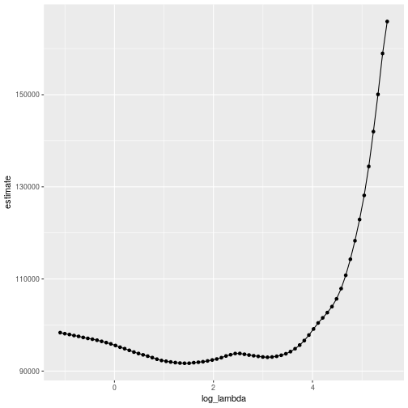

```r
lasso.pred <- predict(lasso.mod, s = lasso.cv$lambda.min, newx = x.test)
mean((lasso.pred - y.test)^2)
```

```
## [1] 147964.5
```

The main advantage over the ridge regression is that the estimates are sparse:

```r
predict(lasso.mod, s = lasso.cv$lambda.min, type = 'coefficients')
```

```
## 21 x 1 sparse Matrix of class "dgCMatrix"
##                        1
## (Intercept)  -50.9475142
## (Intercept)    .        
## AtBat         -0.2076188
## Hits           1.0571536
## HmRun          3.1270724
## Runs           .        
## RBI            2.2654979
## Walks          4.8394796
## Years         -3.4568155
## CAtBat         .        
## CHits          0.3743793
## CHmRun        -0.6036365
## CRuns          0.4838344
## CRBI           .        
## CWalks        -0.6536503
## LeagueN       23.0199715
## DivisionW   -126.5994583
## PutOuts        0.2709289
## Assists        .        
## Errors        -1.7373176
## NewLeagueN     .
```

We see a number of the coefficients have been taken to 0.

## 6.7 - PCR and PLS Regression

### 6.7.1 - Principal Components Regression

Principal components regression can be performed using the `pcr()` function which is part of the `pls` library. However we are going to take a different direction and use the `prcmp()` function in a tidier manner.

Before looking at the hitters data, we take a look at a simpler data set with two principal components:


```r
library(pls)
```


```r
set.seed(1)
sample <- tibble(x = 1:1000, y = 2*x + rnorm(length(x), 30, 300))
sample %>% ggplot(aes(x,y)) + geom_point()
```

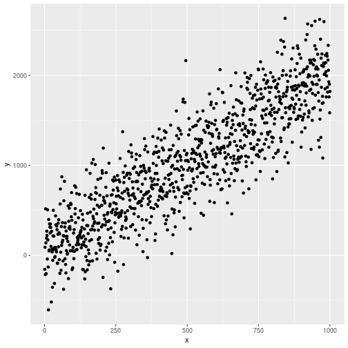

We take this data set and nest it in a tibble. We then run the `prcomp()` function over the top to get our princpal components. We augment these with the `broom` library which gives us each observations projection into the PCA space and then unnest this variable.

The two PC columns per observation are '.fittedPC1' and '.fittedPC2', so we summarise the variance of both of these columns. The resulting tibble has those two columns with their variance, so we gather them togeher to there's a column for the PC number, and a column for the variance.

We then calculate the percentage of the total variance, ending up with 96.7% of the variance explained by the first principal component, and 3.3% being described by the second principal component.


```r
sample %>% 
    nest() %>% 
    mutate(
        pc = map(data, ~prcomp(.x)), 
        pc_aug = map2(data, pc, ~augment(.y, data = .x))
    ) %>% 
    unnest(pc_aug) %>% 
    summarise_at(vars(contains('PC')), funs(var)) %>% 
    gather(key = pc, value = variance) %>% 
    mutate(var_explained = variance/sum(variance))
```

```
## # A tibble: 2 x 3
##   pc         variance var_explained
##   <chr>         <dbl>         <dbl>
## 1 .fittedPC1  487593.        0.967 
## 2 .fittedPC2   16480.        0.0327
```

Let's now apply this to the `hitters` data. There are two extra steps in the pipeline: we remove columns that aren't numeric, and we rename the PC columns for aesthetics.


```r
hitters_pca_variance <- 
    hitters %>% 
    select_if(is.numeric) %>% 
    nest() %>% 
    mutate(
        pc = map(data, ~prcomp(.x, center = T, scale = T)), 
        pc_augment = map2(pc, data, ~augment(.x, .y))
    ) %>% 
    unnest(pc_augment) %>% 
    summarise_at(vars(contains('PC')), funs(var)) %>% 
    rename_all(funs(str_replace(., '.fittedPC', ''))) %>% 
    gather(key = pc, value = variance) %>% 
    mutate(pc = as.integer(pc)) %>%
    mutate(explained_variance = variance/sum(variance))

hitters_pca_variance
```

```
## # A tibble: 17 x 3
##       pc variance explained_variance
##    <int>    <dbl>              <dbl>
##  1     1  7.69             0.452    
##  2     2  4.12             0.242    
##  3     3  1.73             0.102    
##  4     4  0.917            0.0539   
##  5     5  0.707            0.0416   
##  6     6  0.524            0.0308   
##  7     7  0.488            0.0287   
##  8     8  0.251            0.0148   
##  9     9  0.181            0.0106   
## 10    10  0.132            0.00779  
## 11    11  0.0974           0.00573  
## 12    12  0.0594           0.00349  
## 13    13  0.0538           0.00317  
## 14    14  0.0267           0.00157  
## 15    15  0.0141           0.000828 
## 16    16  0.00481          0.000283 
## 17    17  0.00120          0.0000707
```

Let's have a look at the graph:

```r
hitters_pca_variance %>% ggplot() + geom_bar(aes(pc, explained_variance), stat = 'identity')
```

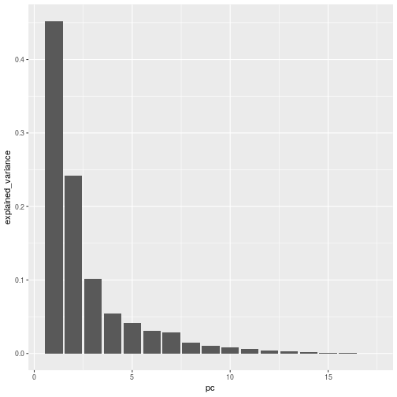

Now we go back to using the `prc()` function.


```r
pcr_fit <- pcr(formula = Salary ~ ., data = hitters, scale = T, validation = "CV")
pcr_fit %>% summary()
```

```
## Data: 	X dimension: 263 19 
## 	Y dimension: 263 1
## Fit method: svdpc
## Number of components considered: 19
## 
## VALIDATION: RMSEP
## Cross-validated using 10 random segments.
##        (Intercept)  1 comps  2 comps  3 comps  4 comps  5 comps  6 comps
## CV             452    356.5    353.8    352.9    350.9    347.7    344.0
## adjCV          452    355.9    353.2    352.3    350.3    347.1    343.1
##        7 comps  8 comps  9 comps  10 comps  11 comps  12 comps  13 comps
## CV       344.3    345.3    346.7     350.7     352.7     354.7     355.2
## adjCV    343.4    344.4    345.7     349.4     351.3     353.2     353.6
##        14 comps  15 comps  16 comps  17 comps  18 comps  19 comps
## CV        353.2     353.9     346.8     349.5     348.1     350.6
## adjCV     351.3     352.0     344.7     347.1     345.6     348.0
## 
## TRAINING: % variance explained
##         1 comps  2 comps  3 comps  4 comps  5 comps  6 comps  7 comps
## X         38.31    60.16    70.84    79.03    84.29    88.63    92.26
## Salary    40.63    41.58    42.17    43.22    44.90    46.48    46.69
##         8 comps  9 comps  10 comps  11 comps  12 comps  13 comps  14 comps
## X         94.96    96.28     97.26     97.98     98.65     99.15     99.47
## Salary    46.75    46.86     47.76     47.82     47.85     48.10     50.40
##         15 comps  16 comps  17 comps  18 comps  19 comps
## X          99.75     99.89     99.97     99.99    100.00
## Salary     50.55     53.01     53.85     54.61     54.61
```

```r
validationplot(pcr_fit, val.type = 'MSEP')
```

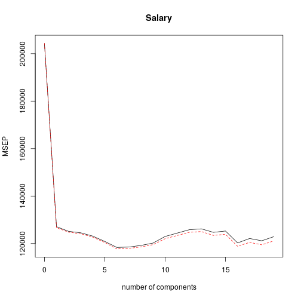

The CV score is the *root mean squared error*. To obtain the usual MSE, the values need to be squared.


```r
set.seed(1)
hitters_pcr <- hitters %>%
    resample_partition(c('train' = .5, 'test' = .5)) %>%
    rbind() %>%
    as.tibble() %>%
    mutate(pcr = map(train, ~pcr(Salary ~ ., data = as.tibble(.x), scale = T, validation = 'CV')))

hitters_pcr
```

```
## # A tibble: 1 x 3
##   train          test           pcr      
##   <list>         <list>         <list>   
## 1 <S3: resample> <S3: resample> <S3: mvr>
```

```r
hitters_pcr %>% pull(pcr) %>% .[[1]] %>% validationplot(., val.type = 'MSEP')
```

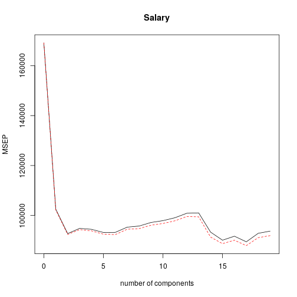

We now see the lowest validation occurs when $M = 7$. We calculate the test MSE:


```r
hitters_pcr %>% 
    transmute(
        pred = map2(pcr, test, ~predict(.x, as.tibble(.y), ncomp = 5)), 
        res = map(test, ~as.tibble(.x))) %>% 
        unnest() %>% 
        summarise(test_mse = mean((pred - Salary)^2))
```

```
## # A tibble: 1 x 1
##   test_mse
##      <dbl>
## 1  148922.
```

### 6.7.2 - Partial Least Squares

Partial least squares is implemented using the `plsr()` function, which is also a part of the `pls` library. The syntax is the same as the `pcr()` function.


```r
hitters <- as.tibble(Hitters)
set.seed(1)
hitters_pls <- hitters %>%
    nest() %>%
    mutate(
        sample = map(data, ~resample_partition(.x, c(test = .5, train = .5))),
        pls = map2(data, sample, ~plsr(Salary ~ ., data = .x, subset = as.integer(.y$test), scale = T, validation = 'CV'))
    ) 

hitters_pls %>%
    pull(pls) %>%
    .[[1]] %>%
    summary()
```

```
## Data: 	X dimension: 130 19 
## 	Y dimension: 130 1
## Fit method: kernelpls
## Number of components considered: 19
## 
## VALIDATION: RMSEP
## Cross-validated using 10 random segments.
##        (Intercept)  1 comps  2 comps  3 comps  4 comps  5 comps  6 comps
## CV           428.7    319.4    321.3    331.3    344.4    358.2    359.0
## adjCV        428.7    318.4    319.8    328.8    340.8    352.9    353.7
##        7 comps  8 comps  9 comps  10 comps  11 comps  12 comps  13 comps
## CV       356.6    352.7    354.5     354.0     355.5     352.5     351.1
## adjCV    351.5    348.0    349.7     348.9     350.3     347.4     346.0
##        14 comps  15 comps  16 comps  17 comps  18 comps  19 comps
## CV        350.5     352.2     349.7     348.8     346.3     352.8
## adjCV     345.2     346.8     344.4     343.5     341.3     347.1
## 
## TRAINING: % variance explained
##         1 comps  2 comps  3 comps  4 comps  5 comps  6 comps  7 comps
## X         38.41    54.19    68.24    74.68    77.88    83.48    88.71
## Salary    50.99    54.77    56.19    57.31    59.15    60.09    60.55
##         8 comps  9 comps  10 comps  11 comps  12 comps  13 comps  14 comps
## X         91.35    93.35     94.58     97.32     97.93     98.63     98.97
## Salary    60.96    61.39     62.04     62.29     62.88     63.17     63.50
##         15 comps  16 comps  17 comps  18 comps  19 comps
## X          99.23     99.44     99.74     99.95    100.00
## Salary     63.75     64.07     64.20     64.25     64.44
```

```r
hitters_pls %>%
    pull(pls) %>%
    .[[1]] %>%
    validationplot(val.type = 'MSEP')
```

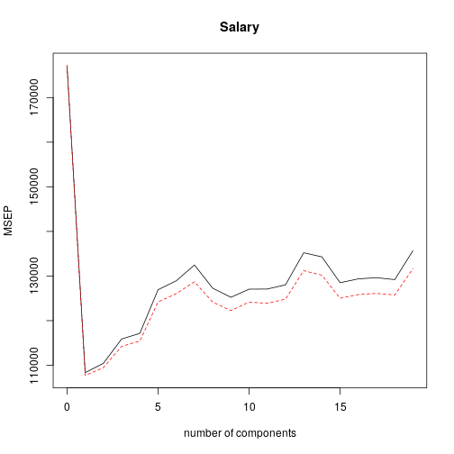

