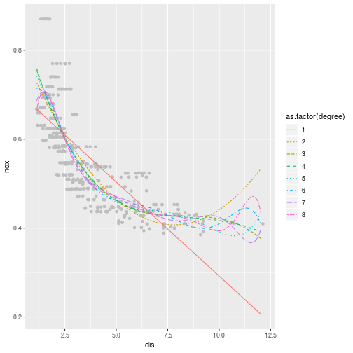

# Chapter 7- Applied

## 6)

*In this exercise, you will further analyze the Wage data set considered throughout this chapter.*

### a)

*Perform polynomial regression to predict wage using age . Use cross-validation to select the optimal degree d for the polynomial. What degree was chosen, and how does this compare to the results of hypothesis testing using ANOVA? Make a plot of the resulting polynomial fit to the data.*


```r
library(tidyverse)
library(ISLR)
library(modelr)
library(gam)
library(splines)
library(corrplot)
library(leaps)
```


```r
set.seed(1)

wage <- as.tibble(Wage)

wage_poly <- 
    tibble(degree = 1:10) %>%
    mutate(
        crossv = list(resample_partition(wage, c(train = .5, test = .5))),
        model = map2(degree, crossv, ~lm(wage ~ poly(age, .x), data = .y$train)),
        mse = map2_dbl(model, crossv, ~mse(.x, data = .y$test))
    )

wage_poly %>% pull(mse) %>% which.min()
```

```
## [1] 4
```

```r
wage_poly %>%
    ggplot(aes(degree, mse)) +
    geom_line() +
    geom_point() +
    scale_x_continuous(breaks = wage_poly$degree)
```


```r
wage_poly %>%
    pull(model) %>%
    do.call(anova, .) %>%
    as.tibble()
```

```
## # A tibble: 10 x 6
##    Res.Df      RSS    Df `Sum of Sq`       F  `Pr(>F)`
##  *  <dbl>    <dbl> <dbl>       <dbl>   <dbl>     <dbl>
##  1   1497 2432083.    NA         NA  NA      NA       
##  2   1496 2333231.     1      98852. 63.5     3.10e-15
##  3   1495 2326307.     1       6924.  4.45    3.51e- 2
##  4   1494 2324374.     1       1933.  1.24    2.65e- 1
##  5   1493 2319218.     1       5155.  3.31    6.89e- 2
##  6   1492 2318499.     1        719.  0.462   4.97e- 1
##  7   1491 2317330.     1       1169.  0.751   3.86e- 1
##  8   1490 2317217.     1        113.  0.0728  7.87e- 1
##  9   1489 2315466.     1       1751.  1.13    2.89e- 1
## 10   1488 2314928.     1        538.  0.346   5.57e- 1
```

We see that using cross-validation, a degree 4 polynomial provides the best fit of the data. This lines up with the ANOVA where the p-value between the cubic to quartic is very large.


```r
tibble(age = range(wage$age)[1]:range(wage$age)[2]) %>%
    mutate(wage = predict(wage_model, newdata = .)) %>%
    ggplot(aes(age, wage)) +
    geom_jitter(data = wage, mapping = aes(age, wage), alpha = .1) +
    geom_line() +
    geom_point()
```

```
## Error in mutate_impl(.data, dots): Evaluation error: object 'wage_model' not found.
```

### b)

*Fit a step function to predict wage using age , and perform crossvalidation to choose the optimal number of cuts. Make a plot of the fit obtained.*


```r
set.seed(2)
wage_cut <- 
    tibble(
        cuts = 2:10,
        crossv = list(resample_partition(wage, c(train = .5, test = .5)))
    ) %>%
    mutate(
        model = map2(cuts, crossv, ~lm(wage ~ cut(age, .x), data = .y$train)),
        mse = map2_dbl(model, crossv, ~mse(.x, .y$test))
    )

wage_cut %>% pull(mse) %>% which.min() + 1
```

```
## [1] 8
```

```r
wage_cut %>%
    ggplot(aes(cuts, mse)) +
    geom_line() +
    geom_point()
```


## 7)

*The `Wage` data set contains a number of other features not explored in this chapter, such as marital status ( `maritl` ), job class ( `jobclass` ), and others. Explore the relationships between some of these other predictors and wage , and use non-linear fitting techniques in order to fit flexible models to the data. Create plots of the results obtained, and write a summary of your findings.*

Let's take a look at marital status and job class versus wage:


```r
wage %>%
    ggplot() +
    geom_boxplot(aes(maritl, wage)) 
```


```r
wage %>%
    ggplot() +
    geom_boxplot(aes(education, wage)) 
```


Let's perform an ANOVA:


```r
tibble(formula = list(
    wage ~ ns(age, 4),
    wage ~ ns(age, 4) + education,
    wage ~ ns(age, 4) + education + jobclass
)) %>%
    mutate(model = map(formula, ~gam(.x, data = wage))) %>%
    pull(model) %>%
    do.call(anova, .)
```

```
## Analysis of Deviance Table
## 
## Model 1: wage ~ ns(age, 4)
## Model 2: wage ~ ns(age, 4) + education
## Model 3: wage ~ ns(age, 4) + education + jobclass
##   Resid. Df Resid. Dev Df Deviance  Pr(>Chi)    
## 1      2995    4773109                          
## 2      2991    3717338  4  1055770 < 2.2e-16 ***
## 3      2990    3705071  1    12267  0.001653 ** 
## ---
## Signif. codes:  0 '***' 0.001 '**' 0.01 '*' 0.05 '.' 0.1 ' ' 1
```


## 8)

*Fit some of the non-linear models investigated in this chapter to the Auto data set. Is there evidence for non-linear relationships in this data set? Create some informative plots to justify your answer.*

In this section we're going to fit natural splines, smoothing splines and local regression.

### Natural Spline

We first look at a natural spline, performing k-fold cross-validation with k = 4) on different degreees of freedom. There appears to be a non-linear relationship between `displacement` and `mpg`.


```r
auto <- as.tibble(Auto)

set.seed(1)

tibble(
    df = 1:30,
    data = list(auto)
) %>%
    mutate(crossv = map(data, ~crossv_kfold(.x, k = 4))) %>%
    unnest(crossv) %>%
    mutate(
        model = map2(df, train, ~lm(mpg ~ ns(displacement, df = .x), data = .y)),
        predict = map2(test, model, ~predict(.y, newdata = as.tibble(.x))),
        actual = map(test, ~as.tibble(.x)[['mpg']])
    ) %>%
    unnest(predict, actual) %>%
    mutate(resid = actual - predict) %>%
    group_by(df) %>%
    summarise(mse = mean(resid^2)) %>%
    ggplot(aes(df, mse)) +
    geom_line() +
    geom_point()
```


We see the lowest MSE when the df is equal to 12. Let's see how this looks across the data.


```r
auto_model <- auto %>% lm(mpg ~ ns(displacement, df = 12), data = .)

tibble(displacement = min(auto$displacement):max(auto$displacement)) %>%
    mutate(
        fit = predict(auto_model, newdata = tibble(displacement = displacement), se = T)[['fit']],
        se.fit = predict(auto_model, newdata = tibble(displacement = displacement), se = T)[['se.fit']]
    ) %>%
    ggplot(aes(displacement, fit)) +
    geom_jitter(data = auto, mapping = aes(displacement, mpg), colour = 'grey') +
    geom_line() +
    geom_line(aes(displacement, fit + (2 * se.fit)), colour = 'red', linetype = 2) +
    geom_line(aes(displacement, fit - (2 * se.fit)), colour = 'red', linetype = 2)
```


### Smoothing Spline

We now try a smoothing spline. In the same manner as the natural spline, we perform k-fold cross validation to select the degrees of freedom:


```r
set.seed(1)
tibble(
    df = 2:20,
    data = list(select(auto, x = displacement, y = mpg))
) %>%
    mutate(crossv = map(data, ~crossv_kfold(.x, k = 4))) %>%
    unnest(crossv) %>%
    mutate(
        model = map2(df, train, ~smooth.spline(x = as.tibble(.y), df = .x)),
        predict = map2(test, model, ~predict(.y, x = as.tibble(.x))[['y']][['y']]),
        actual = map(test, ~as.tibble(.x)[['y']])
    ) %>%
    unnest(predict, actual) %>%
    mutate(resid = actual - predict) %>%
    group_by(df) %>%
    summarise(mse = mean(resid^2)) %>%
    ggplot(aes(df, mse)) +
    geom_line() +
    geom_point()
```


We see the minimal test MSE is at 11. Let's look at this curve over the data:


```r
auto_model_ss <- auto %>%
    select(x = displacement, y = mpg) %>%
    smooth.spline(x = ., df = 11)

tibble(x = min(auto$displacement):max(auto$displacement)) %>%
    mutate(predict = predict(auto_model_ss, x = x, deriv = 0)[['y']]) %>%
    ggplot(aes(x, predict)) +
    geom_jitter(data = auto, mapping = aes(displacement, mpg), colour = 'grey') +
    geom_line()
```


### Local Regression

We move on to a local regression. We'll use k-fold cross validation to determine the `span` parameter which controls the degree of smoothing.


```r
set.seed(1)
loess_spans <- tibble(
    span = seq(.15, 1, .01),
    data = list(na.omit(auto))
) %>%
    mutate(crossv = map(data, ~crossv_kfold(.x, k = 4))) %>%
    unnest(crossv) %>%
    mutate(
        local_reg = map2(train, span, ~loess(mpg ~ displacement, data = .x, span = .y)),
        predict = map2(test, local_reg, ~predict(.y, newdata = as.tibble(.x))),
        actual = map(test, ~as.tibble(.x)$mpg)
    ) %>%
    unnest(actual, predict) %>%
    na.omit() %>%
    mutate(resid = actual - predict) %>%
    group_by(span) %>%
    summarise(mse = mean(resid^2))

loess_spans %>%
    ggplot(aes(span, mse)) +
    geom_line()
```


```r
loess_spans %>% arrange(mse)
```

```
## # A tibble: 86 x 2
##     span   mse
##    <dbl> <dbl>
##  1  0.29  16.9
##  2  0.26  17.0
##  3  0.19  17.1
##  4  0.31  17.3
##  5  0.27  17.3
##  6  0.24  17.3
##  7  0.16  17.4
##  8  0.35  17.5
##  9  0.36  17.5
## 10  0.21  17.6
## # ... with 76 more rows
```

We see the minimal MSE is with a span of around 0.29. Let's now view that curve across the data:


```r
auto_loc_reg <- loess(mpg ~ displacement, data = auto, span = .29)

tibble(displacement = min(auto$displacement):max(auto$displacement)) %>%
    mutate(mpg = predict(auto_loc_reg, newdata = tibble(displacement = displacement))) %>%
    ggplot(aes(displacement, mpg)) +
    geom_jitter(data = auto, mapping = aes(displacement, mpg), colour = 'grey') +
    geom_line()
```


## 9)

*This question uses the variables `dis` (the weighted mean of distances to five Boston employment centers) and `nox` (nitrogen oxides concentration in parts per 10 million) from the `Boston` data. We will treat dis as the predictor and nox as the response.*

### a) 

*Use the `poly()` function to fit a cubic polynomial regression to predict `nox` using `dis` . Report the regression output, and plot the resulting data and polynomial fits.*


```r
library(MASS)
```


```r
boston <- as.tibble(Boston)
nox_poly_fit <- glm(nox ~ poly(dis, 3), data = boston)

tibble(x = min(boston$dis):max(boston$dis)) %>%
    mutate(
        fit = predict(nox_poly_fit, newdata = tibble(dis = x), se = T)[['fit']],
        se = predict(nox_poly_fit, newdata = tibble(dis = x), se = T)[['se.fit']]
    ) %>%
    ggplot() +
    geom_jitter(data = boston, mapping = aes(dis, nox), colour = 'grey') +
    geom_line(aes(x, fit)) +
    geom_line(aes(x, fit + 2 * se), colour = 'red', linetype = 2) +
    geom_line(aes(x, fit - 2 * se), colour = 'red', linetype = 2)
```


### b)


```r
boston_poly_models <- tibble(degree = 1:8, data = list(boston)) %>%
    mutate(
        model = map2(degree, data, ~lm(nox ~ poly(dis, .x), data = .y)),
        span_dis = map(data, ~tibble(dis = seq(min(.x$dis),max(.x$dis), .1))),
        span_fit = map2(model, span_dis, ~predict(.x, newdata = .y)),
        actual = map(data, ~.x$nox),
        predict = map(model, ~predict(.x)),
        rss = map2_dbl(actual, predict, ~mean((.x - .y)^2))
    )

boston_poly_models %>%
    ggplot(aes(degree, rss)) +
    geom_line()
```


```r
boston_poly_models %>%
    unnest(span_fit, span_dis) %>%
    ggplot() +
    geom_jitter(data = boston, mapping = aes(dis, nox), colour = 'grey') +
    geom_line(aes(dis, span_fit, colour = as.factor(degree), linetype = as.factor(degree)))
```



### c)

*Perform cross-validation or another approach to select the optimal degree for the polynomial, and explain your results.*


```r
boston_poly_crossv <- tibble(degree = 1:8, data = list(boston)) %>%
    mutate(
        crossv = map(data, ~crossv_kfold(.x))
    ) %>%
    unnest(crossv) %>%
    mutate(
        model = map2(degree, train, ~glm(nox ~ poly(dis, .x), data = .y)),
        fit = map2(model, test, ~predict(.x, newdata = .y)),
        actual = map(test, ~as.tibble(.x)[['nox']]),
    ) %>%
    unnest(fit, actual) %>%
    mutate(residual = fit - actual) %>%
    group_by(degree) %>%
    summarise(rss = mean(residual^2))

boston_poly_crossv %>% arrange(rss) %>% slice(1)
```

```
## # A tibble: 1 x 2
##   degree     rss
##    <int>   <dbl>
## 1      3 0.00386
```

```r
boston_poly_crossv %>%
    ggplot(aes(degree, rss)) +
    geom_line()
```


We see that a third degree polynomial (cubic) provides the minimal test error.

### d)

*Use the `bs()` function to fit a regression spline to predict `nox` using `dis` . Report the output for the fit using four degrees of freedom. How did you choose the knots? Plot the resulting fit.*


We let the `bs()` function determinet he knots by specifying the degrees of freedom.


```r
boston_bs_fit <- lm(nox ~ bs(dis, df = 4), data = boston)

tibble(x = seq(min(boston$dis),max(boston$dis),.1)) %>%
    mutate(
        fit = predict(boston_bs_fit, newdata = tibble(dis = x)),
        se = predict(boston_bs_fit, newdata = tibble(dis = x), se = T)$se.fit
    ) %>%
    ggplot() +
    geom_jitter(data = boston, mapping = aes(dis, nox), colour = 'grey') +
    geom_line(aes(x, fit)) +
    geom_line(aes(x, fit + 2 * se), linetype = 2, colour = 'red') +
    geom_line(aes(x, fit - 2 * se), linetype = 2, colour = 'red')
```


### e)

*Now fit a regression spline for a range of degrees of freedom, and plot the resulting fits and report the resulting RSS. Describe the results obtained.*


```r
boston_reg_train <- tibble(df = 3:15, data = list(boston)) %>%
    mutate(
        model = map2(df, data, ~lm(nox ~ bs(dis, .x), data = .y)),
        fit = map(model, ~predict(.x)),
        actual = map(data, ~.x$nox)
    ) %>%
    unnest(fit, actual) %>%
    group_by(df) %>%
    summarise(rss = mean((fit - actual)^2))

boston_reg_train %>%
    ggplot(aes(df, rss)) +
    geom_line()
```


```r
boston_reg_train
```

```
## # A tibble: 13 x 2
##       df     rss
##    <int>   <dbl>
##  1     3 0.00382
##  2     4 0.00380
##  3     5 0.00364
##  4     6 0.00362
##  5     7 0.00362
##  6     8 0.00359
##  7     9 0.00361
##  8    10 0.00354
##  9    11 0.00355
## 10    12 0.00354
## 11    13 0.00352
## 12    14 0.00352
## 13    15 0.00352
```

### f)


```r
set.seed(1)

boston_reg_crossv <- tibble(df = 3:30, data = list(boston)) %>%
    mutate(
        crossv = map(data, ~crossv_kfold(.x))
    ) %>%
    unnest(crossv) %>%
    mutate(
        model = map2(df, train, ~lm(nox ~ bs(dis, .x), data = .y)),
        fit = map2(model, test, ~predict(.x, newdata = as.tibble(.y))),
        actual = map(test, ~as.tibble(.x)$nox)
    ) %>%
    unnest(fit, actual) %>%
    na.omit() %>%
    group_by(df) %>%
    summarise(rss = mean((actual - fit)^2))

boston_reg_crossv %>%
    ggplot(aes(df, rss)) +
    geom_line()
```


```r
boston_reg_crossv %>% arrange(rss) %>% slice(1)
```

```
## # A tibble: 1 x 2
##      df     rss
##   <int>   <dbl>
## 1    11 0.00365
```

We see the minimum RSS when there are 11 degrees of freedom.

## 10) 

*This question relates to the `College` data set.*

### a)

*Split the data into a training set and a test set. Using out-of-state tuition as the response and the other variables as the predictors, perform forward stepwise selection on the training set in order to identify a satisfactory model that uses just a subset of the predictors.*


```r
set.seed(1)
college <- as.tibble(College)
college_sample <- college %>% resample_partition(c(train = .5, test = .5))

college_regsub_mdl <- 
    college_sample$train %>%
    regsubsets(Outstate ~ ., data = ., nvmax = ncol(.), method = 'forward')


college_fwd_select <- college_regsub_mdl %>%
    summary() %>%
    rbind() %>%
    as.tibble() %>%
    dplyr::select(rss, rsq, bic) %>%
    unnest() %>%
    mutate(nvar = row_number()) %>%
    gather(func, value, -nvar)

college_fwd_select %>%
    ggplot() +
    geom_line(aes(nvar, value)) +
    facet_wrap(~func, scales = 'free')
```


The elbow of the appears with around 6 predictors, so we will use that value.


```r
college_regsub_mdl %>% coef(id = 6)
```

```
##   (Intercept)    PrivateYes    Room.Board           PhD   perc.alumni 
## -3937.9678480  3017.4054469     0.9643078    39.0036257    48.4727157 
##        Expend     Grad.Rate 
##     0.1927395    33.2292015
```


### b)

*Fit a GAM on the training data, using out-of-state tuition as the response and the features selected in the previous step as the predictors. Plot the results, and explain your findings.*


```r
library(gam)
```


```r
college_train_mdl <- gam(Outstate ~ Private + s(Room.Board, df = 3) + s(Personal, df = 3) + s(Terminal, df = 3) + s(perc.alumni, df = 3) + s(Expend, df = 3), data = college_sample$train)

plot(college_train_mdl)
```


### c)

*Evaluate the model obtained on the test set, and explain the results obtained.*


```r
as.tibble(college_sample$test) %>%
    mutate(
        Outstate_Pred = predict(college_train_mdl, newdata = .)
    ) %>%
    summarise(mse = mean((Outstate - Outstate_Pred)^2))
```

```
## # A tibble: 1 x 1
##        mse
##      <dbl>
## 1 3740149.
```

### d)

*For which variables, if any, is there evidence of a non-linear relationship with the response?*


```r
college_train_mdl %>% summary()
```

```
## 
## Call: gam(formula = Outstate ~ Private + s(Room.Board, df = 3) + s(Personal, 
##     df = 3) + s(Terminal, df = 3) + s(perc.alumni, df = 3) + 
##     s(Expend, df = 3), data = college_sample$train)
## Deviance Residuals:
##      Min       1Q   Median       3Q      Max 
## -5800.87 -1319.14    25.68  1364.51  6928.30 
## 
## (Dispersion Parameter for gaussian family taken to be 3700779)
## 
##     Null Deviance: 6480297586 on 387 degrees of freedom
## Residual Deviance: 1372988365 on 370.9998 degrees of freedom
## AIC: 6987.846 
## 
## Number of Local Scoring Iterations: 2 
## 
## Anova for Parametric Effects
##                         Df     Sum Sq    Mean Sq F value    Pr(>F)    
## Private                  1 1730414903 1730414903 467.581 < 2.2e-16 ***
## s(Room.Board, df = 3)    1 1153843730 1153843730 311.784 < 2.2e-16 ***
## s(Personal, df = 3)      1   58244206   58244206  15.738 8.731e-05 ***
## s(Terminal, df = 3)      1  367053291  367053291  99.183 < 2.2e-16 ***
## s(perc.alumni, df = 3)   1  232211913  232211913  62.747 2.765e-14 ***
## s(Expend, df = 3)        1  551354095  551354095 148.983 < 2.2e-16 ***
## Residuals              371 1372988365    3700779                      
## ---
## Signif. codes:  0 '***' 0.001 '**' 0.01 '*' 0.05 '.' 0.1 ' ' 1
## 
## Anova for Nonparametric Effects
##                        Npar Df Npar F     Pr(F)    
## (Intercept)                                        
## Private                                            
## s(Room.Board, df = 3)        2  0.573   0.56417    
## s(Personal, df = 3)          2  1.136   0.32233    
## s(Terminal, df = 3)          2  2.333   0.09840 .  
## s(perc.alumni, df = 3)       2  4.727   0.00939 ** 
## s(Expend, df = 3)            2 39.231 3.331e-16 ***
## ---
## Signif. codes:  0 '***' 0.001 '**' 0.01 '*' 0.05 '.' 0.1 ' ' 1
```

There is evidence of non-linearity for Expend.


## 11)

*In Section 7.7, it was mentioned that GAMs are generally fit using a backfitting approach. The idea behind backfitting is actually quite simple. We will now explore backfitting in the context of multiple linear regression.

Suppose that we would like to perform multiple linear regression, but we do not have software to do so. Instead, we only have software to perform simple linear regression. 

Therefore, we take the following iterative approach: we repeatedly hold all but one coefficient estimate fixed at its current value, and update only that coefficient estimate using a simple linear regression. The process is continued until convergence—that is, until the coefficient estimates stop changing. We now try this out on a toy example.*

### a)

*Generate a response Y and two predictors X 1 and X 2 , with n = 100.*


```r
gam_data <- tibble(X1 = 1:100, X2 = seq(303, 600, 3), Y = 3*X1 + .5*X2 + rnorm(100))
```

### b)

*Initialise $\hat{\beta}_1$ to take on a value of your choice*


```r
beta_hat_1 <- 20
```

### c)

*Keeping $\hat{\beta}_1$ fixed, fit the model:*

$$ Y - \hat\beta_1X_1 = \beta_0 + \beta_2X2 + \epsilon $$
