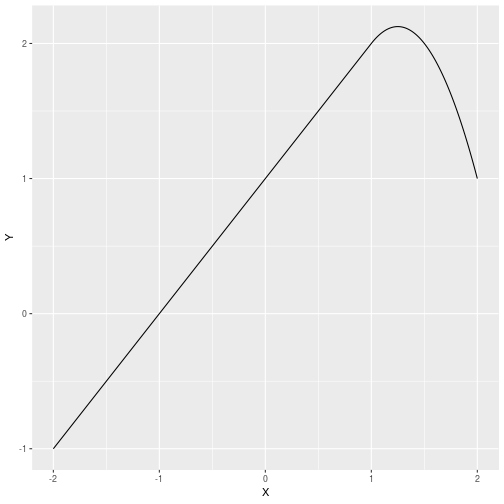
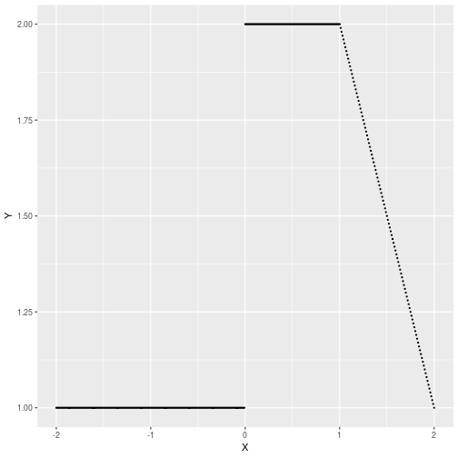

# Chapter 7 - Conceptual

## 1)

*It was mentioned in the chapter that a cubic regression spline with one knot at $\xi$ can be obtained using a basis of the form $x, x^2, x^3, (x - \xi)^3_+$, where $(x - \xi)^3_+ = (x - \xi)^3$ if $x > \xi$. and equals 0 otherwise.*

*We will now show that a function of the form:*

$$ f(x) = \beta_0 + \beta_1x + \beta_2x^2 + \beta_3x^3 + \beta_4(x - \xi)^3_+ $$

*is indeed a cubic regression spline, regardless of the values of $\beta$.*

### a)

*Find a cubic polynomial:*

$$ f_1(x) = a_1 + b_1x +c_1x^2 + d_1x3 $$

*such that $f(x) = f_1(x)$ for all $x \le \xi$. Express $a_1,b_1,c_1,d_1$ in terms of $\beta_1,\beta_2,\beta_3,\beta_4$.*

If $x \le \xi$ then the *truncated power basis function* is equal to zero. Therefore we have:

$$ a_1 = \beta_0, b_1 = \beta_1, c_1 = \beta_2, d_1 = \beta_3 $$

### b)
*Find a cubic polynomial:*

$$ f_2(x) = a_2 + b_2x +c_2x^2 + d_2x3 $$

*such that $f(x) = f_2(x)$ for all $x > \xi$. Express $a_2,b_2,c_2,d_2$ in terms of $\beta_1,\beta_2,\beta_3,\beta_4$.*

$$ \beta_0 + \beta_1x + \beta_2x^2 + \beta_3x^3 + \beta_4(x - \xi)^3 $$

$$ = \beta_0 + \beta_1x + \beta_2x^2 + \beta_3x^3 + \beta_4(x - \xi)(x - \xi)(x - \xi)$$

$$ = \beta_0 + \beta_1x + \beta_2x^2 + \beta_3x^3 + \beta_4(x^2 - 2x\xi + \xi^2)(x - \xi)$$

$$ = \beta_0 + \beta_1x + \beta_2x^2 + \beta_3x^3 + \beta_4(x^3 - x^2\xi - 2x^2\xi + 2x\xi^2 + x\xi^2 - \xi^3)$$

$$ = \beta_0 + \beta_1x + \beta_2x^2 + \beta_3x^3 + \beta_4(x^3 - 3x^2\xi + 3x\xi^2 - \xi^3)$$

$$ = \beta_0 + \beta_1x + \beta_2x^2 + \beta_3x^3 + \beta_4x^3 - \beta_43x^2\xi + \beta_43x\xi^2 - \beta_4\xi^3$$

$$ = \beta_0 - \beta_4\xi^3 + (\beta_1 + 3\beta_4\xi^2)x + (\beta_2 - 3\beta_4\xi)x^2 + (\beta_3 + \beta_4)x^3 $$

Therefore we have:

* $a_2 = \beta_0 - \beta_4\xi^3$
* $b_2 = \beta_1 + 3\beta\xi^2$
* $c_2 = \beta_2 - 3\beta_4\xi$
* $d_2 = \beta_3 + \beta_4$

### c)

*Show that $f_1(\xi) = f_2(\xi)$*

$$ \beta_0 + \beta_1\xi + \beta_2\xi^2 + \beta_3\xi^3 = \beta_0 - \beta_4\xi^3 + (\beta_1 + 3\beta_4\xi^2)\xi + (\beta_2 - 3\beta_4\xi)\xi^2 + (\beta_3 + \beta_4)\xi^3 $$

$$ \beta_0 + \beta_1\xi + \beta_2\xi^2 + \beta_3\xi^3 = \beta_0 - \beta_4\xi^3 + \beta_1\xi + 3\beta_4\xi^3 + \beta_2\xi^2 - 3\beta_4\xi^3 + \beta_3\xi^3 + \beta_4\xi^3 $$

$$ \beta_0 + \beta_1\xi + \beta_2\xi^2 + \beta_3\xi^3 = \beta_0 + \beta_1\xi + \beta_2\xi^2 + \beta_3\xi^3 $$

$$ = 0 $$

### d)

*Show that $f_1^\prime(\xi) = f_2^\prime(\xi)$*

$$ f_1^\prime(\xi) = \beta_1 + 2\beta_2\xi + 3\beta_3\xi^2 $$

$$ f_2^\prime(\xi) = -3\beta_4\xi^2 + \beta_1 + 9\beta_4\xi^2 + 2\beta_2\xi - 9\ beta_4\xi^2 + 3\beta_3\xi^2 + 3\beta_4\xi^2 $$

$$ f_2^\prime(\xi) = \beta_1 + 2\beta_2\xi + 3\beta_3\xi^2 $$

$$ f_1^\prime(\xi) = f_2^\prime(\xi) $$

### e)

*Show that $f_1^{\prime\prime}(\xi) = f_2^{\prime\prime}(\xi)$*

$$ f_1^{\prime\prime}(\xi) = 4\beta_2 + 9\beta_3\xi $$

$$ f_2^{\prime\prime}(\xi) = 4\beta_2 + 9\beta_3\xi $$

$$ f_1^{\prime\prime}(\xi) = f_2^{\prime\prime}(\xi) $$

## 2) 

*Suppose that a curve $\hat{g}$ is computed to smoothly fit a set of n points using the following formula:*

$$ \hat{g} = arg \ \underset{g}{min}\bigg{(}\sum_{i=1}^n(y_i - g(x_i))^2 + \lambda \int\bigg[g^{(m)}(x)\bigg]^2 dx\bigg{)} $$

*where $g^{(m)}$ represents the $m$ th derivative of $g$ (and $g^{(0)} = g$). Provide example sketches of $\hat{g}$ in the following scenarios:*

The $arg \ \underset{g}{min}$ is the **arguments of the maxima**. It is the argument to the function that attains it's minimum value. This is constrasted against the value that is returned from the function.

### a)

* $\lambda = \infty, m = 0$

$\lambda \to \infty$ means the first term does not come into play. Whem $m = 0$, $g^{(0)} = g$. Therefore $\hat{g}$ = 0.

* $\lambda = \infty, m = 1$

$\lambda \to \infty$ means the first term does not come into play. Whem $m = 0$, $g^{(1)} = g^{\prime}$. The function $\hat{g}$ that minimises the first derivative is a horizontal line.

* $\lambda = \infty, m = 2$

$\lambda \to \infty$ means the first term does not come into play. Whem $m = 0$, $g^{(2)} = g^{\prime\prime}$. The functions $\hat{g}$ that minimises the second derivative is a linear line.

* $\lambda = \infty, m = 3$

$\lambda \to \infty$ means the first term does not come into play. Whem $m = 0$, $g^{(3)} = g^{\prime\prime\prime}$. The functions $\hat{g}$ that minimises the second derivative is a quadratic.

* $\lambda = 0, m = 3$

$\lambda = 0$ means the second term does not come into play. The equation then becomes a standard least squares equation, so $\hat{h}$ is a linear line.

## 3)

*Suppose we fit a curve with basis functions $b_1(X) = X,\ b_2(X) = (X - 1)^2I(X \ge 1)$.*

*We fit a linear regression model $Y = \beta_0 + \beta_1b_1(X) + \beta_2b_2(X) + \epsilon$.*

*and obtain coefficient estimates $\beta_0 = 1, \beta_1 = 1, \beta_2 = −2. Sketch the estimated curve between X = −2 and X = 2. Note the intercepts, slopes, and other relevant information.*

Between -2 and 1 the curve is a linear curve. From 1 to 2 the curve is a quadratic.


```r
library(tidyverse)
```


```r
b1 <- function(X) X
b2 <- function(X) (X - 1)^2 * (X >= 1)

tibble(
    X = seq(-2, 2, .01),
    Y = 1 + b1(X) - 2*b2(X)
) %>%
    ggplot() +
    geom_line(aes(X,Y))
```



## 4)

*Suppose we fit a curve with basis functions $b_1(X) = I(0 \le X \le 2) - (X - 1)I(1 \le X \le 2),\ b_2(X) = (X - 3)I(3 \le X \le 4) + I(4 < X \le 5)$*

*We fit the linear regression model and obtain coefficient estimates of $\hat\beta_0 = 1, \hat\beta_1 = 1, \hat\beta_2 = 3$*

*Sketch the estimated curve between $X = -2$ and $X = 2$*

* [-2, 0) straight line with no slope at $Y = 1$ solely due due to the $\hat\beta_0$;
* [0, 1) there is a straight line with no slope at $Y = 2$.
* [1, 2) there is a linear line with an equation of $Y = 2 - X$


```r
b1 <- function(X) (0 <= X & X <= 2) - (X - 1)*(1 <= X & X <= 2)

tibble(
    X = seq(-2, 2, .01),
    Y = 1 + b1(X)
) %>%
    ggplot() +
    geom_point(aes(X,Y), size = .4) 
```



## 5)

*Consider two curves $\hat{g_1},\ \hat{g_2}$ defined by:*

$$ \hat{g_1} = arg \ \underset{g}{min}\bigg(\sum_{i=1}^n(y_i - g(x_i))^2 + \lambda\int\bigg[g^{(3)}(x)\bigg]^2\ dx\bigg) $$

$$ \hat{g_1} = arg \ \underset{g}{min}\bigg(\sum_{i=1}^n(y_i - g(x_i))^2 + \lambda\int\bigg[g^{(3)}(x)\bigg]^2\ dx\bigg) $$

*where $g^{(m)}$ represents the $m$ th derivative of $g$.*

### a)

*As $\lambda \to \infty$, will $\hat{g_1}$ or $\hat{g_2}$ have the smaller training RSS?*

As $\lambda \to \infty$, the first term becomes irrelevant. In the second term to minimuse $g$, $\hat{g_1}$ will be a cubic, and $\hat{g_4}$ will be a quartic.

The quartic function is more flexible, so we would expect $\hat{g_2}$ to have the smaller training RSS.

### b) 

*As $\lambda \to \infty$, will $\hat{g_1}$ or $\hat{g_2}$ have the smaller test RSS?*

**My answer**

This depends on the underlying data, and whether the response variable is best modelled by a cubic or a quartic function.

**Another answer**

$\hat{g_1}$ will provide a better test RSS as $\hat{g_2}$ could overfit the data due to the extra degree of freedom.

### c) 

*For $\lambda = 0$, will $\hat{g_1}$ or $\hat{g_2}$ have the smaller training and test RSS?*

The functions are the same (a standard least squares regression), so the RSS in both cases will be the same.
