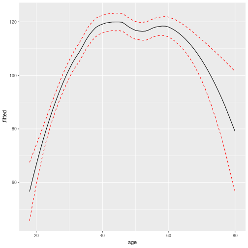
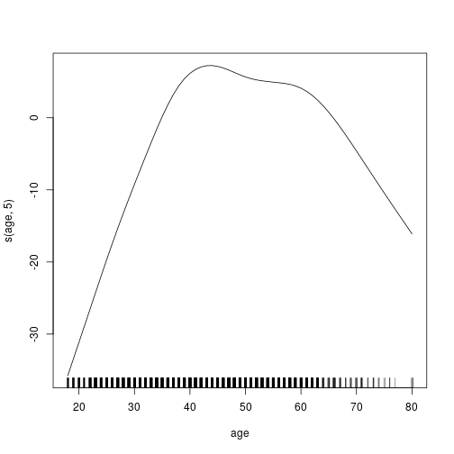

# Chapter 7 - Lab


```r
library(ISLR)
library(broom)
library(tidyverse)
library(splines)
```

## Polynomial and Step Functions

We first fit a polynomial of degree 4 to the wage data


```r
wage <- as.tibble(Wage)
wage %>% 
    lm(wage ~ poly(age, 4), data = .) %>%
    tidy()
```

```
## # A tibble: 5 x 5
##   term          estimate std.error statistic  p.value
##   <chr>            <dbl>     <dbl>     <dbl>    <dbl>
## 1 (Intercept)      112.      0.729    153.   0.      
## 2 poly(age, 4)1    447.     39.9       11.2  1.48e-28
## 3 poly(age, 4)2   -478.     39.9      -12.0  2.36e-32
## 4 poly(age, 4)3    126.     39.9        3.14 1.68e- 3
## 5 poly(age, 4)4    -77.9    39.9       -1.95 5.10e- 2
```

```r
wage_model <- lm(wage ~ poly(age, 4), data = wage)
```

The `poly()` function allows us to avoid writing out the polynomial formula. The result is a matrix whose columns are a basis of *orthogonal polynomials*. This means that each column is a linear combination of the variables $age, age^2, age^3$ and $age^4$. We can also get the direct polynomials by using `raw = T`.

Let's re-create the first graph from the chapter - this time with the standard error lines.


```r
tibble(
    age = range(wage$age)[1]:range(wage$age)[2]
) %>%
mutate(
    wage = predict(wage_model, newdata = tibble(age = age), se = T)[['fit']],
    se.fit = predict(wage_model, newdata = tibble(age = age), se = T)[['se.fit']]
) %>%
    ggplot() +
    geom_jitter(data = wage, aes(age,wage), colour = 'grey') +
    geom_line(aes(age, wage)) +
    geom_line(aes(age, wage + 2 * se.fit), linetype = 2, colour = 'red') +
    geom_line(aes(age, wage - 2 * se.fit), linetype = 2, colour = 'red')
```


In performing a polynomial regression we must decide on the degree of polynomial to use. We now fit models ranging from linear to degree 5.

We use the `anova()` function which performs an *analysis of variance* (ANOVA, using an F-test) in order to test the null hypothesis that a model $M_1$ is sufficient to explain the data against an alternative hypothesis that a more complex model $M_2$ is required.

In order to use ANOVA, $M_1$ and $M_2$ must be nested models: the predictors in the first must be a subset of the predictors in the second.


```r
tibble(
    degree = 1:5,
    model = map(degree, ~lm(wage ~ poly(age, .x), data = wage))
) %>%
pull(model) %>%
do.call(anova, .)
```

```
## Analysis of Variance Table
## 
## Model 1: wage ~ poly(age, .x)
## Model 2: wage ~ poly(age, .x)
## Model 3: wage ~ poly(age, .x)
## Model 4: wage ~ poly(age, .x)
## Model 5: wage ~ poly(age, .x)
##   Res.Df     RSS Df Sum of Sq        F    Pr(>F)    
## 1   2998 5022216                                    
## 2   2997 4793430  1    228786 143.5931 < 2.2e-16 ***
## 3   2996 4777674  1     15756   9.8888  0.001679 ** 
## 4   2995 4771604  1      6070   3.8098  0.051046 .  
## 5   2994 4770322  1      1283   0.8050  0.369682    
## ---
## Signif. codes:  0 '***' 0.001 '**' 0.01 '*' 0.05 '.' 0.1 ' ' 1
```

The p-value comparing the linear to the quadratic is essentially 0, indicating a linear fit is insufficient. The quadratic to cubic is also quite low, so the quadratic fit is not sufficient either. The p-value between the cubic and quartic is 5%, while the quintic seems unnecessary as the p-value is high. This a subic or quartic appears to provide a reasonable fit of the data.

We could have skipped the ANOVA an instead used the fact that the `poly()` function creates orthogonal polynomials:


```r
wage_coefs <- wage %>%
    lm(wage ~ poly(age, 5), data = .) %>%
    summary() %>%
    coef() %>%
    as.tibble()
wage_coefs
```

```
## # A tibble: 6 x 4
##   Estimate `Std. Error` `t value` `Pr(>|t|)`
##      <dbl>        <dbl>     <dbl>      <dbl>
## 1    112.         0.729   153.      0.      
## 2    447.        39.9      11.2     1.49e-28
## 3   -478.        39.9     -12.0     2.37e-32
## 4    126.        39.9       3.14    1.68e- 3
## 5    -77.9       39.9      -1.95    5.10e- 2
## 6    -35.8       39.9      -0.897   3.70e- 1
```

The p-values are the same, and the sqaure of the t-statictics are equal to the F-statistics.


```r
wage_coefs %>%
    mutate(F.stat = `t value`^2)
```

```
## # A tibble: 6 x 5
##   Estimate `Std. Error` `t value` `Pr(>|t|)`    F.stat
##      <dbl>        <dbl>     <dbl>      <dbl>     <dbl>
## 1    112.         0.729   153.      0.       23494.   
## 2    447.        39.9      11.2     1.49e-28   125.   
## 3   -478.        39.9     -12.0     2.37e-32   144.   
## 4    126.        39.9       3.14    1.68e- 3     9.89 
## 5    -77.9       39.9      -1.95    5.10e- 2     3.81 
## 6    -35.8       39.9      -0.897   3.70e- 1     0.805
```

However the ANOVA model works whether or not we use orthogonal polynomials; it also works when we have other terms in the model as well:

```r
tibble(
    degree = 1:3,
    model = map(degree, ~lm(wage ~ education + poly(age, .x), data = wage))
) %>%
pull(model) %>%
do.call(anova, .)
```

```
## Analysis of Variance Table
## 
## Model 1: wage ~ education + poly(age, .x)
## Model 2: wage ~ education + poly(age, .x)
## Model 3: wage ~ education + poly(age, .x)
##   Res.Df     RSS Df Sum of Sq        F Pr(>F)    
## 1   2994 3867992                                 
## 2   2993 3725395  1    142597 114.6969 <2e-16 ***
## 3   2992 3719809  1      5587   4.4936 0.0341 *  
## ---
## Signif. codes:  0 '***' 0.001 '**' 0.01 '*' 0.05 '.' 0.1 ' ' 1
```
As an alternative to ANOVA we could choose the polynomial degree using cross-validation.

***

Next we consider the task of predicting whether an individual earns over 250,000 a year. We create a logical variable for whether the earning is above 250k, and perform a logistical regression with a quartic polynomial.


```r
wage <- wage %>% mutate(high_earn = wage > 250)
high_earn_model = wage %>% glm(high_earn ~ poly(age, 4), data = ., family = 'binomial')
```

There is a slight difference in this scenario with the `predict()` function. By default it returns the *logit* or log-odds:
$$ log\bigg(\frac{P(Y = 1|X)}{1 - Pr(Y = 1|X)}\bigg) = X\beta $$

The the predictions are given in the form $X\hat{\beta}$. The standard errors are also of this form. We could use the the `type = 'response'` in the predict function, however this will give negative probabilities. 

We obtain the probability by performing the transformation:
$$ Pr(Y = 1|X) = \frac{exp(X\beta)}{1 + exp(X\beta)} $$


```r
tibble(
    age = range(wage$age)[1]:range(wage$age)[2]
) %>%
    mutate(
        fit = predict(high_earn_model, newdata = tibble(age = age), se = T)[['fit']],
        se.fit = predict(high_earn_model, newdata = tibble(age = age), se = T)[['se.fit']],
        prob = exp(fit) / (1 + exp(fit)),
        se.high = exp(fit + 2 * se.fit) / (1 + exp(fit + 2 * se.fit)),
        se.low = exp(fit - 2 * se.fit) / (1 + exp(fit - 2 * se.fit))
    ) %>%
    ggplot() +
    geom_line(aes(age, prob)) +
    geom_line(aes(age, se.high), linetype = 2, colour = 'red') +
    geom_line(aes(age, se.low), linetype = 2, colour = 'red')
```


In order to create a step function we can use the `cut()` function:


```r
wage %>%
    lm(wage ~ cut(age, 4), data = .) %>%
    tidy()
```

```
## # A tibble: 4 x 5
##   term                   estimate std.error statistic  p.value
##   <chr>                     <dbl>     <dbl>     <dbl>    <dbl>
## 1 (Intercept)               94.2       1.48     63.8  0.      
## 2 cut(age, 4)(33.5,49]      24.1       1.83     13.1  1.98e-38
## 3 cut(age, 4)(49,64.5]      23.7       2.07     11.4  1.04e-29
## 4 cut(age, 4)(64.5,80.1]     7.64      4.99      1.53 1.26e- 1
```

## Splines

### Basis Functions

In order to fit regression splines in R, we use the `splines` library. We saw that regression splines can be fit be constructing an appropriate matrix of basis functions. The `bs()` function the entire matrix of basis functions for splines with the specified knots. By default cubic splines are created.


```spline_setup
library(splines)
```


```r
wage %>%
    lm(wage ~ bs(age, knots = c(25, 40, 60)), data = .) %>%
    augment(wage) %>%
    ggplot() +
    geom_jitter(data = wage, aes(age,wage), alpha = .1) +
    geom_line(aes(age, .fitted)) +
    geom_line(aes(age, .fitted + 2*.se.fit), linetype = 2, colour = 'red') +
    geom_line(aes(age, .fitted - 2*.se.fit), linetype = 2, colour = 'red')
```


We have knots at 25, 40 and 60. This produces a spline with 6 basis functions: a cubic spline with 3 knots has seven degrees of freedon, and these are used up by an intercept and 6 basis functions.

The `df` option to produce a spline with knots at uniform quantiles of the data.

### Natural Splines

In order to fit a natural spline we use the `ns()` function.


```r
wage %>%
    lm(wage ~ ns(age, df = 4), data = .) %>%
    augment(wage) %>%
    ggplot() +
    geom_jitter(data = wage, aes(age,wage), alpha = .1) +
    geom_line(aes(age, .fitted)) +
    geom_line(aes(age, .fitted + 2*.se.fit), linetype = 2, colour = 'red') +
    geom_line(aes(age, .fitted - 2*.se.fit), linetype = 2, colour = 'red')
```


### Smoothing Splines

In order to fit a smoothing spline, we use the `smooth.spline()` function.


```r
wage %>%
    select(x = age, y = wage) %>%
    as.list() %>%
    smooth.spline(x = .) %>%
    glance()
```

```
## # A tibble: 1 x 6
##      df lambda cv.crit pen.crit  crit  spar
##   <dbl>  <dbl>   <dbl>    <dbl> <dbl> <dbl>
## 1  6.47 0.0349   1594.   76185. 1594. 0.712
```


The function will perform cross validation. It uses ordinary LOOCV when `cv = T` and generalised cross validation when `cv = F`. It generates a $\lambda$ and calculate the degrees of freedom.


```r
wage %>%
    select(x = age, y = wage) %>%
    as.list() %>%
    smooth.spline(x = .) %>%
    augment() %>%
    ggplot() +
    geom_line(aes(x, .fitted))
```


### Local Regression 

In order to perform local regress we use the `loess()` funfction (localally estimated scatterplot smoothing). 


```r
wage %>%
    loess(wage ~ age, span = .5, data = .) %>%
    augment() %>%
    ggplot() +
    geom_line(aes(age, .fitted)) +
    geom_line(aes(age, .fitted + 2*.se.fit), linetype = 2, colour = 'red') +
    geom_line(aes(age, .fitted - 2*.se.fit), linetype = 2, colour = 'red')
```



Let's use a smoothing spline and a local regression and compare the graphs:


```r
wage %>%
    select(x = age, y = wage) %>%
    nest() %>%
    mutate(
        ss = map(data, ~smooth.spline(x = .x$x, y = .x$y)),
        loess = map(data, ~loess(y ~ x, span = .5, data = .))
    ) %>%
    gather('model_name', 'model', c(ss, loess)) %>%
    mutate(pred = map(model, ~augment(.x))) %>%
    unnest(pred) %>%
    ggplot() +
    geom_line(aes(x, .fitted, colour = model_name))
```


Let's also have a look at how the local regression changes depending on the span parameter:


```r
tibble(span = seq(.1, .9, .2)) %>%
    mutate(
        local_reg = map(span, ~loess(wage ~ age, span = .x, data = wage)),
        pred = map(local_reg, ~augment(.x))) %>%
    unnest(pred) %>%
    ggplot() +
    geom_line(aes(age, .fitted, colour = as.factor(span)))
```


## GAMs

We fit a GAM to predict `wage` using natural spline functions of `year` and `age`, treating `education` as a qualitative predictor. Since this is a linear model with appropriate basis functions, we can use `lm()`:


```r
wage %>%
    lm(wage ~ ns(year, 4) + ns(age,5) + education, data = .)
```

```
## 
## Call:
## lm(formula = wage ~ ns(year, 4) + ns(age, 5) + education, data = .)
## 
## Coefficients:
##                 (Intercept)                 ns(year, 4)1  
##                      46.949                        8.625  
##                ns(year, 4)2                 ns(year, 4)3  
##                       3.762                        8.127  
##                ns(year, 4)4                  ns(age, 5)1  
##                       6.806                       45.170  
##                 ns(age, 5)2                  ns(age, 5)3  
##                      38.450                       34.239  
##                 ns(age, 5)4                  ns(age, 5)5  
##                      48.678                        6.557  
##         education2. HS Grad     education3. Some College  
##                      10.983                       23.473  
##    education4. College Grad  education5. Advanced Degree  
##                      38.314                       62.554
```

We now fit the model with smoothing splines rather than natural splines. In order to fit more general sorts of GAMs using smoothing splines or other components than cannot be expressed in terms of basis functions, the `gam` library is used.

Within the `gam` library, the `s()` function is used to indicate a smoothing spline. We'll use the standard `plot()` as it has a good `plot.gam()`.


```r
library(gam)
```


```r
wage %>%
    gam(wage ~ s(year,4) + s(age,5) + education, data = .) %>%
    plot()
```



The `year` looks rather linear, so we can perform ANOVA tests in order to determine which of the models is best:

```r
tibble(formula = list(
    as.formula(wage ~ s(age,5) + education),
    as.formula(wage ~ year + s(age,5) + education),
    as.formula(wage ~ s(year, 4) + s(age,5) + education)
)) %>%
    mutate(gam = map(formula, ~gam(.x, data = wage))) %>%
    pull(gam) %>%
    do.call(anova, .)
```

```
## Analysis of Deviance Table
## 
## Model 1: wage ~ s(age, 5) + education
## Model 2: wage ~ year + s(age, 5) + education
## Model 3: wage ~ s(year, 4) + s(age, 5) + education
##   Resid. Df Resid. Dev Df Deviance  Pr(>Chi)    
## 1      2990    3711731                          
## 2      2989    3693842  1  17889.2 0.0001419 ***
## 3      2986    3689770  3   4071.1 0.3483897    
## ---
## Signif. codes:  0 '***' 0.001 '**' 0.01 '*' 0.05 '.' 0.1 ' ' 1
```

We see strong evidence that adding the linear `year` in improves the model, but not much evidence (given the high p value) that a non-linear `year` is needed.


Local regression fits can be used in the GAM with the `lo()` function.


```r
wage %>%
    gam(wage ~ s(year, df = 4) + lo(age, span = 0.7) + education, data = .) %>%
    tidy()
```

```
## # A tibble: 4 x 6
##   term                   df    sumsq  meansq statistic    p.value
##   <chr>               <dbl>    <dbl>   <dbl>     <dbl>      <dbl>
## 1 s(year, df = 4)        1    25188.  25188.      20.3  7.04e-  6
## 2 lo(age, span = 0.7)    1   195537. 195537.     157.   3.43e- 35
## 3 education              4  1101825. 275456.     222.   1.07e-166
## 4 Residuals           2989. 3716672.   1244.      NA   NA
```

The `lo()` function can also be used to create interactions before calling the `gam()` function:


```r
wage %>%
    gam(wage ~ lo(year, age, span = 0.5) + education, data = .) %>%
    tidy()
```

```
## Warning in lo.wam(x, z, wz, fit$smooth, which, fit$smooth.frame,
## bf.maxit, : liv too small. (Discovered by lowesd)
```

```
## Warning in lo.wam(x, z, wz, fit$smooth, which, fit$smooth.frame,
## bf.maxit, : lv too small. (Discovered by lowesd)
```

```
## Warning in lo.wam(x, z, wz, fit$smooth, which, fit$smooth.frame,
## bf.maxit, : liv too small. (Discovered by lowesd)
```

```
## Warning in lo.wam(x, z, wz, fit$smooth, which, fit$smooth.frame,
## bf.maxit, : lv too small. (Discovered by lowesd)
```

```
## # A tibble: 3 x 6
##   term                         df    sumsq  meansq statistic    p.value
##   <chr>                     <dbl>    <dbl>   <dbl>     <dbl>      <dbl>
## 1 lo(year, age, span = 0.5)    2   217479. 108740.      88.1  6.96e- 38
## 2 education                    4  1074786. 268696.     218.   4.67e-164
## 3 Residuals                 2987. 3688928.   1235.      NA   NA
```

The `akima` package can be used to plot the bivariate function:

```r
library(akima)
```


```r
wage %>%
    gam(wage ~ lo(year, age, span = 0.5), data = .) %>%
    plot()
```

```
## Warning in lo.wam(x, z, wz, fit$smooth, which, fit$smooth.frame,
## bf.maxit, : liv too small. (Discovered by lowesd)
```

```
## Warning in lo.wam(x, z, wz, fit$smooth, which, fit$smooth.frame,
## bf.maxit, : lv too small. (Discovered by lowesd)
```

```
## Warning in lo.wam(x, z, wz, fit$smooth, which, fit$smooth.frame,
## bf.maxit, : liv too small. (Discovered by lowesd)
```

```
## Warning in lo.wam(x, z, wz, fit$smooth, which, fit$smooth.frame,
## bf.maxit, : lv too small. (Discovered by lowesd)
```


### Logistic Regression

In order to fit a logisitic regression GAM, we use the `I()` (inhibit) function in constructing the response variable.


```r
wage %>%
    gam(I(wage > 250) ~ year + s(age, df = 5) + education, data = .) %>%
    tidy()
```

```
## # A tibble: 4 x 6
##   term              df   sumsq meansq statistic   p.value
##   <chr>          <dbl>   <dbl>  <dbl>     <dbl>     <dbl>
## 1 year              1   0.0102 0.0102     0.418  5.18e- 1
## 2 s(age, df = 5)    1   0.289  0.289     11.8    5.92e- 4
## 3 education         4   3.27   0.818     33.4    2.53e-27
## 4 Residuals      2989. 73.1    0.0245    NA     NA
```


