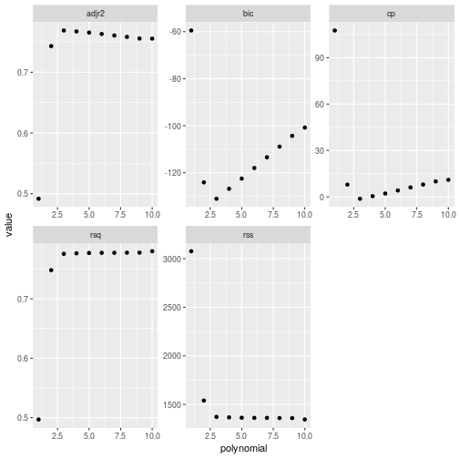
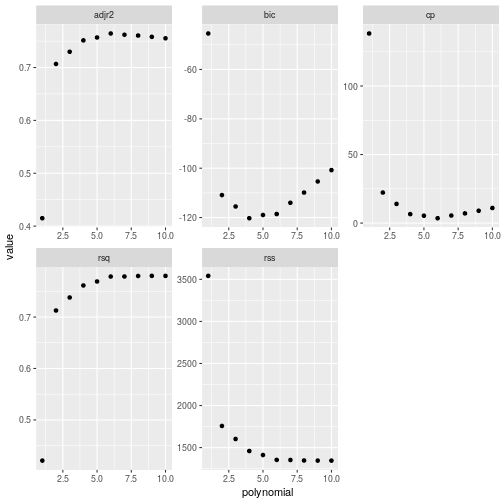
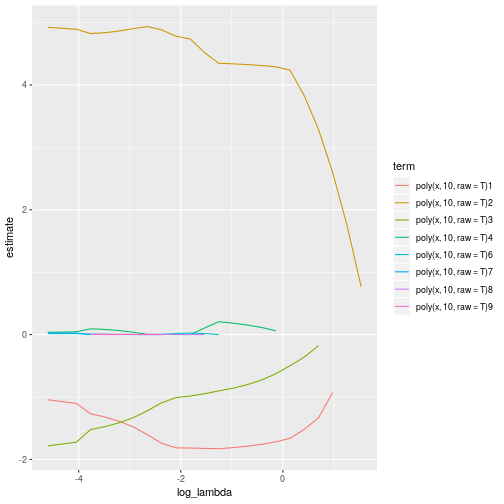
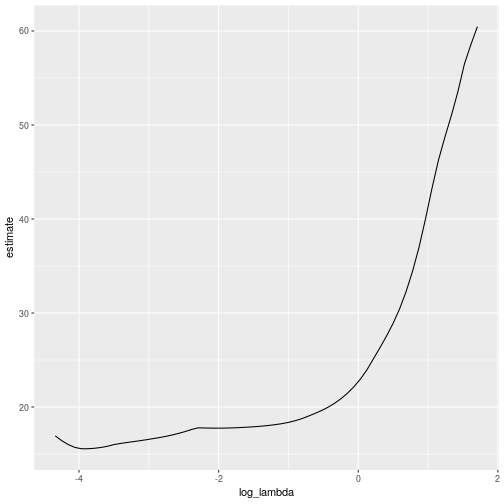
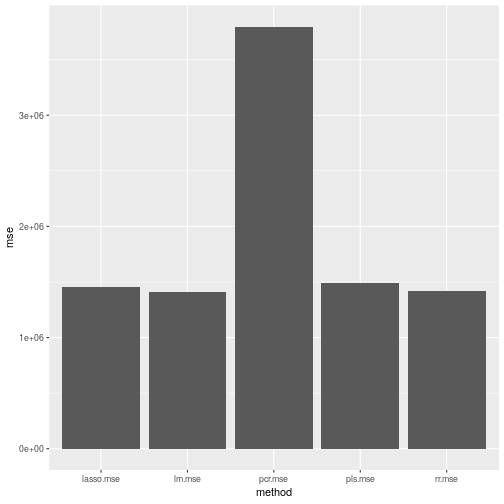
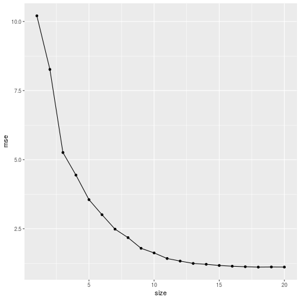
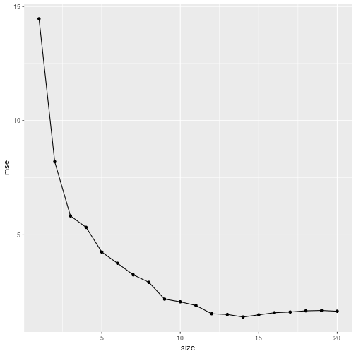
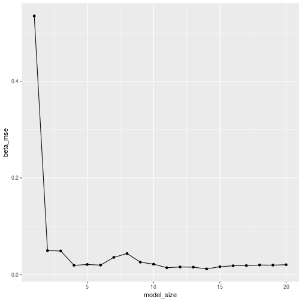

# Applied


```r
library(tidyverse)
library(leaps)
library(broom)
library(glmnet)
library(modelr)
library(ISLR)
```

## 8 - Subset Selection

### a)
*Use the rnorm() function to generate a predictor $X$ of length $n = 100$, as well as a noise vector of length $n = 100$.*

```r
set.seed(1)
subset_selection = tibble(x = rnorm(100), e = rnorm(100, 0, 4))
```

### b)
*Generate a response vector Y of length n = 100 according to a cubic model*

```r
subset_selection <- subset_selection %>%
    mutate(y = 4 - 2*x + 6*x^2 - x^3 + e)
```

### c)
*Use the regsubsets() function to perform best subset selection in order to choose the best model containing the predictors $X, X^2, \ldots, X^10$. What is the best model obtained according to $C_p$, BIC, and adjusted $R^2$?*


```r
bestsub_result <- subset_selection %>%
    regsubsets(y ~ poly(x, 10, raw = T), data = ., nvmax = 10)

bestsub_result %>% summary() %>% .$cp %>% which.min()
```

```
## [1] 3
```

```r
bestsub_result %>% summary() %>% .$bic %>% which.min()
```

```
## [1] 3
```

```r
bestsub_result %>% summary() %>% .$adjr2 %>% which.max()
```

```
## [1] 3
```

```r
bestsub_metrics <- bestsub_result %>%
    summary() %>%
    rbind() %>%
    as.tibble() %>%
    dplyr::select(rsq, rss, adjr2, cp, bic) %>%
    unnest() %>%
    rownames_to_column('polynomial') %>%
    mutate(polynomial = as.integer(polynomial))

bestsub_metrics
```

```
## # A tibble: 10 x 6
##    polynomial   rsq   rss adjr2       cp    bic
##         <int> <dbl> <dbl> <dbl>    <dbl>  <dbl>
##  1          1 0.497 3076. 0.492  108.     -59.5
##  2          2 0.748 1540. 0.743    7.89  -124. 
##  3          3 0.776 1372. 0.769   -1.24  -131. 
##  4          4 0.777 1366. 0.767    0.418 -127. 
##  5          5 0.777 1361. 0.766    2.09  -123. 
##  6          6 0.779 1353. 0.764    3.55  -119. 
##  7          7 0.779 1350. 0.762    5.31  -114. 
##  8          8 0.780 1346. 0.760    7.09  -110. 
##  9          9 0.780 1345. 0.758    9.00  -105. 
## 10         10 0.780 1345. 0.755   11     -101.
```
We see that all three have chosen a third degree polynomial.

*Show some plots to provide evidencefor your answer, and report the coefficients of the best model obtained.* 


```r
bestsub_metrics %>%
    gather(key = 'metric', value = 'value', c(rsq, rss, adjr2, cp, bic)) %>%
    ggplot(aes(polynomial, value)) +
    geom_point() +
    facet_wrap(~metric, scales = 'free')
```


We can see that in all of the graphs, the 'elbow' of the graph is at polynomial order 3.


```r
coefficients(bestsub_result, id = 3)
```

```
##           (Intercept) poly(x, 10, raw = T)2 poly(x, 10, raw = T)3 
##             4.2777703             5.3728654            -3.1085786 
## poly(x, 10, raw = T)5 
##             0.3731805
```

We see the coefficients are reasonably close to the 4, -2, 6 and -1, however it's chosen the 2nd, 3rd and 5th monomials.

### d)
*Repeat (c), using forward stepwise selection and also using backwards stepwise selection. How does your answer compare to the results in (c)?*


```r
fw_result <- subset_selection %>%
    regsubsets(y ~ poly(x, 10, raw = T), data = ., nvmax = 10, method = 'forward')

bw_result <- subset_selection %>%
    regsubsets(y ~ poly(x, 10, raw = T), data = ., nvmax = 10, method = 'backward')

fw_result %>% summary() %>% .$cp %>% which.min()
```

```
## [1] 3
```

```r
fw_result %>% summary() %>% .$bic %>% which.min()
```

```
## [1] 3
```

```r
fw_result %>% summary() %>% .$adjr2 %>% which.max()
```

```
## [1] 3
```

```r
bw_result %>% summary() %>% .$cp %>% which.min()
```

```
## [1] 6
```

```r
bw_result %>% summary() %>% .$bic %>% which.min()
```

```
## [1] 4
```

```r
bw_result %>% summary() %>% .$adjr2 %>% which.max()
```

```
## [1] 6
```

We see the forward stepwise has chosen the 3rd degree polynomial, however the backward selection has chosen polynomials of degree 6, 4 and 6.


```r
fw_metrics <- fw_result %>%
    summary() %>%
    rbind() %>%
    as.tibble() %>%
    dplyr::select(rsq, rss, adjr2, cp, bic) %>%
    unnest() %>%
    rownames_to_column('polynomial') %>%
    mutate(polynomial = as.integer(polynomial))

fw_metrics
```

```
## # A tibble: 10 x 6
##    polynomial   rsq   rss adjr2       cp    bic
##         <int> <dbl> <dbl> <dbl>    <dbl>  <dbl>
##  1          1 0.497 3076. 0.492  108.     -59.5
##  2          2 0.748 1540. 0.743    7.89  -124. 
##  3          3 0.776 1372. 0.769   -1.24  -131. 
##  4          4 0.777 1366. 0.767    0.418 -127. 
##  5          5 0.777 1363. 0.765    2.18  -122. 
##  6          6 0.777 1361. 0.763    4.09  -118. 
##  7          7 0.777 1361. 0.760    6.06  -113. 
##  8          8 0.778 1360. 0.758    7.97  -109. 
##  9          9 0.778 1359. 0.755    9.96  -104. 
## 10         10 0.780 1345. 0.755   11     -101.
```

```r
bw_metrics <- bw_result %>%
    summary() %>%
    rbind() %>%
    as.tibble() %>%
    dplyr::select(rsq, rss, adjr2, cp, bic) %>%
    unnest() %>%
    rownames_to_column('polynomial') %>%
    mutate(polynomial = as.integer(polynomial))

fw_metrics
```

```
## # A tibble: 10 x 6
##    polynomial   rsq   rss adjr2       cp    bic
##         <int> <dbl> <dbl> <dbl>    <dbl>  <dbl>
##  1          1 0.497 3076. 0.492  108.     -59.5
##  2          2 0.748 1540. 0.743    7.89  -124. 
##  3          3 0.776 1372. 0.769   -1.24  -131. 
##  4          4 0.777 1366. 0.767    0.418 -127. 
##  5          5 0.777 1363. 0.765    2.18  -122. 
##  6          6 0.777 1361. 0.763    4.09  -118. 
##  7          7 0.777 1361. 0.760    6.06  -113. 
##  8          8 0.778 1360. 0.758    7.97  -109. 
##  9          9 0.778 1359. 0.755    9.96  -104. 
## 10         10 0.780 1345. 0.755   11     -101.
```

We now have a look at the graphs:


```r
fw_metrics %>%
    gather(key = 'metric', value = 'value', c(rsq, rss, adjr2, cp, bic)) %>%
    ggplot(aes(polynomial, value)) +
    geom_point() +
    facet_wrap(~metric, scales = 'free')
```



```r
bw_metrics %>%
    gather(key = 'metric', value = 'value', c(rsq, rss, adjr2, cp, bic)) %>%
    ggplot(aes(polynomial, value)) +
    geom_point() +
    facet_wrap(~metric, scales = 'free')
```



We now look at the coefficients chosen for the 3 degree polynomial with forward selection, and for the 4 and 6 degree for backward selection:

```r
coefficients(fw_result, id = 3)
```

```
##           (Intercept) poly(x, 10, raw = T)2 poly(x, 10, raw = T)3 
##             4.2777703             5.3728654            -3.1085786 
## poly(x, 10, raw = T)5 
##             0.3731805
```

```r
coefficients(bw_result, id = 3)
```

```
##           (Intercept) poly(x, 10, raw = T)3 poly(x, 10, raw = T)4 
##              5.673300             -1.530438              2.344011 
## poly(x, 10, raw = T)6 
##             -0.233447
```

```r
coefficients(bw_result, id = 4)
```

```
##           (Intercept) poly(x, 10, raw = T)3 poly(x, 10, raw = T)4 
##             5.6086515            -3.1371491             2.7793143 
## poly(x, 10, raw = T)5 poly(x, 10, raw = T)6 
##             0.3976656            -0.3430995
```

```r
coefficients(bw_result, id = 6)
```

```
##            (Intercept)  poly(x, 10, raw = T)3  poly(x, 10, raw = T)4 
##             4.91443615            -3.20149653             8.81233356 
##  poly(x, 10, raw = T)5  poly(x, 10, raw = T)6  poly(x, 10, raw = T)8 
##             0.40512626            -5.16224256             1.18920171 
## poly(x, 10, raw = T)10 
##            -0.09246571
```

The forward stepwise has chosed coefficients close to the real ones. The backwards stepwise has not done as well.

### e)
*Now fit a lasso model to the simulated data, again using $X, X^2 ,\ldots, X^10$ as predictors. Use cross-validation to select the optimal value of $\lambda$.*

We first generate our lasso model - we remove the intercept from the model matrix.


```r
cubic_data <- subset_selection

cubic_predictors <- model.matrix(y ~ poly(x, 10, raw = T), data = cubic_data)[,-1]
cubic_response <- cubic_data$y

cubic_lasso <- glmnet(cubic_predictors, cubic_response, alpha = 1, lambda = 10 ^ seq(10, -2, length = 100))
```

Let's now have a look at the graph of the coefficients:

```r
cubic_lasso %>%
    tidy() %>%
    dplyr::filter(term != '(Intercept)') %>%
    mutate(log_lambda = log(lambda)) %>%
    ggplot(aes(log_lambda, estimate, colour = term)) +
    geom_line()
```



We now run a cross-validation on this with `glmnet()`:


```r
set.seed(1)
cubic_lasso_cv <- cv.glmnet(cubic_predictors, cubic_response, alpha = 1)

cubic_lasso_cv %>%
    tidy() %>%
    mutate(log_lambda = log(lambda)) %>%
    ggplot(aes(log_lambda, estimate)) +
    geom_line()
```



```r
cubic_lasso_cv$lambda.min
```

```
## [1] 0.02075291
```

*Report the resulting coefficient estimates, and discuss the results obtained.*


```r
best_lasso <- glmnet(cubic_predictors, cubic_response, alpha = 1)
```

### f)
**Now generate a response vector Y according to the model**
$$ Y = \beta_0 + \beta_7X^7 + e $$
*and perform best subset selection and the lasso. Discuss the results obtained.*

We choose $\beta_7$ to be 9.


```r
septic_response <- subset_selection %>%
    mutate(y = 4 + 9*x^7 + e)

septic_best_sub <- septic_response %>%
    regsubsets(y ~ poly(x, 10, raw = T), data = ., nvmax = 10)

septic_best_sub %>% summary() %>% .$cp %>% which.min()
```

```
## [1] 2
```

```r
septic_best_sub %>% summary() %>% .$bic %>% which.min()
```

```
## [1] 1
```

```r
septic_best_sub %>% summary() %>% .$adjr2 %>% which.max()
```

```
## [1] 4
```

```r
coefficients(septic_best_sub, id = 1)
```

```
##           (Intercept) poly(x, 10, raw = T)7 
##              3.835761              9.003082
```

```r
coefficients(septic_best_sub, id = 2)
```

```
##           (Intercept) poly(x, 10, raw = T)2 poly(x, 10, raw = T)7 
##             4.2819615            -0.5668337             9.0062208
```

```r
coefficients(septic_best_sub, id = 4)
```

```
##           (Intercept) poly(x, 10, raw = T)1 poly(x, 10, raw = T)2 
##             4.3050098             1.1656064            -0.6470685 
## poly(x, 10, raw = T)3 poly(x, 10, raw = T)7 
##            -1.0106107             9.0365350
```

We see the BIC picks the one variable model with a coefficient very close to the original coefficient.

We now try a lasso:


```r
septic_x <- model.matrix(y ~ poly(x, 10, raw = T), data = septic_response)[,-1]
septic_y <- septic_response$y

septic_lasso_cv <- cv.glmnet(septic_x, septic_y, alpha = 1)
septic_lasso_cv$lambda.min
```

```
## [1] 17.45735
```

```r
glmnet(septic_x, septic_y, alpha = 1, lambda = septic_lasso_cv$lambda.min) %>% coefficients()
```

```
## 11 x 1 sparse Matrix of class "dgCMatrix"
##                                s0
## (Intercept)            5.04829526
## poly(x, 10, raw = T)1  .         
## poly(x, 10, raw = T)2  .         
## poly(x, 10, raw = T)3  .         
## poly(x, 10, raw = T)4  .         
## poly(x, 10, raw = T)5  .         
## poly(x, 10, raw = T)6  .         
## poly(x, 10, raw = T)7  8.66594284
## poly(x, 10, raw = T)8  .         
## poly(x, 10, raw = T)9  0.00885059
## poly(x, 10, raw = T)10 .
```

The lasso correctly picks the seventh degree polynomial, and is also close to the real value.

## 9
*In this exercise, we will predict the number of applications received using the other variables in the College data set.*

### a)
*Split the data set into a training set and a test set.*


```r
set.seed(1)
college <- College %>%
    as.tibble() %>%
    nest() %>%
    mutate(partition = map(data, ~resample_partition(.x, c(train = .5, test = .5))))

college
```

```
## # A tibble: 1 x 2
##   data                partition 
##   <list>              <list>    
## 1 <tibble [777 × 18]> <list [2]>
```

### b)
*Fit a linear model using least squares on the training set, and report the test error obtained.*


```r
college <- college %>%
    mutate(
        lm = map(partition, ~lm(Apps ~ ., data = .x$train)),
        lm.mse = map2(partition, lm, ~mse(.y, .x$test))
    ) %>%
    select(-lm) %>%
    unnest(lm.mse)

college
```

```
## # A tibble: 1 x 3
##   data                partition    lm.mse
##   <list>              <list>        <dbl>
## 1 <tibble [777 × 18]> <list [2]> 1407766.
```

### c)
*Fit a ridge regression model on the training set, with $\lambda$ chosen by cross-validation. Report the test error obtained.*


```r
set.seed(1)
college <- college %>%
    mutate(rr = map(partition, ~cv.glmnet(
        model.matrix(Apps ~ ., .x$train),
        as.tibble(.x$train)$Apps,
        alpha = 0,
        lambda = 10 ^ seq(10, -2, length = 100)
    ))) %>%
    mutate(
        rr.pred = map2(
            partition,
            rr,
            ~predict(.y, s = .y$lambda.min, newx = model.matrix(Apps ~ ., .x$test)
        )),
        rr.mse = map2(partition, rr.pred, ~mean((as.tibble(.x$test)$Apps - .y)^2))
    ) %>%
    select(-c(rr, rr.pred)) %>%
    unnest(rr.mse)

college
```

```
## # A tibble: 1 x 4
##   data                partition    lm.mse   rr.mse
##   <list>              <list>        <dbl>    <dbl>
## 1 <tibble [777 × 18]> <list [2]> 1407766. 1422683.
```

### d)
*Fit a lasso model on the training set, with $\lambda$ chosen by crossvalidation. Report the test error obtained, along with the number of non-zero coefficient estimates.*


```r
set.seed(1)
college <- college %>%
    mutate(lasso = map(partition, ~cv.glmnet(
        model.matrix(Apps ~ ., .x$train),
        as.tibble(.x$train)$Apps,
        alpha = 1,
        lambda = 10 ^ seq(10, -2, length = 100)
    ))) %>%
    mutate(
        lasso.pred = map2(
            partition,
            lasso,
            ~predict(.y, s = .y$lambda.min, newx = model.matrix(Apps ~ ., .x$test)
        )),
        lasso.mse = map2(partition, lasso.pred, ~mean((as.tibble(.x$test)$Apps - .y)^2))
    ) %>%
    select(-c(lasso.pred)) %>%
    unnest(lasso.mse)

college
```

```
## # A tibble: 1 x 6
##   data                partition    lm.mse  rr.mse lasso          lasso.mse
##   <list>              <list>        <dbl>   <dbl> <list>             <dbl>
## 1 <tibble [777 × 18]> <list [2]> 1407766.  1.42e6 <S3: cv.glmne…  1458869.
```

Let's take a look at the coefficients:

```r
college %>%
    pull(lasso) %>%
    predict(object = .[[1]], s = .[[1]]$lambda.min, type = 'coefficients')
```

```
## 19 x 1 sparse Matrix of class "dgCMatrix"
##                         1
## (Intercept) -7.923062e+02
## (Intercept)  .           
## PrivateYes  -6.180410e+02
## Accept       1.252269e+00
## Enroll       .           
## Top10perc    5.475042e+01
## Top25perc   -1.922255e+01
## F.Undergrad  1.791780e-02
## P.Undergrad  .           
## Outstate    -3.095159e-02
## Room.Board   1.902181e-01
## Books        1.471236e-03
## Personal     1.066474e-01
## PhD         -4.511206e+00
## Terminal     .           
## S.F.Ratio    .           
## perc.alumni -6.971380e+00
## Expend       6.221479e-02
## Grad.Rate    6.821201e+00
```

We see it's reduced *Enroll*, *P.Undergrad*, *Terminal* and *S.F Ratio* to zero.

### e)
*Fit a PCR model on the training set, with M chosen by crossvalidation. Report the test error obtained, along with the value of M selected by cross-validation.*

```r
library(pls)
```


```r
set.seed(1)
college <- college %>%
    mutate(
        pcr = map(partition, ~pcr(Apps ~ ., data = .x$train, scale = T, validation = 'CV')),
        pcr.pred = map2(partition, pcr, ~predict(.y, .x$test, ncomp = 5)),
        pcr.mse = map2(partition, pcr.pred, ~mean((as.tibble(.x$test)$Apps - .y)^2))
    ) %>%
    select(-c(pcr, pcr.pred)) %>%
    unnest(pcr.mse)
```

### f)
*Fit a PLS model on the training set, with M chosen by crossvalidation. Report the test error obtained, along with the value of M selected by cross-validation.*


```r
college <- college %>%
    mutate(
        pls = map(partition, ~plsr(Apps ~ ., data = .x$train, scale = T, validation = 'CV')),
        pls.pred = map2(partition, pls, ~predict(.y, .x$test, ncomp = 7)),
        pls.mse = map2(partition, pls.pred, ~mean((as.tibble(.x$test)$Apps - .y)^2))
    ) %>%
    select(-c(pls, pls.pred)) %>%
    unnest(pls.mse) -> college

college
```

```
## # A tibble: 1 x 8
##   data       partition   lm.mse  rr.mse lasso    lasso.mse pcr.mse pls.mse
##   <list>     <list>       <dbl>   <dbl> <list>       <dbl>   <dbl>   <dbl>
## 1 <tibble [… <list [2]>  1.41e6  1.42e6 <S3: cv…  1458869.  3.80e6  1.49e6
```
### g)
*Comment on the results obtained. How accurately can we predict the number of college applications received? Is there much difference among the test errors resulting from these five approaches?*

Let's have a look at the MSE across the different methods:


```r
college %>%
    select(-c(data, partition)) %>%
    gather(key = 'method', value = 'mse', c(lm.mse, rr.mse, lasso.mse, pcr.mse, pls.mse)) %>%
    ggplot() +
    geom_bar(aes(method, mse), stat = 'identity')
```



We see most of the methods return similar MSEs - except for PCR which is much greater.

## 10)
*We have seen that as the number of features used in a model increases, the training error will necessarily decrease, but the test error may not. We will now explore this in a simulated data set.*

### a)
*Generate a data set with $p = 20$ features, $n = 1,000$ observations, and an associated quantitative response vector generated according a standard linear model. Let $\beta$ have some elements that are 0*


```r
set.seed(1)
n = 1000
p = 20
X <- matrix(rnorm(p * n), n, p)
Beta <- rnorm(p)
Beta[ sample(1:p, 5) ] = 0
Y <- X %*% Beta + rnorm(p)

data_set <- as.tibble(X) %>% mutate(Y = Y)
```

### b)
*Split your data set into a training set containing 100 observations and a test set containing 900 observations.*


```r
set.seed(1)
data_set <- data_set %>%
    nest(.key = 'data_set') %>%
    mutate(partition = map(data_set, ~resample_partition(.x, c(train = .1, test = .9))))
```

### c)

*Perform best subset selection on the training set, and plot the training set MSE associated with the best model of each size.*

The first thing we create is a `predict.regsubsets()` function we can use.
This function takes the model and data, and returns a list of responses, one for each of the sizes.


```r
predict.regsubsets <- function(model, data) {
    ret <- list()
    nvmax <- model$np - 1

    for (x in 1:nvmax) {
        coefs <- coefficients(model, x)[-1]
        matrix_columns <- names(data) %in% names(coefs)

        result <- as.vector( as.matrix(data[, matrix_columns]) %*% coefs )
        ret[[x]] <- result
    }

    return (ret)
}
```
Let's run the best subset across the data and pull out the metrics for each size:


```r
data_set <- data_set %>%
    mutate(best_sub = map(partition, ~regsubsets(Y ~ ., data = .x$train, nvmax = 20)))
```
Now we use our predict function to calculate the training MSE. We then take our data set and transmute this to a tibble with the predictions, a list of 1:20 representing the model sizes, and the response variable from the test partition. We unnest predictions and sizes and preserve the responses. We then calculate the MSE for each of the sizes and unnest this value.


```r
regsub_train_mse <- data_set %>%
    transmute(
        pred = map2(partition, best_sub, ~predict(.y, as.tibble(.x$train))),
        size = list(1:20),
        response = map(partition, ~as.tibble(.x$train)[['Y']])
    ) %>%
    unnest(pred, size, .preserve = response) %>%
    mutate(mse = map2(response, pred, ~mean((.x - .y)^2))) %>%
    unnest(mse)

regsub_train_mse
```

```
## # A tibble: 20 x 4
##    response   pred        size   mse
##    <list>     <list>     <int> <dbl>
##  1 <dbl [99]> <dbl [99]>     1 10.2 
##  2 <dbl [99]> <dbl [99]>     2  8.27
##  3 <dbl [99]> <dbl [99]>     3  5.26
##  4 <dbl [99]> <dbl [99]>     4  4.44
##  5 <dbl [99]> <dbl [99]>     5  3.55
##  6 <dbl [99]> <dbl [99]>     6  3.01
##  7 <dbl [99]> <dbl [99]>     7  2.49
##  8 <dbl [99]> <dbl [99]>     8  2.18
##  9 <dbl [99]> <dbl [99]>     9  1.79
## 10 <dbl [99]> <dbl [99]>    10  1.62
## 11 <dbl [99]> <dbl [99]>    11  1.42
## 12 <dbl [99]> <dbl [99]>    12  1.33
## 13 <dbl [99]> <dbl [99]>    13  1.24
## 14 <dbl [99]> <dbl [99]>    14  1.21
## 15 <dbl [99]> <dbl [99]>    15  1.17
## 16 <dbl [99]> <dbl [99]>    16  1.14
## 17 <dbl [99]> <dbl [99]>    17  1.12
## 18 <dbl [99]> <dbl [99]>    18  1.11
## 19 <dbl [99]> <dbl [99]>    19  1.12
## 20 <dbl [99]> <dbl [99]>    20  1.11
```

Now let's graph it:


```r
regsub_train_mse %>%
    ggplot(aes(size, mse)) +
    geom_line() +
    geom_point()
```



### d)
*Plot the test set MSE associated with the best model of each size.*

We perform the same pipeline, but use the test partition.


```r
regsub_test_mse <- data_set %>%
    transmute(
        pred = map2(partition, best_sub, ~predict(.y, as.tibble(.x$test))),
        size = list(1:20),
        response = map(partition, ~as.tibble(.x$test)[['Y']])
    ) %>%
    unnest(pred, size, .preserve = response) %>%
    mutate(mse = map2(response, pred, ~mean((.x - .y)^2))) %>%
    unnest(mse)

regsub_test_mse
```

```
## # A tibble: 20 x 4
##    response    pred         size   mse
##    <list>      <list>      <int> <dbl>
##  1 <dbl [901]> <dbl [901]>     1 14.5 
##  2 <dbl [901]> <dbl [901]>     2  8.20
##  3 <dbl [901]> <dbl [901]>     3  5.83
##  4 <dbl [901]> <dbl [901]>     4  5.33
##  5 <dbl [901]> <dbl [901]>     5  4.25
##  6 <dbl [901]> <dbl [901]>     6  3.76
##  7 <dbl [901]> <dbl [901]>     7  3.25
##  8 <dbl [901]> <dbl [901]>     8  2.92
##  9 <dbl [901]> <dbl [901]>     9  2.19
## 10 <dbl [901]> <dbl [901]>    10  2.07
## 11 <dbl [901]> <dbl [901]>    11  1.91
## 12 <dbl [901]> <dbl [901]>    12  1.55
## 13 <dbl [901]> <dbl [901]>    13  1.51
## 14 <dbl [901]> <dbl [901]>    14  1.40
## 15 <dbl [901]> <dbl [901]>    15  1.50
## 16 <dbl [901]> <dbl [901]>    16  1.59
## 17 <dbl [901]> <dbl [901]>    17  1.62
## 18 <dbl [901]> <dbl [901]>    18  1.67
## 19 <dbl [901]> <dbl [901]>    19  1.69
## 20 <dbl [901]> <dbl [901]>    20  1.66
```

We now graph the test MSE against the size of each model:

```r
regsub_test_mse %>%
     ggplot(aes(size, mse)) +
     geom_line() + 
     geom_point()
```



### e)
*For which model size does the test set MSE take on its minimum value? Comment on your results.*

Which model has the minimum test MSE?


```r
which.min(regsub_test_mse$mse)
```

```
## [1] 14
```

The model with 14 coefficients has the minimum test MSE.

Originally we had the following coefficients set to 0:

```r
sum(!Beta == 0)
```

```
## [1] 15
```

So there is only one coefficient different.


### f)
*
Lets see which ones have been set to zero in our model:

```r
full_coefs <- map_chr(1:20, ~paste('V', .x, sep = ''))
model_coefs <- data_set %>%
    pull(best_sub) %>% 
    .[[1]] %>% 
    coefficients(id = 14) %>% 
    attributes() %>%
    .[['names']]

full_coefs[!full_coefs %in% model_coefs]
```

```
## [1] "V2"  "V5"  "V9"  "V12" "V13" "V15"
```

The best subset has removed an additional coefficient.

### g)
*Create a plot displaying $\sqrt{\sum_{j=1}\beta_j − \hat{\beta_j^r}}$ for a range of values f r, where β̂ j r is the jth coefficient estimate for the best model containing r coefficients. Comment on what you observe. How does this compare to the test MSE plot from (d)?i*

We take our best_subset model, and add a column with the vector of original $\beta$ and a vector with each of the model sizes. We unnest the model size while preserving the model and the $\beta$ 

For each model size we extact out the $\hat{\beta}$, excluding the coefficient. We then select the columns leaving model size, the original $\beta$ and the $\hat{\beta}$.


```r
model_betas <- data_set %>%
    select(best_sub) %>%
    mutate(
        beta = list(Beta),
        model_size = list(1:20)
    ) %>%
    unnest(model_size, .preserve = c(best_sub, beta)) %>%
    mutate(beta_hat = map2(best_sub, model_size, ~coefficients(.x, id = .y)[-1])) %>%
    select(model_size,beta, beta_hat)

model_betas
```

```
## # A tibble: 20 x 3
##    model_size beta       beta_hat  
##         <int> <list>     <list>    
##  1          1 <dbl [20]> <dbl [1]> 
##  2          2 <dbl [20]> <dbl [2]> 
##  3          3 <dbl [20]> <dbl [3]> 
##  4          4 <dbl [20]> <dbl [4]> 
##  5          5 <dbl [20]> <dbl [5]> 
##  6          6 <dbl [20]> <dbl [6]> 
##  7          7 <dbl [20]> <dbl [7]> 
##  8          8 <dbl [20]> <dbl [8]> 
##  9          9 <dbl [20]> <dbl [9]> 
## 10         10 <dbl [20]> <dbl [10]>
## 11         11 <dbl [20]> <dbl [11]>
## 12         12 <dbl [20]> <dbl [12]>
## 13         13 <dbl [20]> <dbl [13]>
## 14         14 <dbl [20]> <dbl [14]>
## 15         15 <dbl [20]> <dbl [15]>
## 16         16 <dbl [20]> <dbl [16]>
## 17         17 <dbl [20]> <dbl [17]>
## 18         18 <dbl [20]> <dbl [18]>
## 19         19 <dbl [20]> <dbl [19]>
## 20         20 <dbl [20]> <dbl [20]>
```

The indicies from each best subset model are of the form $V1, \ldots, V20$, so we use a regex to extract out the vector of indicies. We then redefine the $\beta$ to be only those indicies chosen from the model, allowing us to then calculate the MSE


```r
beta_mse <- model_betas %>%
    mutate(
        coef_indice = map(beta_hat, ~names(.x) %>% str_extract('\\d+') %>% as.integer()),
        beta = map2(beta, coef_indice, ~.x[.y]),
        beta_mse = map2(beta, beta_hat, ~mean((.x - .y)^2))
    ) %>%
    select(model_size, beta_mse) %>%
    unnest()

beta_mse
```

```
## # A tibble: 20 x 2
##    model_size beta_mse
##         <int>    <dbl>
##  1          1   0.535 
##  2          2   0.0494
##  3          3   0.0487
##  4          4   0.0190
##  5          5   0.0208
##  6          6   0.0195
##  7          7   0.0355
##  8          8   0.0435
##  9          9   0.0256
## 10         10   0.0215
## 11         11   0.0141
## 12         12   0.0156
## 13         13   0.0152
## 14         14   0.0117
## 15         15   0.0162
## 16         16   0.0181
## 17         17   0.0185
## 18         18   0.0197
## 19         19   0.0195
## 20         20   0.0203
```

```r
beta_mse %>%
    ggplot(aes(model_size, beta_mse)) +
    geom_line() +
    geom_point()
```


